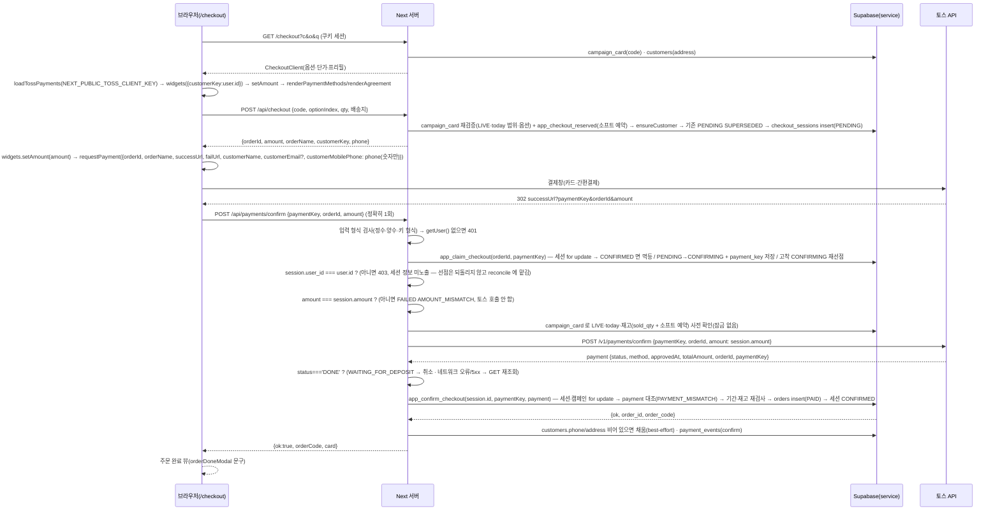

# 셀러리 앱 구현 계획 — 슬라이스 1 (돈이 흐르는 고객 경로)

> **상태(2026-09-21): 슬라이스 1 은 `apps/shop`(SvelteKit) 으로 이식 완료 · S1~S5 + 도메인 전환 완료 · `web/` 은 S5 PR-11 에서 삭제.** 정책·API·DB 계약은 그대로 유효(결정 J), 파일 경로는 `docs/monorepo-migration.md §3~§4` 이식 표로, 배포·운영은 [`deploy.md`](deploy.md) 로 읽는다.
>
> 대상: `web/` (Next.js 16 App Router) 를 구현하는 개발자·병렬 에이전트. 근거 문서: `docs/data-model.md`, `docs/analysis/access-model.md`, `docs/analysis/flows-and-invariants.md`, 마이그레이션 `supabase/migrations/0001~0008`, 프로토타입 `js/60-customer.js`·`js/02-state.js`·`js/80-actions.js`·`css/base.css`·`css/skin.css`. glo 앱(`E:/위글로우/Glo/web`)은 읽기 전용 참고.
>
> 슬라이스 1 범위: 판매 링크 페이지(`/s/[handle]/[code]`, `/c/[code]`) · 고객 홈(`/`, 최소) · 카카오 로그인 · 체크아웃(토스 결제위젯 v2 → 서버 승인) · 웹훅 · 취소/환불 · 내 주문. 파트너 센터(브랜드/인플루언서/관리자)는 §12 에 방향만.

---

## 0. 결정 요약

| # | 결정 | 이유 |
|---|---|---|
| 1 | **앱은 `web/` 하위에 둔다(저장소 루트는 프로토타입 그대로)** | 루트 `index.html + css/ + js/` 는 이해관계자 데모·설계 원본으로 계속 쓰인다. glo 도 같은 구조(저장소 루트 정적 + `web/` Next)라 팀 관례와 일치. `.vercelignore` 가 이미 `web` 을 프로토타입 배포에서 제외한다. |
| 2 | **Vercel 프로젝트를 분리한다: `sellery`(프로토타입) + `sellery-app`(Next, Root Directory `web`)** | 서버 기능(토스 승인·Supabase SSR)은 정적 호스팅 불가. 프로토타입 URL 을 깨지 않고 앱을 독립 배포·롤백. 도메인 `sellery.life` 은 앱이 준비되면 `sellery-app` 으로 이전(§13). |
| 3 | **프로토타입은 유지·수정하지 않는다** | 앱은 프로토타입의 문자열·토큰·규칙을 옮겨 오되, 프로토타입 js/css 를 import 하지 않는다(localStorage 모델과 결합). |
| 4 | **승인 전 주문은 `orders` 가 아니라 `checkout_sessions`(0008)** | `orders` 를 읽는 모든 코드(정산 `calc()`·발주 CSV·관리자 목록·`sold_qty` 트리거·주문번호 시퀀스·시드 1,052건)가 "결제된 주문" 을 가정한다. glo 방식(pending 상태 추가)은 이 가정을 전부 깨고 유령 주문 문제를 가져온다. |
| 5 | **모든 쓰기는 service role, 승인 확정은 DB 함수 1회 호출** | access-model §0-4. `app_confirm_checkout()` 이 세션·캠페인 행 잠금 + 토스 응답 대조 + 기간·재고 재검사 + `orders` insert 를 한 트랜잭션으로 묶어 초과 판매를 막는다. 선점(`app_claim_checkout`)·환불 가드/기록(`app_refund_precheck`/`app_refund_record`)도 함수다 — 호출자(라우트·웹훅·reconcile)가 검증을 반복하지 않는다. |
| 5-1 | **돈이 움직인 뒤의 DB 기록은 현실을 거부하지 않는다** | 토스 승인 DONE·콘솔 취소가 확정된 뒤에는 세션/주문을 반드시 그에 맞게 기록한다(가드는 토스 호출 **전**에만). 돈이 잡혔는데 주문이 없는 세션은 웹훅·재시도·reconcile 잡(§7.5) 중 하나가 반드시 주문 생성 또는 토스 취소로 종결한다. |
| 6 | **가상계좌·계좌이체는 지원하지 않는다** | glo 의 "무입금 출고" 실사고(reuse-map §4-1). 위젯에서 제외하고, confirm 은 `status==='DONE'` 만 인정 — `WAITING_FOR_DEPOSIT` 이면 즉시 토스 취소 후 실패 처리. |
| 7 | **고객 결제는 로그인 필수(카카오)** | 프로토타입 "카카오 로그인 후 결제", access-model 열린 결정 1 을 "회원만" 으로 닫음. `orders.user_id` 로 본인 조회(RLS)가 성립한다. |
| 8 | **고객 셀프 환불은 발송 전(`tracking_no is null`)만, 발송 후는 고객센터** | glo `isCancelable` 원칙. 프로토타입은 발송 여부 무관이었으나 회수 없는 환불은 브랜드 손실이라 닫는다. |
| 9 | **옵션·정책 상수는 DB 단일 소스** | `campaign_card()` 가 확정 옵션(`options`)·`settings`·`today` 를 돌려준다(0008). 앱은 가격 규칙을 복제하지 않는다. |
| 10 | **링크 유입 보호는 httpOnly 쿠키 + 서버 필터** | DB 변경 없음. 행 가시성이 방문 컨텍스트에 달린 규칙이라 RLS 로 표현 불가(access-model §3.4). |

---

## 1. 스택 · 버전 (glo 와 동일)

`web/package.json` — glo 에서 슬라이스 1 에 불필요한 것(`@anthropic-ai/sdk`, `@channel.io/*`, `exceljs`, `gsap`, `resend`, `three`, `tsx`, `predev/prebuild` 훅)을 뺀 목록. 버전 문자열은 glo 그대로.

```json
{
  "name": "sellery-web",
  "private": true,
  "scripts": {
    "dev": "next dev",
    "build": "next build",
    "start": "next start",
    "lint": "eslint",
    "typecheck": "tsc --noEmit",
    "gen:types": "cd .. && supabase gen types typescript --linked --schema public > web/src/lib/database.types.ts"
  },
  "dependencies": {
    "@supabase/ssr": "^0.12.0",
    "@supabase/supabase-js": "^2.108.1",
    "@tosspayments/tosspayments-sdk": "^2.7.1",
    "next": "16.2.9",
    "react": "19.2.4",
    "react-dom": "19.2.4"
  },
  "devDependencies": {
    "@tailwindcss/postcss": "^4",
    "@types/node": "^20",
    "@types/react": "^19",
    "@types/react-dom": "^19",
    "eslint": "^9",
    "eslint-config-next": "16.2.9",
    "tailwindcss": "^4",
    "typescript": "^5"
  }
}
```

- 설정 파일 3종(`tsconfig.json`, `eslint.config.mjs`, `postcss.config.mjs`)은 glo 판을 그대로(`@/*` → `src/*`, flat config, `@tailwindcss/postcss`).
- `next.config.ts` 는 빈 설정(`const nextConfig: NextConfig = {}`)으로 시작. 도메인 이전 시 프로토타입 경로 리다이렉트를 여기에 둔다.
- `vercel.json` — `{ "regions": ["icn1"] }` 만(크론 없음). Supabase Seoul 과 같은 리전.
- Node 20+ (Vercel 기본). `AGENTS.md`("Next 16 은 학습 데이터와 다르다 — `node_modules/next/dist/docs/` 를 먼저 읽어라")는 create-next-app 이 만든 것을 유지.
- **Next 16 주의**: `middleware` → `proxy`(파일 `src/proxy.ts`, 함수 `proxy`), `cookies()` / `params` / `searchParams` 는 전부 `await`.

---

## 2. 디렉터리 트리

`supabase/` 는 **저장소 루트**의 기존 폴더(`config.toml`, `migrations/`, `seed.sql`)를 그대로 쓴다. `web/supabase` 는 만들지 않는다 — Supabase CLI 는 저장소 루트에서 실행(`supabase db push`, `supabase gen types … --linked`)하고, 앱은 생성된 타입 파일만 `web/src/lib/database.types.ts` 로 받는다.

```
web/
├─ package.json  next.config.ts  tsconfig.json  eslint.config.mjs  postcss.config.mjs  vercel.json
├─ .env.example  .gitignore  AGENTS.md  DEPLOY.md  README.md
├─ public/
│  └─ favicon.svg                         # 셀러리 잎 (index.html 7행 data URI 를 파일로)
└─ src/
   ├─ proxy.ts                            # updateSession + 링크 유입 쿠키 (§8)
   ├─ app/
   │  ├─ layout.tsx                       # <html lang="ko">, next/font, AppBar/SubNav/Footer, Toast provider
   │  ├─ globals.css                      # @import "tailwindcss" + @theme 토큰 (§9)
   │  ├─ page.tsx                         # 고객 홈 (최소판: 진행 중·오픈 예정·순위·카테고리 칩·링크 보호 안내)
   │  ├─ not-found.tsx                    # "판매 페이지를 찾을 수 없습니다"
   │  ├─ robots.ts                        # /api /checkout /account /login /auth disallow · /s /c allow
   │  ├─ s/[handle]/[code]/page.tsx       # 판매 링크 페이지 (서버) + store-client.tsx (옵션·수량·CTA)
   │  ├─ c/[code]/page.tsx                # campaign_card → notFound() | permanentRedirect(canonicalStoreUrl) 308
   │  ├─ login/{page.tsx,layout.tsx}      # 카카오 로그인 (client) · robots noindex
   │  ├─ auth/callback/route.ts           # exchangeCodeForSession → customers upsert → next
   │  ├─ auth/signout/route.ts            # POST → signOut → 303 /
   │  ├─ checkout/
   │  │  ├─ layout.tsx                    # robots noindex
   │  │  ├─ page.tsx                      # 서버: 로그인·캠페인 LIVE·재고·옵션 검증 → CheckoutClient
   │  │  ├─ checkout-client.tsx           # 토스 위젯 v2 · 배송지 폼 · /api/checkout → requestPayment
   │  │  ├─ success/page.tsx             # confirm 1회 호출 → 주문 완료 / 실패 뷰
   │  │  └─ fail/page.tsx                 # failUrl 랜딩 (사유 매핑, 다시 시도)
   │  ├─ account/
   │  │  ├─ layout.tsx                    # robots noindex
   │  │  ├─ sign-out-button.tsx
   │  │  └─ orders/
   │  │     ├─ page.tsx                   # 내 주문 목록 (service role 조인, user_id 필터)
   │  │     └─ [code]/{page.tsx,refund-button.tsx}
   │  └─ api/
   │     ├─ me/route.ts                   # { user:{name, avatar} } (네비 스왑)
   │     ├─ checkout/route.ts             # POST 세션 생성 (§6)
   │     ├─ payments/{confirm,cancel,webhook}/route.ts
   │     └─ cron/reconcile/route.ts       # CRON_SECRET — CONFIRMING 고착·CANCEL_PENDING 종결 (§7.5, 슬라이스 1 은 수동 호출)
   ├─ lib/
   │  ├─ supabase/{client,server,middleware,admin}.ts   # glo 복사 (admin.ts 첫 줄 import "server-only")
   │  ├─ database.types.ts                # supabase gen types 산출 (G 파티션)
   │  ├─ auth.ts                          # getSessionUser(), displayName(user), safeNext(next)
   │  ├─ customers.ts                     # ensureCustomer(admin, user) → customers.id
   │  ├─ campaign.ts                      # CampaignCard 타입·ResolvedOption·dday()·isBuyable()·normalizeHandle()·canonicalStoreUrl()
   │  ├─ campaign-server.ts               # fetchCampaignCard(code) · fetchSellerOtherCampaigns(sellerId, exceptId) · fetchHomeCampaigns()
   │  ├─ linkctx.ts                       # LINKCTX_COOKIE · readLinkCtx() · custVisible(c, L)
   │  ├─ dates.ts                         # kstToday() · md() · addDays() (Asia/Seoul 고정)
   │  ├─ money.ts                         # formatKRW() · generateOrderId()
   │  ├─ text.ts                          # cleanText() (이모지·비BMP 제거, glo ebut.ts)
   │  ├─ toss.ts                          # import "server-only" · tossConfirm() · tossCancel() · tossGetPayment() (TOSS_SECRET_KEY, status 0 = 네트워크 오류)
   │  ├─ orders-server.ts                 # fetchMyOrders(userId) · fetchMyOrder(userId, code) (admin 조인)
   │  ├─ order-status.ts                  # orderStatusLabel(order, campaign) · isRefundable(order, campaign)
   │  ├─ carriers.ts                      # 5개 택배사 → 조회 URL
   │  └─ company.ts                       # (주)위글로우 사업자 정보 상수 (플레이스홀더, §13)
   └─ components/
      ├─ wordmark.tsx  app-bar.tsx  sub-nav.tsx  footer.tsx  toast.tsx  modal.tsx
      ├─ icons.tsx                        # CEL · KAKAO_ICON · PLAT_ICONS · GICON · LOGO_ICON (SVG 그대로)
      ├─ grade-box.tsx  status-chip.tsx  platform-handle.tsx  tilt.tsx
      ├─ campaign-card.tsx                # 홈·"다른 판매" 카드 (custCard)
      ├─ trust-band.tsx  verify-modal.tsx  # 인증 띠 · 인증 확인 모달
      └─ cs-modal.tsx                     # 문의 모달 (슬라이스 1: 고객센터 링크 안내만 — 저장 없음)
```

라우트 그룹(`(customer)`/`(partner)`)은 슬라이스 1 에서 만들지 않는다 — 파트너 센터를 붙일 때 고객 라우트를 `(customer)` 로 옮긴다(§12).

---

## 3. 환경변수

값은 사용자가 `web/.env.local`(gitignored) 과 Vercel(`sellery-app`, Production + Preview) 에 직접 넣는다. 코드·문서에 값 금지. `web/.env.example` 은 이름만.

| 이름 | 공개/비밀 | 어디서 얻나 | 용도 |
|---|---|---|---|
| `NEXT_PUBLIC_SUPABASE_URL` | 공개 | Supabase Dashboard → Project `sellery` → Settings → API → Project URL (`https://ocxppeuoiysnkwwujvko.supabase.co`) | 3종 클라이언트 |
| `NEXT_PUBLIC_SUPABASE_ANON_KEY` | 공개 | 같은 화면 → anon(public) key | 브라우저·사용자 세션 클라이언트 |
| `SUPABASE_SERVICE_ROLE_KEY` | **비밀(서버)** | 같은 화면 → service_role key | `lib/supabase/admin.ts` — 모든 쓰기 |
| `NEXT_PUBLIC_TOSS_CLIENT_KEY` | 공개 | 토스페이먼츠 개발자센터 → 내 개발정보 → 상점 `NHN_shingoonk` → **결제위젯 연동 키** → 클라이언트 키 (`test_gck_…` / `live_gck_…`) | 위젯 `loadTossPayments` |
| `TOSS_SECRET_KEY` | **비밀(서버)** | 같은 화면 → 시크릿 키 (`test_gsk_…` / `live_gsk_…`). **반드시 위젯 키 짝** — API 개별연동 키(`test_ck_/sk_`)를 섞으면 위젯이 뜨지 않거나 승인 실패 | confirm / cancel / 조회 (Basic `base64(secret + ":")`) |
| `NEXT_PUBLIC_TOSS_WIDGET_VARIANT` | 공개 | 토스 상점관리자 → 결제위젯 → UI 변형 이름(결제수단). glo 는 `DEFAULT-2`(약관은 `AGREEMENT`) | `renderPaymentMethods({ variantKey })`. 기본값 `DEFAULT-2` — 코드 수정 없이 바꿀 수 있게 환경변수로 뺀다(§13) |
| `NEXT_PUBLIC_SITE_URL` | 공개 | `https://sellery.life`(프로덕션) / `http://localhost:3000` | `metadataBase`, 절대 URL 이 필요한 곳. OAuth `redirectTo`·토스 `successUrl` 은 `window.location.origin` 을 쓴다(프리뷰 배포 호환) |
| `CRON_SECRET` | 비밀 | 임의 생성 | 다음 슬라이스 — `expire_checkout_sessions()`·reconcile(§7.5)·`purge_checkout_pii()` 크론·캠페인 스케줄러 |
| `ADMIN_PASSWORD` | 비밀 | 임의 생성 | 다음 슬라이스(선택) — 관리자 부트스트랩 Basic Auth 이중 잠금. **단독 인증이 아니다**: `app_role()='admin'` 세션 게이트 위에 얹는 이중 잠금일 뿐이며, 구현 시 `updateSession` 을 먼저 호출한 뒤 검사(glo `proxy.ts` 는 `/admin` 에서 세션 갱신을 건너뛴다 — 복사 금지)·`crypto.timingSafeEqual` 비교·실패 로깅·Preview 는 별도 값 또는 비활성. |

앱 환경변수가 **아닌** 것(대시보드에만 입력): 카카오 개발자 앱의 REST API 키·Client Secret → Supabase Dashboard → Authentication → Providers → Kakao. **토스 웹훅은 서명을 제공하지 않으므로 `/api/payments/webhook` 은 공개 엔드포인트이고, `paymentKey` 재조회가 유일한 인증이다** — 본문의 상태값은 절대 쓰지 않으며, 본문 크기·형식 검사와 세션/주문 매칭을 통과하기 전에는 로그도 남기지 않고 토스 재조회도 하지 않는다(§7.3).

`web/.env.example`:

```
# Supabase — project sellery (ref ocxppeuoiysnkwwujvko)
NEXT_PUBLIC_SUPABASE_URL=
NEXT_PUBLIC_SUPABASE_ANON_KEY=
# SERVER ONLY — bypasses RLS. All writes go through this.
SUPABASE_SERVICE_ROLE_KEY=

# Toss Payments — 결제위젯 전용 키 짝 (gck/gsk). MID NHN_shingoonk
NEXT_PUBLIC_TOSS_CLIENT_KEY=
# SERVER ONLY
TOSS_SECRET_KEY=
# 결제수단 위젯 UI 변형 이름 (상점관리자 → 결제위젯). 비우면 DEFAULT-2
NEXT_PUBLIC_TOSS_WIDGET_VARIANT=

# Absolute site URL (metadata)
NEXT_PUBLIC_SITE_URL=http://localhost:3000
```

---

## 4. 인증 설계

### 4.1 고객 = 카카오 OAuth (Supabase Auth, glo 패턴 그대로)

| 단계 | 구현 |
|---|---|
| 시작 | `/login` (client) → `next = safeNext(searchParams.get("next"))` 를 먼저 적용한 뒤 `supabase.auth.signInWithOAuth({ provider: "kakao", options: { redirectTo: \`${origin}/auth/callback?next=${encodeURIComponent(next)}\` } })`. **`scopes` 지정 금지**(지정하면 카카오 싱크 간편가입 화면을 우회 — 동의 항목은 카카오 콘솔이 결정). 이미 로그인이면 즉시 `safeNext(next)` 로(클라이언트 리다이렉트도 같은 함수 — `?next=https://evil` 오픈 리다이렉트 방지). |
| 콜백 | `/auth/callback` (route handler): `exchangeCodeForSession(code)` → 성공 시 `ensureCustomer(admin, user)`(best-effort, `void`+catch) → `redirect(origin + safeNext(next))`. 실패 → `/login?error=auth`. **glo 콜백(`${origin}${next}` 무검증)은 복사 금지.** `safeNext(next)`: 정규식 `^\/(?![\/\\])[^\r\n]*$` 를 만족하고(`/` 로 시작, `//`·`/\` 금지 — 브라우저는 `/\evil.com` 을 `//evil.com` 으로 해석, CR/LF 금지) `/auth/`·`/login` 으로 시작하지 않는 경로만 통과, 아니면 `/`. 시작·콜백·`signInWithOAuth redirectTo` 의 `next` 전부 이 함수를 거친다. |
| profiles | DB 트리거 `handle_new_user`(0001) 가 첫 로그인에 `profiles(role='customer')` 생성. 앱은 만지지 않는다. |
| customers | 트리거 없음 → `ensureCustomer`: `admin.from("customers").upsert({ user_id, name: displayName(user), email: user.email ?? null }, { onConflict: "user_id", ignoreDuplicates: true })` 후 `select id`. 콜백(best-effort) + `/api/checkout`(필수 — 여기서 얻은 `customers.id` 를 세션에 저장). **`user.email` 은 null 일 수 있다**(카카오 이메일이 선택 동의이거나 비즈 앱 미전환 — §13): `customers.email`·토스 `customerEmail` 은 optional 로 다룬다. |
| 표시명 | `user.user_metadata.nickname ?? name ?? full_name ?? preferred_username ?? "고객"`. 전화·배송지는 카카오 추가 동의 없이는 오지 않는다 → 체크아웃 폼 입력. |
| 로그아웃 | `POST /auth/signout` → `auth.signOut()` → 303 `/`. 버튼은 `<form method="post">`. |
| 세션 갱신 | `src/proxy.ts` 가 `updateSession(request)`(glo `lib/supabase/middleware.ts`) 호출 — `createServerClient` 와 `auth.getUser()` 사이에 코드를 넣지 않는다. matcher 는 정적 자산 제외 정규식 그대로. |
| 보호 라우트 | `/checkout*` — 서버 컴포넌트에서 `getUser()` 없으면 `redirect("/login?next=" + encodeURIComponent(현재 URL))`. `/account/orders` — 리다이렉트 대신 "카카오 로그인하면 …" 카드 렌더(프로토타입 동일), 상세·API 는 401/redirect. `/api/checkout`, `/api/payments/cancel` — 401. |
| 네비 | 서버 컴포넌트 `getUser()` 로 persona(`{name}님 · 로그아웃` / `카카오 로그인`) 렌더. `/api/me` 는 클라이언트 스왑이 필요한 곳(토스트 "○○님, 카카오로 로그인했어요" — 콜백이 `?welcome=1` 을 붙임)에만. |

### 4.2 파트너 (다음 슬라이스 — 스텁만)

- 파트너 계정은 이메일/비밀번호(Supabase email provider) + `profiles.role in ('seller','brand','admin')`. 승격은 관리자 서버 액션(0001 헤더).
- 슬라이스 1 에서는 `lib/auth.ts` 에 `getRole(user)`(`app_role()` RPC 호출) 만 두고 화면·게이트는 없다. `/brand`, `/influencer`, `/admin` 경로 예약(404).
- 고객 경로는 `profiles.role` 을 보지 않는다 — 파트너 계정도 구매 가능.
- `profiles.role` 은 파트너 판정에만 쓴다 — 고객 집계(주문 · 고객 수)는 `customers` 행 기준이고, 파트너 계정은 `customers` 행을 만들지 않는다(`docs/inf-console-plan.md §4.2`).

---

## 5. 데이터 계약 확정 (→ `supabase/migrations/0008_app_checkout.sql`)

data-contract 추천안(A안)을 채택했다. 0008 은 **미적용** 상태로 커밋되고 G 파티션이 앱 구현 PR 에서 `supabase db push` 한다.

| 항목 | 확정 내용 |
|---|---|
| 승인 전 주문 | 신규 `checkout_sessions`(service role 전용, 정책 없음). 컬럼: `id, toss_order_id(unique, ^[A-Za-z0-9_-]{6,64}$), user_id, customer_id, campaign_id, option_index, option_name, qty(1..10), unit_price, amount(generated), order_name(≤100), buyer_name/phone/email, shipping jsonb, status, payment_key, payment_method, approved_at, raw_payment, fail_code, fail_message, link_code, expires_at(now+30m), created_at, updated_at`. |
| 세션 상태 | `PENDING → CONFIRMING → CONFIRMED | FAILED | EXPIRED`. 가상계좌용 상태값은 두지 않는다(§0-6). |
| `orders` 추가 컬럼 | `checkout_session_id`(부분 유니크), `order_name`, `buyer_phone`, `buyer_email`, `refund_amount`, `refund_actor('customer'|'brand'|'admin'|'system')`, `raw_cancel`. 열거·`paid_at not null`·`amount generated`·트리거는 불변. |
| 인덱스 | `orders_checkout_session_uidx`(partial unique), `orders_payment_key_idx`(partial, 비유니크 — 다건 결제 확장 대비), `orders_user_paid_idx(user_id, paid_at desc)`, 세션 5개(`user`, `customer`, `campaign+status`, `pending expires_at`, `payment_key` partial unique — 선점 시 타 세션과의 충돌 검출 겸용). |
| grant | `orders` authenticated select 에 `order_name, refund_amount, refund_reason` 추가(정책 `orders_select_own` 그대로). **`shipping` 은 열지 않는다** — 0004 주석·access-model §4 대로 배송지 원문은 서버 응답으로만(내 주문 화면은 service role 조인 §6.1). `customers` 에 `created_at`. 새 테이블은 전부 revoke. |
| `campaign_card(code)` | 같은 시그니처로 교체. 추가: `product.options` = **항상 확정 배열**(`resolve_product_options()` — 비어 있으면 `option_bundle_defaults` 로 1/2/3개 세트, 라벨·반올림은 프로토타입 `optsOf` 와 동일), `product.options_raw`, `campaign.today`(KST), `settings{clear_days, link_protect_days, home_feature_days}`. `channels` 는 `seller_is_public(seller)` 일 때만(0001 `seller_channels` 정책과 같은 범위 — hidden 인플루언서의 공개 캠페인은 인증 모달 채널 목록이 빈다). |
| 서버 전용 함수 | `app_claim_checkout(toss_order_id, payment_key, stale=20s) → {ok, claimed, session(PII 없음)} | {ok:false, code}` (PENDING→CONFIRMING 선점 + payment_key 저장, 고착 CONFIRMING 재선점, `PAYMENT_KEY_CONFLICT`) · `app_confirm_checkout(session_id, payment_key, payment, recover=false) → {ok, already, order_id, order_code} | {ok:false, code, message?}` (함수 안에서 `payment` 를 세션과 대조 `PAYMENT_MISMATCH` · 가상계좌 거부 · 캠페인 LIVE + `start_date ≤ today(KST) ≤ end_date` · 재고; `recover=true` 는 웹훅·reconcile 전용으로 FAILED/EXPIRED 무주문 세션도 복구) · `app_checkout_reserved(campaign_id)` (소프트 예약 합) · `app_refund_precheck(order_id, actor)` (가드만) · `app_refund_record(order_id, actor, reason, amount, raw, partial=false)` (가드 없이 기록: 일반 → REFUNDED, SETTLED/샘플 → `CANCELED` 조정 큐, 발송 후 → REFUNDED + 회수 필요 행, partial → PAID 유지 + refund_amount) · `expire_checkout_sessions(grace)` (PENDING + payment_key 없는 CONFIRMING 만) · `stale_checkout_sessions(age, limit)` (reconcile 입력) · `purge_checkout_pii(older_than)` · 전부 `revoke … from public, anon, authenticated`. |
| 공개 함수 | `public_stats()` — 홈 상단 집계(플랫폼 합계만). anon execute. 앱은 `unstable_cache(…, ["public_stats"], { revalidate: 60 })` 로 감싸 anon 트래픽이 `orders` 스캔으로 직결되지 않게 한다. |
| 감사 로그 | `payment_events`(source webhook/deposit_callback/confirm/cancel, payload, handled, result). 웹훅은 형식 검사·매칭 통과 후 1행, 처리 후 `handled/result` 갱신. `handled=false` 행(`needs_manual_adjust`, `error: …`)은 운영 큐. |
| 타입 | 0008 적용 후 `npm run gen:types` → `web/src/lib/database.types.ts`. `campaign_card` 의 jsonb 반환은 타입이 `Json` 이므로 `lib/campaign.ts` 의 `CampaignCard` 타입 + 런타임 가드(`parseCampaignCard`)로 좁힌다. |

`orders.customer_id` 와 `user_id` 는 둘 다 채운다(본인 정책은 `user_id`). `sold_qty`·`brands.grade` 는 앱이 직접 쓰지 않는다(트리거 / 정산 슬라이스). `orders.status='CANCELED'`(0004 열거의 미사용값)는 슬라이스 1 부터 "돈은 토스에서 돌아갔으나 정산 후·샘플이라 REFUNDED 로 둘 수 없는 주문" 의 조정 큐로 쓴다 — 정산 calc 이관 슬라이스에서 `CANCELED`·`refund_amount>0 & PAID`(부분취소) 를 조정 항목으로 처리한다.

### 5.1 개인정보 보존·파기

| 데이터 | 보존 | 파기 |
|---|---|---|
| `checkout_sessions` FAILED/EXPIRED (결제에 이르지 못한 방문자의 실명·연락처·배송지) | 30일 | `purge_checkout_pii(interval '30 days')` — `buyer_name='(삭제)'`, `buyer_phone/email=null`, `shipping='{}'`, `raw_payment=null`. 행(금액·상태·fail_code)은 남긴다. 슬라이스 1 은 `expire_checkout_sessions` 와 함께 수동/크론 호출(§12). |
| `checkout_sessions` CONFIRMED | 주문 거래기록과 동일(전자상거래법 5년) | 주문과 함께. `orders.checkout_session_id` 는 `on delete set null`. |
| `orders.shipping/buyer_phone/buyer_email/raw_payment/raw_cancel` | 거래기록 5년(전자상거래법 §6) | 5년 후 마스킹(다음 슬라이스, 개인정보처리방침에 명시 — §13) |
| `payment_events.payload` | 1년(감사·재처리용 — 거래기록 아님) | 1년 후 삭제(다음 슬라이스 크론) |
| 사용자당 미결제 세션 상한 | `/api/checkout` 은 새 세션을 만들기 전에 같은 `user_id` 의 기존 **PENDING** 세션을 `EXPIRED(fail_code='SUPERSEDED')` 로 전환한다(진행 중 세션 1건). CONFIRMING 은 건드리지 않는다. 추가로 최근 30분 생성 세션이 20건을 넘으면 429. | — |

개인정보처리방침에 위 표(수집 항목·보존 기간·파기 방법)를 반영한다(§13).

---

## 6. 라우트 · API 목록

클라이언트 표기: **anon** = `lib/supabase/server.ts` `createClient()`(쿠키 없으면 anon) · **user** = 같은 클라이언트에 세션 쿠키가 있어 RLS 본인 정책 · **service** = `lib/supabase/admin.ts`.

### 6.1 페이지

| 경로 | 렌더 | 입력 | 데이터 | 에러 |
|---|---|---|---|---|
| `/` | 서버, `dynamic = "force-dynamic"` | `?cat=`, `?seller=`(seller code), 쿠키 `slry_linkctx` | anon: `campaigns(status in LIVE/SCHEDULE_CONFIRMED/CLEARING) + products/sellers/brands` 공개 컬럼 조인(seller 조인이 비면 제외 = hidden), `public_stats()`(`unstable_cache` 60초); 링크 캠페인은 `campaign_card(cookie)` | 없음(빈 상태 문구) |
| `/s/[handle]/[code]` | 서버, force-dynamic, `generateMetadata` | `params` | anon `campaign_card(code)`; "다른 판매" 는 anon `campaigns?seller_id=…&status=in.(LIVE,SCHEDULE_CONFIRMED)&id=neq.…` | RPC null → `notFound()`; `normalizeHandle(params.handle) !== normalizeHandle(card.seller.handle)` → `permanentRedirect(canonicalStoreUrl(card))` (308). DB `sellers.handle` 은 `'@jiyu_beauty'` 처럼 `@` 를 포함하므로 정식 URL 은 반드시 `canonicalStoreUrl`(= `/s/` + `normalizeHandle(handle)` + `/` + `code`) 로 만든다 — `@` 가 든 URL 로 보내거나 무한 리다이렉트가 되지 않게 |
| `/c/[code]` | 서버 `page.tsx`(렌더 없음) | `params` | anon `campaign_card(code)` | null → `notFound()`(not-found.tsx 한 번에), 있으면 `permanentRedirect(canonicalStoreUrl(card))` — route handler + `/s/_/` 2단 리다이렉트 금지 |
| `/login` | client + Suspense | `?next=`, `?error=` | 브라우저 클라이언트 `signInWithOAuth` | `error=auth` 문구. `next` 는 `safeNext` 통과값만 |
| `/checkout` | 서버 → `CheckoutClient` | `?c={code}&o={optIdx}&q={qty}` | user `getUser()`(없으면 `/login?next=`), anon `campaign_card`, user `customers`(기본 배송지 프리필) | 파라미터 결측/범위 밖 → 판매 페이지로 redirect; `isBuyable(card, qty)` 실패(LIVE 아님·`today` 범위 밖·재고 부족) → `.notice`(danger) + 돌아가기, 위젯 렌더 안 함 |
| `/checkout/success` | client + Suspense | `?paymentKey&orderId&amount` | `POST /api/payments/confirm` **정확히 1회**(`useRef`) | 셋 중 하나라도 없거나 `amount` 가 `^\d+$` 가 아니면 즉시 실패 뷰(`Number()` 파싱 금지 — `'1e4'`·소수 통과); confirm 실패 응답의 `code` 로 사유 문구 매핑(§6.3 표) |
| `/checkout/fail` | 서버 | `?code&message&orderId&c&o&q` | 없음 | `PAY_PROCESS_CANCELED` → "결제를 취소했어요…", 그 외 메시지 + 코드. "다시 시도" → `/checkout?c&o&q` |
| `/account/orders` | 서버 | 쿠키 세션 | 미로그인 → 로그인 카드. 로그인 → service `fetchMyOrders(user.id)`: `orders → campaigns(status, code, end_date) → products(name, thumb_url, emoji) → sellers(name, handle) → brands(name)`, `is_sample=false`, `paid_at desc` · **문의 내역** `listCsForUser(user.id)`(0018) 행 → `/cs/<code>` · 주문 행 [문의] 모달 → `/cs/new?campaign=&order=` | — |
| `/account/orders/[code]` | 서버 | `params.code` | service `fetchMyOrder(user.id, code)` — user_id 불일치면 `notFound()` | 미로그인 → `/login?next=` |
| `/cs/new` (4단계 shop 짝 · brand-console-plan §6 행 4) | 서버 + form action `?campaign=&/open` | `?campaign=<code>`, `?order=<주문번호?>`, 쿠키 세션(선택) | anon `campaign_card(code)` 머리 · `openCs()`(0018 `app_cs_open`) · `rateLimit` IP 30분 5건(+회원 5건) · 응답 `client_token` 은 HttpOnly 쿠키 `slry_cs_<code>`(90일 · Lax · prod Secure)로만 | 캠페인 없음 → 404(`cs/+error.svelte`) · LIVE/CLEARING/SETTLED 아님 → 안내만 · 검증 실패 `fail(400)` 값 유지 · 성공 → 303 `/cs/<code>?opened=1` |
| `/cs/[code]` | 서버 + form action `?/reply` | `params.code`, 쿠키 `slry_cs_<code>` 또는 세션 user | `getCsThread(code, {clientToken, userId})`(0018 `app_cs_thread`) · `customerReplyCs()` — CLOSED 면 폼 대신 새 문의 링크 | 토큰·회원 어느 쪽도 안 맞으면 404(구분 안 함) · `cache-control: private, no-store` · robots noindex + `robots.txt` Disallow `/cs` |
| `/about` (프로토타입 vCustAbout) | 서버(레이아웃 persona 때문에 prerender 안 함) | 없음 | 없음 — 정적 문구(태그라인 · 이름 유래 · 세 가지 검증 · 에스크로 타임라인 · 인증 마크 · 홈과 같은 "셀러리가 다른 이유" 6장(`apps/shop/src/lib/why.ts`) · 회원 혜택 · FAQ · `/brand/signup` `/influencer/signup` CTA). 정책 숫자는 `DEFAULT_SETTINGS.clear_days` · `PLAT_RATE`. canonical `PUBLIC_SITE_URL + /about` · `robots.txt` Allow | 데모 수치 띠·"일반 SNS 공구" 비교 차트는 옮기지 않음(실데이터 아님) |
| `/influencers` (프로토타입 vCustInfluencers) | 서버 | `?platform=`(instagram·youtube·naver·tiktok), `?cat=`(CATS), 쿠키 `slry_linkctx` | anon `fetchPublicSellerProfiles` — `sellers` 공개 grant 컬럼(0001: id·code·name·handle·platform·avatar_url·followers·category·intro·grade) + `seller_channels!inner(is_primary=true)`(RLS 가 verified 만 주므로 = 인증된 메인 채널 보유자만 · hidden 은 `seller_is_public`) · `fetchHomeCampaigns` 로 인플루언서별 진행 중/오픈 예정/완료(CLEARING) 건수와 LIVE 링크(`storeUrl`). 링크 보호(§8): 목록은 전원, 건수·LIVE 링크만 `custVisible` + 안내문(홈 인플루언서 칩과 같은 규칙). 순수부 `@sellery/db/sellers`(vitest). canonical · `robots.txt` Allow | 빈 상태 문구(필터 결과 없음 → 전체 보기 링크) |

### 6.2 API

| 경로 | 메서드 | 입력 | 처리 | 출력 | 클라이언트 | 멱등성 |
|---|---|---|---|---|---|---|
| `/api/me` | GET | 쿠키 | `getUser()` | `{ user: { name, avatar } | null }`, `force-dynamic`, `Cache-Control: no-store` | user | — |
| `/api/checkout` | POST | `{ code, optionIndex, qty, recipient, phone, postcode, address1, address2?, memo?, saveAddress? }` | ① 401 미로그인 ② `campaign_card(code)`: `status==='LIVE'` 이고 `start_date ≤ card.campaign.today ≤ end_date` 아니면 400 `NOT_LIVE`("현재 판매 중이 아닙니다"), `qty` 정수 1..10, **소프트 예약** `left = campaign.qty − sold_qty − app_checkout_reserved(campaign_id)`(진행 중 PENDING/CONFIRMING·미만료 세션 수량 합, service) 가 `left ≥ 요청 qty` 아니면 400 `SOLD_OUT`("남은 수량이 부족합니다 (잔여 n개)") — 잔여가 없으면 결제창을 열지 않는다(카드 승인 후 자동 취소를 줄임; 하드 예약은 하지 않는다), `optionIndex` 정수·범위 ③ 단가 = `options[optionIndex].price`(서버 값), `amount ≥ 100` ④ 배송지 검증 + `cleanText`; `phone = phone.replace(/\D/g, "")` 후 `^\d{8,15}$` 아니면 400 `BAD_REQUEST`("연락처는 숫자 8~15자리") — 토스 `customerMobilePhone` 형식 제약 ⑤ `ensureCustomer` ⑥ 같은 `user_id` 의 기존 PENDING 세션을 `EXPIRED(fail_code='SUPERSEDED')` 로(§5.1) → `checkout_sessions` insert(`toss_order_id = generateOrderId()`, `order_name = "{product.name} · {opt.n} × {qty}".slice(0,100)`, `link_code` = 쿠키(형식 통과값만)) ⑦ `saveAddress` 면 `customers.address` 갱신 | `{ sessionId, orderId(=toss_order_id), amount, orderName, customerKey(=user.id), phone(정규화값 — `requestPayment.customerMobilePhone` 에 이것을 쓴다), email? }` | user(검증) + service(쓰기) | 호출마다 새 세션(기존 PENDING 은 SUPERSEDED). 클라이언트 `amount` 는 받지 않는다 |
| `/api/payments/confirm` | POST | `{ paymentKey, orderId, amount }` — `paymentKey`/`orderId` 는 `^[A-Za-z0-9_-]{6,200}$`, `amount` 는 `Number.isInteger(amount) && amount > 0` 아니면 400 `BAD_REQUEST` | §7.1 순서. **첫 단계 `getUser()` 없으면 401, 세션 조회 후 `session.user_id !== user.id` 면 403(세션 정보 미노출)** | 성공 `{ ok:true, orderCode, already?:true, card:{product, option, qty, amount, seller, brand, handle, code} }` · 실패 `400 { ok:false, code, message }` · 진행 중 `409 { code:'CONFIRMING' }` | user(소유 확인) + service | **멱등**: `CONFIRMED` → 기존 주문 반환; 선점은 `app_claim_checkout(orderId, paymentKey)`(PENDING → CONFIRMING + payment_key 저장, 20초 지난 CONFIRMING 재선점); 토스 `ALREADY_PROCESSED_PAYMENT`·네트워크 오류는 `GET /v1/payments/{paymentKey}` 재조회로 흡수. 토스 confirm 본문의 `amount` 는 요청값이 아니라 **`session.amount`** |
| `/api/payments/cancel` | POST | `{ code(주문번호), reason? }` — `reason` 은 선택지(`단순 변심`/`상품 하자`/`오배송`/`기타`) + 자유 텍스트(`cleanText` 후 200자, 토스 `cancelReason` 200자 제한) | ① 401 ② user 클라이언트로 `orders(id, status, campaign_id, tracking_no)` 본인 행 조회(RLS) — 없으면 404 ③ `app_refund_precheck(order.id, 'customer')`(service) 실패 → 400 코드(`SETTLED`→"정산이 끝난 주문은 브랜드 고객 문의로 접수해주세요", `SHIPPED`→"발송된 주문은 고객센터로 접수해주세요", `REFUNDED`→ already 응답) ④ 토스 `POST /v1/payments/{paymentKey}/cancel { cancelReason: reason.slice(0,200) }` 헤더 `Idempotency-Key: order.id` — 실패(4xx/5xx/네트워크) 면 500 + `payment_events(result='error: cancel failed')`, DB 는 그대로(PAID) ⑤ 성공 시 `app_refund_record(order.id, 'customer', reason, totalCancel, payment)` — **가드 없이 기록**(precheck 후 브랜드가 송장을 입력했어도 REFUNDED + '발송 후 환불 — 회수 필요' 시스템 행) ⑥ `payment_events(source='cancel')` | `{ ok:true, orderCode, amount, afterShip?:true }` | user + service | 토스 Idempotency-Key + record 의 `already` 로 이중 호출 안전. 순서는 **precheck → 토스 → record**(토스가 확정한 취소는 DB 가 거부하지 않는다) |
| `/api/payments/webhook` | POST | 토스 본문(`eventType`, `data.orderId`/`data.paymentKey` 또는 DEPOSIT_CALLBACK 최상위 `orderId`). **본문 ≤ 64KB · JSON · `eventType` 문자열 · `orderId`/`paymentKey` 는 `^[A-Za-z0-9_-]{6,200}$`** 아니면 400(로그 없음) | §7.3 | 항상 200 `{ ok:true, ... }`(모르는 주문 `ignored` — 재조회·전체 payload 저장 없이), 토스 재조회 실패만 502 | service (사용자 컨텍스트 없음 — 재조회가 인증) | 재조회 결과로만 상태 변경, 모든 update 에 `.eq('status', 기대값)`. IP 레이트리밋은 §13 |

`/api/cs`(문의 저장)는 슬라이스 1 밖 — `cs-modal.tsx` 는 고객센터 채널 안내만 렌더한다.

### 6.3 공용 에러 규약

- API 실패 본문은 항상 `{ ok:false, code: string, message: string }`. `code` 는 세션 `fail_code` 와 같은 어휘(`NOT_LIVE`, `SOLD_OUT`, `AMOUNT_MISMATCH`, `PAYMENT_MISMATCH`, `EXPIRED`, `VIRTUAL_ACCOUNT_NOT_SUPPORTED`, `CANCEL_PENDING`, `PAYMENT_KEY_CONFLICT`, `SETTLED`, `SHIPPED`, `UNAUTHORIZED`, `FORBIDDEN`, `BAD_REQUEST`, 토스 code). 종결된 세션(FAILED/EXPIRED)을 다시 confirm 하면 `code = coalesce(fail_code, status)` — 원래 실패 사유가 보존된다(`app_claim_checkout`·`app_confirm_checkout` 반환과 라우트 분기 모두).
- 토스 호출 실패는 `raw_payment`/`payment_events` 에 원문 저장 후 사용자에게는 토스 `message` 를 그대로 노출(카드사 사유가 유용하다).
- 성공 페이지 실패 뷰의 `code → 문구` 표(ux-spec 파일은 없다 — 이 표가 원본):

| `code` | 문구 | 돈 |
|---|---|---|
| `NOT_LIVE` | 현재 판매 중이 아닙니다 — 결제는 자동 취소됩니다 | 취소됨(승인 전이면 "결제되지 않았습니다") |
| `SOLD_OUT` | 남은 수량이 부족해 주문을 완료하지 못했어요 — 결제는 자동 취소됩니다 | 취소됨 |
| `AMOUNT_MISMATCH` / `PAYMENT_MISMATCH` | 결제 금액이 주문과 달라 승인하지 않았어요 | 미승인 / 취소됨 |
| `EXPIRED` | 결제 시간이 만료됐어요 — 판매 페이지에서 다시 시도해주세요 | 미승인 |
| `VIRTUAL_ACCOUNT_NOT_SUPPORTED` | 가상계좌·계좌이체는 지원하지 않아요 — 카드·간편결제로 다시 시도해주세요 | 취소됨 |
| `CANCEL_PENDING` | 주문을 완료하지 못했고 결제 취소를 처리 중이에요 — 잠시 후 내 주문 또는 카드사 내역을 확인해주세요 | 취소 재시도 중(§7.5) |
| `CONFIRMING`(409 2회) | 결제를 확인하고 있어요 — 잠시 후 내 주문에서 확인해주세요 | 확인 중 |
| `SUPERSEDED`(새 결제 시도로 대체된 세션을 confirm) | 다른 결제 시도로 대체된 주문이에요 — 판매 페이지에서 다시 결제해주세요 | 미승인 |
| 토스 code | 토스 `message` 원문 + 코드 | 미승인 |
| 그 외 | 결제 확인에 실패했어요 — 문의하기 | — |
- 부수효과(알림톡 등, 다음 슬라이스)는 PAID 확정 후·응답 전에 `void fn().catch(log)` 로 — 응답을 막지 않는다.

---

## 7. 결제 흐름 시퀀스

### 7.1 정상 경로



confirm 검증 순서(고정): **입력 형식(정수·양수·키 형식) → `getUser()`(401) → 세션 존재(`app_claim_checkout` NOT_FOUND → 404) → 소유자 일치(403) → 미승인(멱등: CONFIRMED → 기존 주문) → 선점(PENDING 또는 20초 지난 CONFIRMING) → 금액 일치(`amount === session.amount`) → 캠페인 LIVE·today·재고(사전) → 토스 confirm(본문 amount = `session.amount`) → `status==='DONE'` → `app_confirm_checkout`(함수 안에서 orderId·totalAmount·paymentKey 대조 + 잠금 재검사 + insert) → 응답.** 웹훅 경로는 사용자 컨텍스트가 없으므로 별도(§7.3, 재조회 기반).

`lib/toss.ts` 의 세 함수는 `{ ok: boolean; status: number; body: TossPayment | TossError }` 를 돌려주며 **`status: 0` 은 fetch 예외·타임아웃(네트워크 오류 — 토스가 요청을 처리했는지 알 수 없음)** 이다. 라우트는 `status 0`·`5xx` 를 4xx(토스가 거절 = 미승인 확정)와 다르게 다룬다 — 아래 표. glo `confirm/route.ts` 의 `if (!tossRes.ok) → failed` 는 5xx·네트워크 오류까지 실패로 만들어 "결제됐는데 주문이 없는" 상태를 만든다 — 복사 금지.

### 7.2 실패 경로

| 지점 | 처리 | 세션 | 돈 |
|---|---|---|---|
| 입력 형식 오류 | 400 `BAD_REQUEST` | — | — |
| 미로그인 | 401 `UNAUTHORIZED` | 유지 | — |
| 타인 세션 / 세션 없음 | 둘 다 404 `NOT_FOUND`(같은 응답 — orderId 존재 여부·주문 정보 미노출) | 유지 / — | 토스 미승인 결제는 자동 무효 |
| `EXPIRED`/`FAILED` 세션 | 400 `code = coalesce(fail_code, status)`, `message = fail_message` — 원래 실패 사유 보존 | 유지 | 위와 같음 |
| `CONFIRMING`(신선 — `updated_at` 20초 이내, 다른 요청 진행 중) | 409 → 클라이언트 1.5초 후 1회 재시도, 그래도 409 면 "확인 중" 안내 + 내 주문 링크 | 유지 | — |
| `CONFIRMING` 고착(`updated_at` 20초 초과 — 앞 요청이 토스 호출 전후에 죽음) | `app_claim_checkout` 이 재선점 → 요청의 paymentKey 로 `GET /v1/payments/{paymentKey}` 재조회: `DONE` → `app_confirm_checkout` 진행 / `NOT_FOUND`·`READY`·`ABORTED`(토스에 승인 기록 없음) → 토스 confirm 시도(정상 경로 계속) / `CANCELED` → `FAILED(토스 status)` | CONFIRMING → 결과에 따라 | 재조회로 확정 |
| `PAYMENT_KEY_CONFLICT`(같은 paymentKey 가 다른 세션에) | 400, 토스 미호출, `payment_events(result='error: key conflict')` | 유지 | — |
| 선점 시 만료(PENDING & `expires_at ≤ now`) | `EXPIRED` 400 (함수가 전이) | EXPIRED | 토스 confirm 호출 안 함 |
| 금액 불일치 | `FAILED(AMOUNT_MISMATCH)` 400 | FAILED | 호출 안 함 |
| 사전 재고/LIVE/기간 실패 | `FAILED(SOLD_OUT|NOT_LIVE)` 400 | FAILED | 호출 안 함 |
| 토스 confirm **4xx**(토스가 거절 — 미승인 확정) | `FAILED(토스 code)` + `raw_payment` 400 | FAILED | 토스가 미승인 처리 |
| 토스 confirm **fetch 예외/타임아웃(status 0)/5xx**(처리 여부 불명) | 세션 **CONFIRMING 유지** → `GET /v1/payments/{paymentKey}` 재조회(1회, 짧은 타임아웃): `DONE` → 정상 경로 계속 / 미승인 상태 → 토스 confirm 1회 재시도 / 재조회도 실패 → 500 `{code:'CONFIRMING'}` 반환, **FAILED 로 바꾸지 않는다** — 고객 재시도(재선점)·웹훅·reconcile 잡(§7.5)이 종결 | CONFIRMING | 불명 → 재조회로 확정 |
| 토스 `ALREADY_PROCESSED_PAYMENT` | `GET /v1/payments/{paymentKey}` 로 재조회 후 DONE 검증 계속 | — | — |
| `WAITING_FOR_DEPOSIT` | 즉시 `POST …/cancel {cancelReason:'가상계좌 미지원'}` → `FAILED(VIRTUAL_ACCOUNT_NOT_SUPPORTED)` 400 | FAILED | 입금 전 취소 |
| `app_confirm_checkout` → `PAYMENT_MISMATCH`(DONE 이지만 orderId/totalAmount/paymentKey 불일치) | 토스 전액 취소 → `FAILED(PAYMENT_MISMATCH)` | FAILED | 취소 |
| `app_confirm_checkout` → `NOT_LIVE`/`SOLD_OUT`/`VIRTUAL_ACCOUNT_NOT_SUPPORTED` | **토스 전액 취소** → `FAILED(code)` 400 + `payment_events` | FAILED | 취소 |
| `app_confirm_checkout` 예외(DB 장애) | 500 + `payment_events(result='error: db')`, 세션 CONFIRMING 유지(payment_key 있음) → 고객 재시도(20초 뒤 재선점)·웹훅(DONE)·reconcile 잡이 복구 | CONFIRMING | 잡힘 — §7.3·§7.5 복구 경로 |
| 토스 취소 자체 실패(위 취소 분기 어디서든) | 세션 `FAILED(fail_code='CANCEL_PENDING', fail_message=원래 code)` + `payment_events(result='error: cancel failed', handled=false)` → 500 `{code:'CANCEL_PENDING'}`. reconcile 잡(§7.5)이 재시도, 운영자에게도 보임 | FAILED(CANCEL_PENDING) | 취소 재시도 |

성공 페이지는 실패 응답의 `code` 를 §6.3 표 문구로 매핑하고 "판매 페이지로"·"문의하기" 를 보여 준다. `failUrl` 랜딩(`/checkout/fail`)은 위젯 단계 실패(고객 취소·카드사 거절)만 온다.

### 7.3 웹훅 (`/api/payments/webhook`)

토스 웹훅은 서명이 없다 — 엔드포인트는 공개이며 **재조회가 유일한 인증**이다. 따라서 본문을 믿지 않을 뿐 아니라, 검증 전에는 저장도 재조회도 하지 않는다(로그 팽창·타 사용자가 유발하는 토스 API 호출 방지).

1. **형식 검사(저장 전)**: `content-length`/본문 ≤ 64KB, JSON 파싱, `eventType` 문자열, `orderId = body.data?.orderId ?? body.orderId`·`paymentKey = body.data?.paymentKey` 가 있으면 `^[A-Za-z0-9_-]{6,200}$`. 실패 → 400, 로그 없음.
2. **매칭(재조회 전)**: `orderId` 로 세션(`toss_order_id`), 없으면 `paymentKey` 로 세션(`payment_key`)·주문(`orders.payment_key`) 검색. **모르는 주문 → 200 `{ignored:true}`** — `payment_events` 에는 payload 를 `{eventType, orderId, paymentKey}` 로 잘라 `result='ignored'` 1행만(선택: 카운터만).
3. 매칭된 경우 `payment_events` insert(`source = eventType==='DEPOSIT_CALLBACK' ? 'deposit_callback' : 'webhook'`, handled=false, payload 원문).
4. 저장된 `payment_key`(세션 또는 주문) 로 `GET /v1/payments/{paymentKey}` **재조회** — 본문의 상태는 쓰지 않는다. paymentKey 가 아직 없는 세션(PENDING, confirm 미도달)은 본문 `data.paymentKey` 로 조회 후 응답의 `orderId` 일치 확인(불일치 → `ignored`).
5. 재조회 결과로 동기화(`app_confirm_checkout` 은 함수 안에서 금액·orderId·paymentKey·기간·재고를 다시 검사한다):
   - `DONE` & 세션 `PENDING/CONFIRMING`(DB 쓰기 실패·라우트 사망 복구) → `app_confirm_checkout(session.id, paymentKey, payment)` — `ok:false`(`NOT_LIVE/SOLD_OUT/PAYMENT_MISMATCH/VIRTUAL_ACCOUNT_NOT_SUPPORTED`) 이면 **토스 전액 취소** → 세션 `FAILED(code)`, `result='refunded_orphan'`(취소 실패 → `CANCEL_PENDING`, `handled=false`).
   - `DONE` & 세션 `FAILED/EXPIRED` & 주문 없음(승인은 됐는데 종결된 세션 — 예: 취소 실패 뒤, 크론 만료 뒤) → `app_confirm_checkout(…, recover=true)`: 캠페인이 LIVE·기간 내·재고 있으면 주문 생성(`result='confirmed_recovered'`), 아니면 **토스 전액 취소** → `result='refunded_orphan'`. `fail_code='CANCEL_PENDING'` 세션은 복구하지 않고 바로 취소 재시도.
   - `DONE` & 세션 `CONFIRMED` → 주문 `raw_payment/payment_method` 최신화(상태 불변), `result='noop'`.
   - `CANCELED` & 주문 `PAID`(토스 콘솔 전액 취소) → `app_refund_record(order.id, 'system', '토스 콘솔 취소', cancels 합, payment)` — 가드 없음: 일반 → `REFUNDED`(`result='refunded'`); **SETTLED 캠페인·샘플 주문 → `CANCELED`(조정 큐) + `campaign_events 'refund_needs_adjust'`, `result='needs_manual_adjust'`, `handled=false`** — 조용히 무시하지 않는다(돈은 이미 환불됨).
   - `PARTIAL_CANCELED` & 주문 `PAID` → `app_refund_record(…, cancels 합, payment, partial=true)`: 주문 **PAID 유지** + `refund_amount`·`raw_cancel` 기록, `result='partial_cancel_manual'`, `handled=false`. 슬라이스 1 은 REFUNDED 로 만들지 않는다(sold_qty 가 qty 전체만큼 줄고 calc 가 전액을 차감하는 불일치 방지). **운영 규칙: 토스 콘솔 부분취소는 하지 않는다** — 정산 calc 이관 슬라이스에서 `refund_amount` 차감으로 정식 지원.
   - `CANCELED` & 세션 `FAILED(CANCEL_PENDING)` → 세션 `fail_code = fail_message(원래 code)`, `result='cancel_confirmed'`.
   - `EXPIRED`/`ABORTED` & 세션 `PENDING/CONFIRMING` → `FAILED(code)`.
6. `payment_events.handled=true, result=…`(수동 큐 항목은 `handled=false` 유지). 200 반환. 재조회 실패만 502(토스 재시도).

### 7.4 취소/환불 (`/api/payments/cancel`)

§6.2 표. 순서: 소유 확인(RLS) → `app_refund_precheck`(가드: PAID·비샘플·비SETTLED·미발송) → **토스 cancel** → `app_refund_record`(가드 없이 기록 — precheck 와 토스 취소 사이에 송장이 입력됐어도 REFUNDED + `refund_after_ship` 시스템 행 "회수 필요") → `campaign_events` 는 함수 안에서 → 토스트 "환불 신청 완료 — 결제수단으로 3영업일 내 환급". 전액만(부분 환불은 파트너 슬라이스). 토스 취소가 실패하면 DB 는 PAID 그대로 두고 500 — 고객이 다시 누르면 같은 `Idempotency-Key` 로 재시도된다.

### 7.5 reconcile 잡 (CONFIRMING 고착·취소 재시도 종결)

`expire_checkout_sessions` 는 PENDING(과 payment_key 없는 CONFIRMING)만 EXPIRED 로 바꾼다. **payment_key 가 있는 CONFIRMING 과 `FAILED(CANCEL_PENDING)` 은 토스 재조회로만 종결**한다 — `stale_checkout_sessions(age=2m)` 목록을 돌며:

| 세션 | `GET /v1/payments/{paymentKey}` 결과 | 처리 |
|---|---|---|
| CONFIRMING(고착) | `DONE` | `app_confirm_checkout(recover=true)` → ok 면 CONFIRMED / ok:false 면 토스 전액 취소 → `FAILED(code)` |
| CONFIRMING(고착) | `NOT_FOUND`·`READY`·`ABORTED`·`EXPIRED`(승인 기록 없음) | `FAILED(fail_code = 토스 status 또는 'NOT_CONFIRMED')` — 카드 가승인은 토스가 자동 무효 |
| CONFIRMING(고착) | `CANCELED` | `FAILED(CANCELED)` |
| FAILED(CANCEL_PENDING) | `DONE` | 토스 전액 취소 재시도(같은 `Idempotency-Key: session.id`) → 성공 시 `fail_code = fail_message(원래 code)` |
| FAILED(CANCEL_PENDING) | `CANCELED` | 이미 취소됨 → `fail_code = 원래 code` |

구현 위치: 슬라이스 1 에서는 `/api/cron/reconcile`(`CRON_SECRET`, `vercel.json` 크론 없이 수동 호출·로컬 스크립트)로 두고, 슬라이스 4 에서 캠페인 스케줄러와 함께 Vercel Cron 에 올린다(§12). **적용(2026-09-22 · 브랜드 콘솔 4단계 PR-A)**: `apps/shop/vercel.json` `crons` — reconcile 10분 · `/api/cron/campaign-tick`(0018 `app_campaign_tick`) 매시 — `docs/deploy.md §8.2`. 고객 새로고침(§7.2 재선점)과 웹훅이 대부분을 먼저 처리하므로 잡은 잔여분만 본다. 실행 결과는 `payment_events(source='confirm' | 'cancel', result=…)` 에 남긴다.

---

## 8. 링크 유입 보호 (쿠키 명세)

**이 쿠키는 보안·귀속 장치가 아니다** — UX/영업 규칙(access-model §3.4 "앱 규칙 — RLS 아님")이다. 방문자가 쿠키를 지우거나 시크릿 창·다른 브라우저를 쓰면 필터가 풀리며 이를 막지 않는다. `sec-fetch-site` 판정도 클라이언트가 조작할 수 있다. **판매 귀속(정산)은 세션/주문의 `campaign_id` 이고 `link_code` 는 분석용**일 뿐이다.

| 항목 | 값 |
|---|---|
| 이름 | `slry_linkctx` |
| 값 | 캠페인 `code` 문자열만(예 `c12`). PII·시각 없음(해제 기준이 캠페인 종료일이라 진입 시각 불필요). |
| 속성 | `HttpOnly; SameSite=Lax; Secure(prod); Path=/; Max-Age=7776000`(90일 — 실제 유효성은 서버가 판정) |
| 설정 위치 | `src/proxy.ts`: `GET`/`HEAD` `/s/:handle/:code` 매치 시 `updateSession` 이 만든 응답에 `response.cookies.set(...)` 덧붙임(세션 쿠키와 같은 응답). URL 세그먼트 `:code` 가 `^[a-z0-9_-]{1,32}$` 에 맞을 때만 설정(형식 검증 없이 쿠키 값으로 쓰지 않는다). `/c/:code` 는 308 로 `/s/` 에 도달하므로 별도 처리 없음. |
| 덮어쓰기 규칙 | 요청 헤더 `sec-fetch-site` 가 `same-origin` 이 **아닐 때만** 설정(외부 링크·직접 입력·다른 사이트 = 새 유입). 홈 카드 클릭 같은 내부 이동은 기존 쿠키를 유지한다 — 프로토타입 `preview` 가 linkCtx 를 바꾸지 않던 동작과 일치. 헤더가 없는 구형 UA 는 설정한다(보수적). |
| 읽기·검증 | `lib/linkctx.ts readLinkCtx()`: `cookies().get('slry_linkctx')` → 형식 검사 → anon `campaign_card(code)` RPC 를 **직접 호출**하고 최소 필드만 좁힌다(C 의 `fetchCampaignCard`/`parseCampaignCard` 에 의존하지 않는다 — 파티션 의존 방향 §10.0) → `null` 이면 무시; `end_date` 있고 `kstToday − end_date > settings.link_protect_days` 면 무시. 반환 `{ code, sellerId, productId, category, sellerName } | null`. |
| 해제 | 무효 쿠키는 무시(삭제 불필요). 클라이언트 삭제 API 없음. |
| 필터 `custVisible(c, L)` | `!L` → 보임; `c.seller_id === L.sellerId` → 보임; 그 외 `c.product_id !== L.productId && c.product.category !== L.category` 일 때만 보임. 적용: 홈 진행 중·오픈 예정·카테고리 건수·순위. 미적용: 인증 띠·모달·사업자 정보·안내문. |
| 안내 문구 | 홈 `.notice` "🔗 **{L.sellerName}**님의 판매 링크로 들어오셨어요 — 이 판매와 같은 상품·카테고리의 다른 판매는 표시되지 않습니다. (판매 종료 후 {link_protect_days}일까지 유지)" |
| ★ 추천 카드 | 쿠키 보호 중에는 타 인플루언서 `home_featured_at` 상단 고정을 끈다(제안서 "다른 브랜드의 추천·배너 ✕"). `custVisible` 통과 여부는 동일 규칙. |
| 세션 기록 | `/api/checkout` 이 쿠키 값을 `checkout_sessions.link_code` 에 저장(분석용 — 귀속 근거 아님). |

---

## 9. UI 시스템

### 9.1 디자인 토큰 → Tailwind v4 `@theme`

`web/src/app/globals.css`: `@import "tailwindcss";` 다음 `@theme { … }` 에 프로토타입 최종값(`css/skin.css` 가 `css/base.css` 를 덮은 결과)을 등록하면 `bg-*/text-*/border-*` 유틸이 생성된다. 리셋은 `@layer base` 에 둔다(유틸이 이기도록).

```css
@theme {
  --color-bg: #eef3dc;          --color-surface: #f8faee;   --color-surface-2: #e2ead0;
  --color-ink: #1c2a14;         --color-mute: #5b6b4a;      --color-line: #1c2a14;     --color-soft-line: #c9d4ae;
  --color-accent: #4f8a2c;      --color-accent-soft: #dfeccc;                  /* 프로토타입 --red (초록) */
  --color-lime: #b7e34a;        --color-lime-soft: #e8f3c6;                    /* --yellow */
  --color-money: #8a6a12;       --color-money-soft: #f1ecd0;
  --color-danger: #e03131;      --color-danger-soft: #fbe3e0;
  --color-info: #2757a8;        --color-info-soft: #e2ebf9;
  --color-plat: #2f6a1e;        --color-plat-bg: #dfeccc;
  --color-seller: #b0326a;      --color-seller-bg: #f7e2ec;
  --color-brand: #2f63b8;       --color-brand-bg: #e2ebf9;
  --color-bar: #2f5a1a;         --color-bar-fg: #d8ee9a;
  --color-kakao: #FEE500;       --color-kakao-ink: #191919; --color-kakao-hover: #f3da00;
  --font-sans: var(--font-plex-kr), -apple-system, "Apple SD Gothic Neo", "Malgun Gothic", sans-serif;
  --font-mono: var(--font-plex-mono), ui-monospace, monospace;
  --font-display: var(--font-archivo), sans-serif;
  --shadow-hs: 4px 4px 0 #1c2a14;  --shadow-hs-sm: 3px 3px 0 #1c2a14;  --shadow-hs-accent: 4px 4px 0 #4f8a2c;
  --radius-card: 6px;
}
```

`@layer base`: `html { font-size: 14.5px; line-height: 1.65; color: var(--color-ink); background: var(--color-bg); font-synthesis: none; word-break: keep-all; overflow-wrap: break-word; }` · `:focus-visible { outline: 3px solid var(--color-accent); outline-offset: 2px }` · `.skip`(스킵 링크) · `prefers-reduced-motion` 에서 애니메이션 전부 끔. **`-webkit-font-smoothing: antialiased` 금지**, Tailwind `antialiased` 유틸을 body 에 붙이지 않는다.

### 9.2 폰트 (`app/layout.tsx`, `next/font/google`)

- `IBM_Plex_Sans_KR`(300/400/500/600/700, `variable: "--font-plex-kr"`) — 본문. 700 이 최대이므로 한글 굵기는 `font-bold` 까지.
- `IBM_Plex_Mono`(400/500/700, `--font-plex-mono`) — 버튼·`.sec` 라벨·표 숫자(`tabular-nums`)·토스트.
- `Archivo`(500~900, `--font-archivo`) — 워드마크·`h1/h2.pg`·가격·KPI. uppercase 는 Archivo 에만.
- Galmuri 픽셀 폰트는 적재하지 않는다.

### 9.3 로고 · 아이콘

`components/icons.tsx` 에 프로토타입 SVG 를 그대로: `LOGO_ICON`(28×32 잎, `#7cc142/#93d64f`, 줄기 `#d6ecad/#eaf6cf`), `CEL`(15×17), `KAKAO_ICON`(16×16 `#191919`), `PLAT_ICONS`(instagram/youtube/naver/tiktok), `GICON`(등급 7종). `components/wordmark.tsx` = `LOGO_ICON`(24×28, `rotate(-14deg)`, origin `50% 80%`) + `SELLERY` + `.dot`(accent) — Archivo 800 18px `.06em` uppercase, 흰 배경, 2px 테두리, `3px 3px 0` 섀도. **워드마크는 이 컴포넌트로만** 렌더한다(glo 교훈 15). 파비콘 `public/favicon.svg`.

### 9.4 공통 레이아웃

`layout.tsx`: `<html lang="ko">` → `<body>` → skip link → `<AppBar>`(sticky, 워드마크 + 마이페이지 아이콘) → `<SubNav>`(진행 중인 판매 · 내 주문(로그인 시) · 우측 persona) → `<main id="main" class="mx-auto max-w-[1200px] px-6 pt-[26px] pb-[90px] max-[640px]:px-4">{children}</main>` → `<Footer>`(통신판매중개자 고지 + `lib/company.ts` 사업자 정보 + 약관 링크) → `<ToastHost>`. 판매 페이지는 `main` 안에 `.store`(max-width 760) 컨테이너. `metadata.metadataBase = new URL(NEXT_PUBLIC_SITE_URL)`.

반응형은 ux-spec §1.3 브레이크포인트(1100/900/640/600)를 Tailwind 임의 미디어(`max-[900px]:…`)로 옮긴다. 좌우 여백 최소 16px, 가로 스크롤은 서브내비·카테고리 칩·표만.

### 9.5 컴포넌트 목록 (파티션 소유 표기)

| 컴포넌트 | 소유 | 요약 |
|---|---|---|
| `Wordmark`, `AppBar`, `SubNav`, `Footer`, `ToastHost`(+`useToast`), `Modal`, `icons`, `GradeBox`, `StatusChip`, `PlatformHandle` | A | ux-spec §1.4·§2 스타일. 버튼은 전역 `button` 스타일(Mono 12.5px 700, 2px 테두리, 하드섀도, `.pri/.ghost/.kakao/.sm`) — Tailwind `@utility btn` 세트로 |
| `CampaignCard`, `TrustBand`, `VerifyModal`, `Tilt`, `store/OptionPicker`, `store/QtyStepper`, `store/BuyCta` | C | 판매 카드·인증 띠·인증 모달·3D 틸트(터치 무동작)·옵션/수량/CTA 클라이언트 |
| `checkout/Field`, `checkout/AddressFields`(다음 우편번호), `checkout/PaymentWidget`, `checkout/OrderSummary` | D | 체크아웃 폼 조각 |
| `orders/OrderRow`, `orders/ShipInfo`, `RefundButton`, `CsModal` | F | 내 주문 |

---

## 10. 구현 작업 분할표 (병렬 8 파티션)

### 10.0 공유 계약 — 먼저 고정하는 export 시그니처

병렬 작업의 충돌을 없애기 위해 아래 모듈의 export 이름·시그니처를 계약으로 둔다. 소유 파티션이 **먼저 스텁(타입 + `throw new Error("TODO")`)을 커밋**하고 다른 파티션은 import 만 한다. 시그니처 변경은 소유자만, 변경 시 이 표를 갱신.

**스텁 커밋 0(병렬 시작 전, 한 커밋)**: 파티션 간 의존이 권장 순서와 반대인 곳이 있다 — A 의 layout/SubNav 는 B 의 `getSessionUser`·`SignOutButton` 을, B 의 `ensureCustomer` 는 C 의 `Shipping` 을 import 한다. 그래서 병렬 시작 전에 다음 스텁을 한 커밋으로 올린다: G `lib/database.types.ts`(`export type Database = any` — 아래) · C `lib/types.ts`(Shipping 등 타입만)·`lib/campaign.ts`(타입 + `parseCampaignCard`/`normalizeHandle`/`canonicalStoreUrl` 스텁)·`lib/campaign-server.ts` 스텁 · B `lib/auth.ts`·`lib/customers.ts`·`lib/linkctx.ts`·`lib/supabase/*` 스텁 + `account/sign-out-button.tsx` 스텁 · A `components/toast.tsx`·`lib/company.ts` 스텁. 이 커밋이 `npm run typecheck` 를 통과한 뒤 각 파티션이 시작한다. B 의 `readLinkCtx` 는 RPC 를 직접 호출해 C 에 의존하지 않는다(§8).

**서버 전용 모듈 가드**: `lib/supabase/admin.ts` 와 `lib/toss.ts` 의 첫 줄은 `import "server-only"` (Next 내장 패키지, 추가 의존성 없음). Client Component 에서 실수로 import 하면 빌드가 실패한다 — 주석에만 의존하지 않는다(glo `admin.ts` 에는 없다).

**타입 스텁**: `SupabaseClient<Database>` 에서 `Database` 가 `Tables: {}` 인 빈 타입이면 `.from('orders')`·`.rpc('campaign_card')` 가 전부 컴파일 에러라 G 가 실제 산출을 올릴 때까지 아무도 typecheck 를 통과할 수 없다. 그래서 G 의 스텁은 `// eslint-disable-next-line @typescript-eslint/no-explicit-any` + `export type Database = any` 로 하고, 실제 `gen:types` 산출로 교체한 뒤 **전체 typecheck 를 다시 돌리는 것**을 G 완료 기준에 넣는다(각 lib 는 `.returns<T>()`/런타임 가드로 좁혀 두어 교체 시 깨지는 곳을 줄인다).

```ts
// lib/supabase (B)
export function createClient(): Promise<SupabaseClient<Database>>          // server.ts (쿠키 세션 = user/anon)
export function createAdminClient(): SupabaseClient<Database>              // admin.ts (service role, throw if key missing) — 첫 줄 import "server-only"
export function createBrowserClient(): SupabaseClient<Database>            // client.ts
export async function updateSession(request: NextRequest): Promise<NextResponse>  // middleware.ts
// lib/auth.ts (B)
export async function getSessionUser(): Promise<User | null>
export function displayName(user: User): string
export function safeNext(next: string | null | undefined): string          // /^\/(?![\/\\])[^\r\n]*$/ 이고 /auth/·/login 으로 시작하지 않으면 그대로, 아니면 "/"
// lib/customers.ts (B)
export async function ensureCustomer(admin, user: User): Promise<{ id: string; address: Shipping | null; phone: string | null }>
// lib/linkctx.ts (B)
export const LINKCTX_COOKIE = "slry_linkctx"
export const LINK_CODE_RE = /^[a-z0-9_-]{1,32}$/
export async function readLinkCtx(): Promise<LinkCtx | null>               // RPC 직접 호출 (C 미의존)
export function custVisible(c: { seller_id: string; product_id: string; category: string }, L: LinkCtx | null): boolean
// lib/campaign.ts (C)
export type CampaignCard = { campaign: {...; today: string}; product: {...; options: ResolvedOption[]}; seller; brand; channels; settings }
export type ResolvedOption = { n: string; price: number }
export function parseCampaignCard(json: unknown): CampaignCard | null
export function normalizeHandle(h: string): string                          // '@' 제거·소문자·[a-z0-9._-]{2,40}
export function canonicalStoreUrl(card: CampaignCard): string               // "/s/" + normalizeHandle(card.seller.handle) + "/" + card.campaign.code — DB handle 은 '@' 포함
export function ddayLabel(card: CampaignCard): string                       // '오늘 마감' | 'D-3 마감' | '오픈 D-2' | '판매 종료' | '오픈 준비 중'
export function stockLeft(card: CampaignCard): number                       // qty − sold_qty (소프트 예약은 서버 API 에서만 차감)
export function isBuyable(card: CampaignCard, qty: number): { ok: true } | { ok: false; code: "NOT_LIVE" | "SOLD_OUT"; message: string }   // LIVE + start_date ≤ card.campaign.today ≤ end_date + 재고
// lib/campaign-server.ts (C)
export async function fetchCampaignCard(code: string): Promise<CampaignCard | null>   // anon RPC
export async function fetchSellerOtherCampaigns(sellerId: string, exceptCampaignId: string): Promise<HomeCard[]>
export async function fetchHomeCampaigns(): Promise<HomeCard[]>
// lib/dates.ts (C)  kstToday(): string(YYYY-MM-DD) · md(iso): string · addDays(iso, n): string · daysBetween(a, b): number
// lib/money.ts (E)  formatKRW(n): string · generateOrderId(): string   // `slry_${Date.now()}_${uuid 12자}`
// lib/text.ts (E)   cleanText(s: string): string · normalizePhone(s: string): string | null   // 숫자만 남겨 ^\d{8,15}$ 아니면 null
// lib/toss.ts (E)   첫 줄 import "server-only". tossConfirm({paymentKey, orderId, amount}) · tossCancel(paymentKey, reason(≤200자), {idempotencyKey, cancelAmount?}) · tossGetPayment(paymentKey)
//                   → { ok: boolean; status: number; body: TossPayment | TossError }   // status 0 = fetch 예외·타임아웃(네트워크 오류 — 처리 여부 불명, 실패로 단정 금지); 5xx 도 같은 취급(§7.2)
// lib/orders-server.ts (F)  fetchMyOrders(userId): Promise<MyOrder[]> · fetchMyOrder(userId, code): Promise<MyOrder | null>
// lib/order-status.ts (F)   orderStatusLabel(o, c) · shipLabel(o, c, settings) · isRefundable(o, c): { ok } | { ok:false; code }
// lib/company.ts (A)        export const COMPANY = { name, ceo, bizNo, mailOrderNo, address, email, csUrl }
// components/toast.tsx (A)  export function useToast(): (msg: string) => void
```

Shipping 타입(`{ recipient, phone, postcode, address1, address2?, memo? }`)은 `lib/campaign.ts` 옆 `lib/types.ts`(C 소유)에 둔다. 체크아웃 폼(D)의 `phone` 은 제출 전 `normalizePhone` 으로 하이픈을 제거하고(placeholder `01012345678`), 서버 응답의 정규화된 `phone` 을 `requestPayment.customerMobilePhone` 에 쓴다 — 토스는 숫자 8~15자만 받는다(glo 는 원문을 넘긴다 — 복사 금지). `renderPaymentMethods({ selector, variantKey: process.env.NEXT_PUBLIC_TOSS_WIDGET_VARIANT || "DEFAULT-2" })`, `renderAgreement({ variantKey: "AGREEMENT" })`.

### 10.1 파티션 · 파일 소유 · 완료 기준

| 파티션 | 소유 파일(생성·수정 권한) | 완료 기준 (검증 방법) |
|---|---|---|
| **A 설정·레이아웃·토큰** | `web/package.json`(deps 확정), `next.config.ts`, `tsconfig.json`, `eslint.config.mjs`, `postcss.config.mjs`, `vercel.json`, `.env.example`, `.gitignore`(`!.env.example`), `src/app/{layout.tsx,globals.css,not-found.tsx,robots.ts}`, `src/components/{wordmark,app-bar,sub-nav,footer,toast,modal,icons,grade-box,status-chip,platform-handle}.tsx`, `src/lib/company.ts`, `public/favicon.svg` | `npm run typecheck && npm run lint && npm run build` 통과(다른 파티션 스텁 포함). `/` 에 헤더·푸터·토큰 색이 프로토타입과 같게 렌더(스크린샷 대조: 배경 `#eef3dc`, 워드마크 회전). 폰트 3종 네트워크 탭에서 로드 확인. 400px 폭에서 가로 스크롤 없음. 임시 Client Component 에서 `lib/supabase/admin.ts` 를 import 하면 `server-only` 로 빌드가 실패함을 확인(확인 후 제거). |
| **B supabase 클라이언트·auth·proxy·링크 쿠키** | `src/lib/supabase/*`, `src/proxy.ts`, `src/lib/{auth,customers,linkctx}.ts`, `src/app/auth/**`, `src/app/login/**`, `src/app/api/me/route.ts`, `src/app/account/sign-out-button.tsx` | 로컬에서 카카오 로그인 → `/auth/callback` → `next` 복귀 → `customers` 행 생성 확인(Supabase Table Editor). 로그아웃 후 쿠키 제거. `curl -s -D - -o /dev/null http://localhost:3000/s/x/c1` 응답에 `set-cookie: slry_linkctx=c1; HttpOnly; SameSite=Lax`(GET — `curl -I` 는 HEAD 라 proxy 매치를 `GET`/`HEAD` 로 두었으므로 둘 다 통과), 같은 요청에 `sec-fetch-site: same-origin` 헤더를 붙이면 쿠키 없음, 형식 불일치 코드(`/s/x/C1!`)는 쿠키 없음. `safeNext` 단위 테스트(간단 스크립트): `safeNext("//evil")==="/"`, `safeNext("/\\evil.com")==="/"`, `safeNext("https://x")==="/"`, `safeNext("/auth/callback")==="/"`, `safeNext("/login?next=/x")==="/"`, `safeNext("/checkout?c=c1")==="/checkout?c=c1"`. `/login?next=https://evil` 에 로그인 상태로 진입해도 `/` 로 감. |
| **C 링크 페이지·홈** | `src/lib/{campaign,campaign-server,dates,types}.ts`, `src/app/s/**`, `src/app/c/**`, `src/app/page.tsx`, `src/components/{campaign-card,trust-band,verify-modal,tilt}.tsx`, `src/components/store/*` | 시드 LIVE 캠페인(`/s/{handle}/{code}`)이 옵션·잔여·D-day·인증 띠·사업자 카드·환불 안내를 렌더. `/c/{code}` → 308 `canonicalStoreUrl`(`@` 없는 핸들). 핸들 오타·`@` 포함 핸들 → 308 정식 URL(무한 리다이렉트 없음 — 정식 URL 재요청은 200). 없는 코드 → 404. SETTLED 코드 → "판매가 종료되었습니다" + 잔여 미표시. `end_date` 가 어제인 LIVE 캠페인(SQL 로 수정) → `isBuyable` 실패, CTA 비활성. 옵션 없는 상품이 `1개 / 2개 세트 · 5% 추가 할인 / 3개 세트 · 10% 추가 할인` 3종을 보임. 홈이 쿠키 있을 때 `custVisible` 로 필터되고 안내 문구가 뜸. |
| **D 체크아웃 UI** | `src/app/checkout/{layout,page,checkout-client}.tsx`, `src/app/checkout/success/**`, `src/app/checkout/fail/**`, `src/components/checkout/*` | 테스트 키로 위젯이 렌더(`IS_TEST_KEY` 안내 표시, `variantKey` 는 §13 에서 확인한 값), 배송지 검증 토스트, `010-1234-5678` 입력 → `01012345678` 로 정규화되어 `customerMobilePhone` 에 전달(INVALID_PARAMETER 없음), `/api/checkout` 호출 후 `requestPayment` 로 결제창 진입, 성공 URL 복귀 시 confirm **1회만** 호출(네트워크 탭·StrictMode), 성공 뷰에 `orders.code` 대문자·문구 원문(`js/80-actions.js` L731-737 중 **L736 의 데모 문장 "실서비스에서는 이 단계에서 PG 결제창이 열립니다" 는 제외**). 실패 뷰 사유 매핑은 §6.3 표 전부(`NOT_LIVE/SOLD_OUT/AMOUNT_MISMATCH/PAYMENT_MISMATCH/EXPIRED/VIRTUAL_ACCOUNT_NOT_SUPPORTED/CANCEL_PENDING/CONFIRMING/토스 code`). `?amount=1e4` → 즉시 실패 뷰. `/checkout` 직접 진입 미로그인 → `/login?next=`. 환불 신청 모달 문구는 `80-actions.js` L656("이미 발송된 상품은 회수 후 처리돼요") 대신 §0-8 문구("발송 전 주문만 신청할 수 있어요 · 발송 후에는 고객센터로 접수해주세요"). |
| **E 결제 API 3종 + 세션 API + reconcile** | `src/app/api/checkout/route.ts`, `src/app/api/payments/{confirm,cancel,webhook}/route.ts`, `src/app/api/cron/reconcile/route.ts`, `src/lib/{toss,money,text}.ts` | §11.3 토스 테스트 시나리오 전부 통과. `checkout_sessions` 행 전이 `PENDING→CONFIRMING(payment_key 저장)→CONFIRMED`, `orders` 1행 `PAID`, `campaigns.sold_qty` 증가(SQL 확인). 금액 변조(success URL 의 amount 수정) → `AMOUNT_MISMATCH`, 토스 미호출. 같은 confirm 2회 → 두 번째 `already:true`. 다른 계정의 쿠키로 confirm → 403, 미로그인 → 401. `tossConfirm` mock 이 `status:0` 을 돌려주면 세션 CONFIRMING 유지 + 재조회 호출(FAILED 아님). `CONFIRMING` 세션의 `updated_at` 을 30초 전으로 SQL 수정 후 confirm → 재선점·재조회 경로. cancel → `REFUNDED`, `sold_qty` 감소, `campaign_events` 1행; precheck 통과 후 SQL 로 `tracking_no` 를 넣고 cancel 마무리 → `REFUNDED` + `refund_after_ship` 행. 웹훅 curl 시뮬레이션 → 모르는 orderId 는 `ignored`(토스 재조회 호출 없음 — mock 카운트), 65KB 본문 → 400, 아는 orderId 는 `payment_events` 1행 + 재조회 결과 반영. `PARTIAL_CANCELED` mock → 주문 PAID 유지 + `refund_amount`, `result='partial_cancel_manual'`. `/api/checkout` 은 잔여 1개에 PENDING 세션 1건이 있으면 두 번째 호출이 `SOLD_OUT`(소프트 예약). |
| **F 내 주문·계정** | `src/app/account/{layout.tsx}`, `src/app/account/orders/**`, `src/lib/{orders-server,order-status,carriers}.ts`, `src/components/orders/*`, `src/components/cs-modal.tsx` | 로그인 고객의 주문 목록에 상품명(`order_name`)·옵션·브랜드·상태 칩·파생 배송 문구, SETTLED 캠페인 주문도 이름이 비지 않음(service 조인). `CANCELED` 주문(조정 큐)도 고객에게는 `환불 완료` 칩. 환불 버튼 조건(PAID·비SETTLED·미발송)만 노출, 클릭 → 사유 선택(단순 변심/상품 하자/오배송/기타 + 200자) → `/api/payments/cancel` → 새로고침 후 `환불 완료`. 타인 주문 코드 URL → 404. 미로그인 → 로그인 카드. |
| **G DB 적용·타입·시드 보강** | `supabase/migrations/0008_app_checkout.sql`(적용·필요 시 수정), `supabase/seed.sql`(보강 절 추가만), `web/src/lib/database.types.ts`, `docs/data-model.md`(0008 반영 절) | 사전: `supabase login` + `supabase link --project-ref ocxppeuoiysnkwwujvko`(§13). `supabase db push` 성공(클라우드 `sellery`). `set role anon` 스모크: `select campaign_card('c1')->'product'->'options'` 가 비어 있지 않음, `select * from checkout_sessions` permission denied, `select app_confirm_checkout(...)`·`app_claim_checkout(...)`·`app_refund_record(...)` permission denied, `public_stats()` 반환. `authenticated` 로 `orders.order_name` select 가능, `orders.shipping` 은 permission denied. service role 로 `app_confirm_checkout` 에 `totalAmount` 가 다른 payment 를 넣으면 `PAYMENT_MISMATCH`, `end_date` 지난 LIVE 캠페인 세션이면 `NOT_LIVE`. `expire_checkout_sessions()` 가 payment_key 있는 CONFIRMING 을 건드리지 않음. 시드에 **오늘 기준 LIVE 캠페인 1건 이상**(start ≤ today ≤ end, 재고 여유)이 있도록 보강 절 추가(날짜 상대식 `current_date`). 스텁 커밋 0 의 `Database = any` 를 `npm run gen:types` 산출로 교체해 커밋하고 **전체 `typecheck` 를 다시 통과**. |
| **H CI · Vercel · 문서** | `.github/workflows/web-ci.yml`, `web/DEPLOY.md`, `web/README.md`, `web/AGENTS.md`(확인), 루트 `README.md`(web 링크 한 줄), `CONTRIBUTING.md`(web 절) | PR 에서 CI 가 `web/` 기준 `npm ci → typecheck → lint → build` 를 돌리고(빌드용 더미 env: `NEXT_PUBLIC_SUPABASE_URL=https://example.supabase.co`, `NEXT_PUBLIC_SUPABASE_ANON_KEY=ci`, `NEXT_PUBLIC_TOSS_CLIENT_KEY=test_gck_ci`, `NEXT_PUBLIC_SITE_URL=http://localhost:3000`), 통과. 브랜치 보호 required check 에 `web-ci` job 이름을 추가(기존 `ci.yml` 은 job 이름을 보호 규칙에 묶어 둠 — §13). `web/DEPLOY.md` 에 §13 체크리스트·Vercel 설정(Root Directory `web`, "Include files outside root" off, Deployment Protection, env 표)·도메인 이전 절차 기재. |
| **I 인플루언서 콘솔** (`docs/inf-console-plan.md`) | `src/app/(partner)/influencer/**`, `src/app/auth/confirm/route.ts`, `src/lib/partner/{seller,signup,signup-rules,slack}.ts`, `src/lib/partner/sample.ts`(3단계), `src/lib/partner-payment-sync.ts`(4단계), `src/app/api/partner/**`, `web/scripts/{partner-admin,dev-seller}.mjs`, `supabase/migrations/0010_partner_signup.sql`(적용 완료 2026-09-18) · 공유 파일 수정분(`lib/auth.ts isPartnerUser`, `auth/callback` 파트너 분기, `(partner)/partner-shell.tsx` 상단 바, `globals.css .console-*`)은 공동 리뷰 | 단계별 완료 기준은 `docs/inf-console-plan.md §7` (1단계: `inf.sellery.life` 셸 · 308 루프 없음 · 회전 쿠키 · `/auth/*` 리라이트 제외 · 고객 회귀 없음). 공유 파일(`proxy.ts`, `lib/hosts.ts`, `(customer)/` 이동, `(partner)/layout.tsx`, `partner-shell.tsx`, `money.ts`, 0010/0011)은 1단계 PR 에서 먼저 병합하고 이후 변경은 공동 리뷰 |
| **J 브랜드 콘솔** (다음) | `src/app/(partner)/brand/**`, `src/lib/partner/brand.ts` | `docs/inf-console-plan.md §9` — 같은 `(partner)/layout.tsx` 셸 · `hosts.ts` 표에 `NEXT_PUBLIC_BRAND_HOST` 한 줄 |

공통 규칙: 자기 파티션 밖 파일은 만들지도 고치지도 않는다. 공유 계약(§10.0) 변경은 소유자가 하고 PR 설명에 적는다. `web/src/lib/database.types.ts` 는 G 만 만진다(다른 파티션은 G 가 올릴 때까지 `Database = any` 임시 타입 파일을 **자기 디렉터리에 두지 말고** 스텁 커밋 0 의 G 스텁(`export type Database = any`)을 쓴다).

권장 순서: **스텁 커밋 0**(§10.0 — 모든 파티션의 스텁 + G 의 `Database = any`, typecheck 통과) → G(0008 push + 타입) 와 A·B 가 먼저(반나절), 그 위에 C·E, 그 다음 D·F, H 는 병행.

---

## 11. 검증 계획

### 11.1 정적

`cd web && npm run typecheck && npm run lint && npm run build`. 빌드는 `force-dynamic` 페이지를 프리렌더하지 않으므로 실제 키 없이도 통과해야 한다(더미 env, §10 H). `admin.ts` 는 호출 시점에만 throw.

### 11.2 로컬 dev 브라우저 시나리오 (`npm run dev`, `.env.local` 에 테스트 키)

1. `/s/{handle}/{code}` 진입 → 쿠키 세팅 → `/` 로 이동 시 필터·안내 문구 → `/c/{code}` 308.
2. `구매하기` 미로그인 → `/login?next=/checkout?c&o&q` → 카카오 로그인 → 체크아웃 복귀(옵션·수량 유지).
3. 체크아웃: 배송지 미입력 토스트 → 입력 → 결제창(테스트 카드) → 성공 페이지 → 내 주문에 1건.
4. 성공 페이지 새로고침 → `already:true`, 주문 중복 없음.
5. 내 주문 → 환불 신청 → `환불 완료` 칩, 판매 페이지 잔여 +1.
6. 다른 브라우저(또는 시크릿) 로 같은 캠페인 잔여 1개를 두 세션이 동시에 결제 → 소프트 예약(§6.2) 때문에 보통 두 번째 `/api/checkout` 이 `SOLD_OUT` 으로 결제창을 열지 않는다. 첫 세션이 만료(30분)된 뒤 두 번째가 들어오는 경합을 재현하려면 SQL 로 첫 세션 `expires_at` 을 과거로 바꾼 뒤 두 번째 결제 → 한쪽만 성공, 다른 쪽 `SOLD_OUT` + 토스 취소(토스 개발자센터 테스트 결제 내역에서 취소 확인). 취소 실패 mock → 세션 `FAILED(CANCEL_PENDING)` + `payment_events handled=false`, reconcile 잡 호출로 취소 완료.
7. 400px 폭: 판매 페이지·체크아웃·내 주문 가로 스크롤 없음, 하단 고정 결제 바.

### 11.3 토스 테스트 결제 시나리오 (테스트 키 `test_gck_/test_gsk_`)

| # | 시나리오 | 기대 |
|---|---|---|
| 1 | 카드 정상 승인 | 세션 `CONFIRMED`, 주문 `PAID`, `payment_method='카드'`, `paid_at = approvedAt` |
| 2 | 결제창에서 취소 | `/checkout/fail?code=PAY_PROCESS_CANCELED` 문구, 세션 `PENDING` 유지(만료 정리 대상) |
| 3 | success URL 의 `amount` 를 수동 변조 | 400 `AMOUNT_MISMATCH`, 토스 confirm 미호출(토스 콘솔에 승인 기록 없음) |
| 4 | confirm 직전 관리자가 캠페인 status 를 `CLEARING` 으로 변경(SQL) | `NOT_LIVE` → 토스 취소 → 실패 뷰 "현재 판매 중이 아닙니다 — 결제는 자동 취소됩니다" |
| 5 | confirm 2회(성공 페이지 새로고침·curl 재전송) | 두 번째 `already:true`, 주문 1건 |
| 6 | 세션 만료(`expires_at` 을 과거로 SQL 수정 후 confirm) | `EXPIRED`, 토스 미호출. 같은 세션 confirm 재호출 → `code='EXPIRED'`(fail_code 보존) |
| 7 | 가상계좌(테스트 콘솔에서 위젯에 일시 활성화하거나 `tossConfirm` mock 으로 `WAITING_FOR_DEPOSIT` 응답) | 즉시 취소 + `VIRTUAL_ACCOUNT_NOT_SUPPORTED`, 주문 없음 |
| 8 | cancel 2회 | 두 번째 `already:true`(토스는 Idempotency-Key 로 같은 응답) |
| 9 | 토스 콘솔에서 결제 취소 → 웹훅 | 주문 `REFUNDED`, `refund_actor='system'` |
| 10 | 토스 confirm 을 mock 으로 `status:0`(네트워크 오류) → 실제로는 승인됨(재조회 DONE) | 세션 FAILED 되지 않음, 재조회 후 `CONFIRMED`, 주문 1건 |
| 11 | confirm 라우트를 선점 직후 강제 종료(디버거) → 20초 뒤 성공 페이지 새로고침 | 재선점 → 재조회 `NOT_FOUND`/미승인 → 토스 confirm → `CONFIRMED` |
| 12 | 승인 후 `app_confirm_checkout` 을 mock 으로 예외 → 웹훅(또는 reconcile 호출) | 세션 CONFIRMING 유지 → 웹훅 DONE 분기가 `CONFIRMED` + 주문 생성 |
| 13 | SETTLED 캠페인 주문을 토스 콘솔에서 취소 → 웹훅 | 주문 `CANCELED`, `campaign_events 'refund_needs_adjust'`, `payment_events handled=false result='needs_manual_adjust'`, 200 |
| 14 | 콘솔 부분취소 → 웹훅 | 주문 `PAID` 유지 + `refund_amount`, `result='partial_cancel_manual'` |

### 11.4 웹훅 로컬 테스트

- 터널: `npx cloudflared tunnel --url http://localhost:3000`(또는 ngrok) 으로 얻은 URL 을 토스 개발자센터 → 웹훅 → 테스트 상점 웹훅 URL 에 `…/api/payments/webhook` 으로 등록. 콘솔의 "웹훅 테스트 전송" 으로 `PAYMENT_STATUS_CHANGED` 를 보낸다.
- 터널 없이: `curl -X POST localhost:3000/api/payments/webhook -H 'content-type: application/json' -d '{"eventType":"PAYMENT_STATUS_CHANGED","data":{"orderId":"slry_…","paymentKey":"…","status":"DONE"}}'` — 본문 상태와 무관하게 재조회 결과로 동기화되는지(`payment_events.result`) 확인. 모르는 orderId → 200 `ignored`(토스 재조회 없음, payload 전체 저장 없음). 64KB 초과 본문·형식 불일치 키 → 400, `payment_events` 행 없음.
- 프로덕션 웹훅 URL 은 §13.

### 11.5 DB 스모크 (G)

`docs/data-model.md §8.4` 의 `set role anon` / `set role authenticated` + `request.jwt.claims` 패턴으로 0008 grant 를 확인(§10 G 완료 기준).

---

## 12. 이후 슬라이스 로드맵

| 순서 | 슬라이스 | 프로토타입 원본 → 앱 라우트 | 비고 |
|---|---|---|---|
| 2 | **브랜드 센터** | `js/40-brand.js` → `/brand/{dashboard, products, campaigns, orders, settlements, profile}`, `js/70-campaign.js`(스레드) → `/brand/campaigns/[code]` | 주문 탭·발주 CSV(BOM+CRLF)·송장 업로드(`courier/tracking_no/shipped_at`)·브랜드 환불(`app_refund_precheck` → 토스 → `app_refund_record(actor='brand')`). 게이트 `getBrandContext()`(세션 → `brands.user_id`). |
| 3 | **인플루언서 센터** | `js/20-seller.js` → `/influencer/{home, products, campaigns, sales, settle, profile}`, `js/30-shared.js`(공용 위젯) → `components/partner/*` | 판매 링크 카드(`NEXT_PUBLIC_SITE_URL + canonicalStoreUrl(card)` 복사 — `@` 없는 핸들), 샘플·일정 제안 흐름(상태 머신 14 상태 — 서버 액션 + `campaign_events`), `maskName`. |
| 4 | **관리자** | `js/50-admin.js` → `/admin/{campaigns, settle, sellers, brands, orders, settings}` | 정산 실행 `calc()` 이관(0004 헤더 수식·독립 반올림 + **`CANCELED` 주문·`PAID & refund_amount>0` 부분취소를 조정 항목으로**), 스케줄러 `api/cron/campaign-tick`(`CRON_SECRET`) + `expire_checkout_sessions` + reconcile(§7.5) + `purge_checkout_pii`(§5.1) 를 Vercel Cron 에(스케줄러 · reconcile 크론은 브랜드 콘솔 4단계 PR-A 에서 먼저 올렸다 — 0018 `app_campaign_tick` · `deploy.md §8.2`; `purge_checkout_pii` 는 아직 수동). `payment_events handled=false` 큐 화면. Basic Auth(`ADMIN_PASSWORD`)는 `app_role()='admin'` 게이트 **위의** 이중 잠금이며 단독 인증이 아니다(§3). |
| 5 | **고객 확장** | `js/60-customer.js` 나머지 → `/cart`(`checkout_items` 자식 테이블 + 다건 승인), `/influencers`, `/about`, 오픈 알림(`campaign_alerts`), 문의(`/api/cs` → `cs_conversations`), 알림톡(SOLAPI) | 장바구니는 세션 1 : 주문 N 으로 `orders_checkout_session_uidx` 해제. |

공통 인프라: 라우트 그룹 `(customer)/(partner)/(admin)` 분리 + 그룹별 `layout.tsx`(서브내비 = 프로토타입 `SCREENS[role]`), `proxy.ts` 에서 `/brand`·`/influencer`·`/admin` 은 세션 + `app_role()` 게이트, 쓰기는 전부 `/api/partner/*` 또는 서버 액션(service role, "클라이언트가 보낸 id 를 믿지 않고 세션에서 재확인"). 파트너 읽기는 서버 경유(access-model §4.1).

---

## 13. 사용자가 해야 할 것 (체크리스트)

- [ ] **토스페이먼츠**: 개발자센터에서 상점 `NHN_shingoonk` 의 **결제위젯 연동 키** 테스트 짝(`test_gck_…`/`test_gsk_…`)을 `web/.env.local` 과 Vercel(Preview) 에, 라이브 짝(`live_gck_…`/`live_gsk_…`)은 실판매 직전 Vercel(Production) 에 입력. 코드에 넣지 않는다.
- [ ] **토스 위젯 설정**: 상점 관리자 → 결제위젯 → 결제수단에서 **가상계좌·계좌이체 비활성화**(카드·간편결제만). **위젯 UI 변형 이름 2개(결제수단·약관)를 확인해 알려주기** — glo 는 `DEFAULT-2` / `AGREEMENT`(`DEFAULT` 로는 위젯이 뜨지 않거나 다른 UI). 결제수단 값은 `NEXT_PUBLIC_TOSS_WIDGET_VARIANT` 에 입력.
- [ ] **토스 웹훅 URL 등록**: 테스트 상점·라이브 상점 각각 `https://sellery.life/api/payments/webhook`(도메인 이전 전에는 `https://sellery-app.vercel.app/api/payments/webhook`) — 이벤트 `PAYMENT_STATUS_CHANGED`(+ `DEPOSIT_CALLBACK` 는 무관하나 켜 두어도 무해). 웹훅은 서명이 없는 공개 엔드포인트다 — Vercel WAF(또는 upstash ratelimit)로 `/api/payments/webhook` 에 IP 기준 레이트리밋(예: 분당 60) 을 건다.
- [ ] **토스 운영 규칙**: 콘솔에서 **부분취소를 하지 않는다**(슬라이스 1 은 전액 취소만 정식 지원 — 부분취소는 `payment_events handled=false` 큐로 남아 수동 정산 조정). 정산 완료 캠페인·샘플 주문의 콘솔 취소도 같은 큐로 간다.
- [ ] **Supabase CLI 링크**: 개발 PC 에서 `supabase login`(access token) 후 저장소 루트에서 `supabase link --project-ref ocxppeuoiysnkwwujvko`(DB 비밀번호 필요) — G 가 `db push`/`gen:types --linked` 전에 완료돼야 한다.
- [ ] **카카오 개발자 앱**: 카카오 로그인 활성화, Redirect URI 에 `https://ocxppeuoiysnkwwujvko.supabase.co/auth/v1/callback` 등록, 동의 항목(닉네임·이메일) 설정, REST API 키·Client Secret 발급. **이메일을 필수 동의로 받으려면 비즈 앱 전환이 필요** — 전환 여부 결정(미전환이면 선택 동의 → `user.email` null 허용, 앱은 이미 optional 로 다룬다 §4.1).
- [ ] **Supabase Auth**: Authentication → Providers → Kakao 에 위 키 입력. URL Configuration → Site URL `https://sellery.life`, Redirect URLs 에 `https://sellery.life/**`, `https://sellery-app.vercel.app/**`, `https://*-<vercel-team>.vercel.app/**`, `http://localhost:3000/**`.
- [ ] **Supabase 키**: Project Settings → API 의 URL·anon·service_role 을 `.env.local` 과 Vercel 에 입력(service_role 은 서버 전용 표시).
- [ ] **Vercel 프로젝트 `sellery-app` 생성**: 같은 GitHub 저장소 연결, **Root Directory `web`**, Framework Next.js, "Include source files outside of the Root Directory" **off**, 환경변수 표(§3) Production + Preview 모두 입력, 리전은 `vercel.json`(icn1). **Deployment Protection**: Preview 는 Off 또는 "Protection Bypass for Automation" 토큰 — 기본값(켜짐)이면 토스 `successUrl` 복귀·웹훅·카카오 콜백이 인증 페이지에 막혀 Preview 결제 테스트가 안 된다.
- [ ] **브랜치 보호**: `main` 의 required status check 에 새 `web-ci` job 이름 추가(기존 `ci.yml` 은 job 이름이 보호 규칙에 묶여 있다).
- [ ] **0008 적용 승인**: G 파티션이 `supabase db push` 하기 전에 0008 내용을 확인(`orders` 컬럼 추가·`campaign_card` 교체·`orders.status='CANCELED'` 를 조정 큐로 쓰는 결정·hidden 인플루언서 채널 비노출). 적용 후 `docs/data-model.md` 갱신 PR 검토.
- [x] **사업자 정보 확정** — 2026-09-17 반영(`web/src/lib/company.ts`): 대표 강신욱 · 사업자등록번호 517-86-00666 · 통신판매업신고번호 제2022-서울강남-00726호 · 주소 서울시 성동구 왕십리로 38(홍성빌딩), 3층 · 고객센터 = 이메일 `official@weglow.biz`(채널톡 등 별도 채널은 두지 않기로 — 사용자 결정). 전자상거래법상 모든 페이지 푸터에 필요.
- [x] **이용약관·개인정보처리방침** — 2026-09-17 `/terms` · `/privacy` 게시(본문 `web/src/content/legal/{terms,privacy}.ts`, 렌더 `components/legal-doc.tsx`). §5.1 표 반영. 푸터·로그인 안내·체크아웃 확인 체크박스(제3자 제공 동의 → `/privacy#third-party`)가 링크한다. 사업자 확정값 반영(통신판매업신고번호 제2022-서울강남-00726호 · 보호책임자 이준호 · 고객센터 = 이메일). 사용자 결정(2026-09-17)으로 국외 이전 상대 연락처·로그 보존일, 결제대금예치·피해보상보험 언급, 관할법원 지정은 넣지 않았다. 오픈 전 법률 검토.
- [ ] **다음 우편번호 API** 사용 승인(외부 스크립트 `t1.daumcdn.net`) — CSP 를 두면 허용 목록에 추가.
- [x] **도메인** — 2026-09-18 `sellery.life`(호스팅케이알)를 `sellery-app` 에 연결(apex · www · inf). 프로토타입 Vercel 프로젝트는 삭제(서브도메인 없음, 프로토타입 데모는 GitHub Pages). 절차·상태는 web/DEPLOY.md §6.
- [ ] **열린 결정 확인**(기본값으로 진행 중): 발송 후 고객 셀프 환불 불가(§0-8) · 홈 "보는 중" 의사난수 유지 · 홈 `최저가` 문구 유지(브랜드 약정은 파트너 슬라이스) · 환불 사유 선택 입력 추가(단순 변심/상품 하자/오배송/기타).
