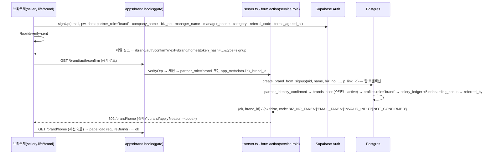

# 브랜드 콘솔 구현 계획 — `apps/brand` 데모 → 실서비스 (sellery.life/brand/*)

> **상태(2026-09-21): 계획만.** 코드·마이그레이션 없음. 인플루언서 콘솔 1~5단계(`docs/inf-console-plan.md §7`, PR #19~#30)가 끝났고, 그 골격(`(console)` 그룹 · `PartnerShell` · `requireSeller()` · form action · `{ok, code}` RPC 관례 · `partner-admin.mjs`)을 **그대로 복사**해 `apps/brand` 를 localStorage 데모에서 브랜드 콘솔로 바꾼다. 인플루언서 계획서 §9 "이후(브랜드 콘솔·관리자)에 그대로 적용되는 것" 이 이 문서의 씨앗이다.
>
> 근거(전부 저장소 안): `docs/inf-console-plan.md`(§0 결정 · §4 인증 · §5.4 함수 관례 · §6 화면 · §7 단계 · §9) · `apps/influencer/src/**`(`hooks.server.ts` 게이트 · `(console)` `(demo)` 그룹 · `lib/demo.ts` · `auth/{confirm,signout}`) · `packages/db/src/server/partner/*.server.ts` · `packages/db/src/partner/*.ts` · `packages/db/src/console-paths.ts` · `packages/ui/src/site/console/*` · `packages/db/scripts/{partner-admin,dev-seller}.mjs` · `supabase/migrations/0001~0013` · `supabase/seed.sql` · 데모 `apps/brand/src/routes/**` · `packages/core/src/{actions,helpers,constants}.ts` · `docs/{app-plan,data-model,deploy,period-policy,sample-policy,settlement-policy,grade-policy}.md`.
>
> 범위: **브랜드 쪽만.** 관리자 콘솔(`apps/admin`)은 그 다음이고, 그때까지 관리 작업(상품 검수 · 정산 실행 · 정지)은 `partner-admin.mjs` + `npx supabase db query --linked` 다. 데모가 하는 일만 옮기고 새 기능은 넣지 않는다. 데모와 정책 문서가 어긋나는 곳은 §8 열린 결정으로 넘긴다.

---

## 0. 결정 요약

브랜드 콘솔은 **기존 Vercel 프로젝트 `sellery-brand`(Root `apps/brand` · base `/brand`) 그대로**, `apps/shop/vercel.json` 의 `/brand/*` 리라이트도 그대로다(코드 0줄). 앱 안을 인플루언서와 같은 두 그룹 `(console)`(SSR · 세션 게이트) · `(demo)`(지금의 데모 화면 전부 · dev 또는 `PUBLIC_DEMO=1` 만) 로 나눈다. 로그인은 같은 이메일/비밀번호 + token_hash 인증 메일, 가입은 **인증 완료 즉시 `brands` 행 생성(수동 심사 없음)** — 사업자 확인은 가입 심사가 아니라 **상품 `pending` 검수 게이트**(0002 `products.status` 기본값 `'pending'`, 관리자만 `listed`)가 맡는다. 브랜드가 하는 일은 캠페인 상태 기계의 브랜드 차례 4개(`ST[*].turn==='brand'`: `SAMPLE_REQUESTED` `SAMPLE_APPROVED` `SAMPLE_PURCHASED` `SCHEDULE_PROPOSED`)와 상품 · 주문 발송 · CS · 정산 열람이고, 단계 순서는 **인플루언서 흐름을 먼저 뚫는 것**(샘플 승인·발송)이 우선이다. 🥬(제안권 · 데이터 열람 · 충전)는 인플루언서 §5.8 과 같은 규제 게이트 뒤.

| # | 결정 | 이유 |
|---|---|---|
| 1 | 경로 모드 `sellery.life/brand/*` · 프로젝트 `sellery-brand` · 리라이트 유지, 호스트(`brand.sellery.life`) 없음 | `docs/deploy.md §1.1·§2` 에 이미 있는 토폴로지. 인플루언서도 경로 모드로 확정(monorepo-migration 결정 11). `console-paths.ts` 는 `brand → '/brand'` 를 이미 안다(`PREFIX_OF`). |
| 2 | `apps/brand` 를 `ssr=false` 데모 SPA 에서 **SSR 콘솔 + `(demo)` 그룹**으로 — `apps/influencer` 와 같은 파일 배치(`hooks.server.ts` `sequence(supabase, gate)` · `(console)/+layout.server.ts` 표시용 `me` · `[...rest]` 404 · `(demo)/+layout.server.ts` `demoEnabled()` 404) | 인플루언서 앱이 검증한 골격. 데모 화면은 지우지 않고 `(demo)` 로 옮긴다 — 제안서 PDF 시연·디자인 참고용(`PUBLIC_DEMO` 는 deploy.md §1.2 에 "예약 — 지금 코드는 읽지 않는다" 로 이미 있음). |
| 3 | 인증 = 이메일/비밀번호 + token_hash `/brand/auth/confirm` · `user_metadata.partner_role='brand'` · Supabase 이메일 템플릿은 **공유**(역할 중립 '셀러리 파트너', inf §4.8) | 브랜드 전용 템플릿은 프로젝트당 1벌이라 둘 수 없다. `isPartnerUser()` 는 이미 `'brand'` 를 허용(`packages/db/src/auth.ts`). |
| 4 | 가입 = 인증 즉시 `create_brand_from_signup()`(**0014**, `partner_identity_confirmed` 위) → 즉시 입장. 필드 상호 · 사업자등록번호(형식 `\d{3}-?\d{2}-?\d{5}` 만) · 담당자 · 연락처 · 카테고리 · 약관. 사업자번호 **진위확인 API 는 후속**(§8) | 프로토타입 `login.html` 브랜드 가입이 자동 입장(inf §9). 실브랜드의 사업자 확인이 필요하지만 **돈이 움직이기 전에 두 게이트가 이미 있다** — (a) 상품은 `pending` 으로 등록되고 관리자가 `listed` 로 바꿔야 인플루언서에게 보인다(0002 · `listProductsForSeller` 는 `status='listed'` 만), (b) 정산 지급은 계좌·사업자 정보가 있어야 하고(`settlements.hold_brand`) 실행은 관리자다. 가입 심사 화면·`/pending` 을 만들지 않아도 안전. `brands_biz_no_uidx`(0001) 가 중복 사업자번호를 막는다(`BIZ_NO_TAKEN`). |
| 5 | 게이트 = hooks 는 세션 유무만, 모든 page load · form action 이 **`requireBrand()`**(`brands.user_id and active`) — 상태 `anon` · `foreign` · `guest` · `suspended` · `ok` | `requireSeller()` 와 같은 5상태(`seller.server.ts` `SellerContext`). 경로 모드라 고객·인플루언서 세션이 `/brand` 에 그대로 붙으므로 `foreign`(파트너 아닌 세션 **또는 `partner_role='seller'` 세션**) → `/brand/login?switch=1`. |
| 6 | 셸 = `PartnerShell role="brand"` — `TABS.brand` 는 이미 있다(`PartnerShell.svelte`). 5탭을 **홈 · 상품 · 캠페인 · 주문 · 내 정보** 로 바꾼다(지금은 seller 와 동일 · `/sales` 자리) | 브랜드의 매일 할 일은 발송·CS 이지 매출 열람이 아니다. `/sales` `/settle` `/cs` 는 홈 카드와 주문·내 정보 탭 안의 링크로. 데모의 10탭(DM · 갤러리 · 셀러리 샵 포함)은 1차에서 뺀다. |
| 7 | 샘플 브랜드 측 = 승인 · 거절 · 발송(**택배사 + 송장 필수**) — `campaigns.sample_courier`(0015) 추가 | 0003 `campaigns` 에 `tracking_no` 만 있고 택배사 열이 없다. 데모 `shipSample` 은 빈 송장을 `6890-XXXX-XXXX` 로 자동 생성(actions.ts L179) — 실서비스는 입력 필수, `carriers.ts` 의 5개 택배사 목록·`trackingUrlOf()` 로 인플루언서 화면에 조회 링크. |
| 8 | 일정 = 브랜드는 **확정 · 반려**만(데모 `confirmSchedule` · `rejectSchedule`). 제안은 인플루언서(`proposeSchedule`) — 인플루언서 콘솔에 아직 없으므로 **3단계에 인플루언서 짝 PR 을 포함** | 데모에 브랜드 측 제안 액션이 없다(`packages/core/src/actions.ts` — `proposeSchedule` 은 seller 분기). `periodBlock` · `stockLeft` 검사는 제안·확정 양쪽 SQL 에서(data-model §5.2 T11·T12). |
| 9 | 상품 = 등록·수정·노출 토글·삭제(soft `deleted_at`) 는 브랜드, **검수(`pending → listed / rejected`) 는 관리자** — 화면 전까지 `partner-admin.mjs review-product` | 데모 `approveProduct/rejectProduct` 는 관리자 액션. 잠금 규칙은 데모 `saveProduct` 그대로: `SCHEDULE_CONFIRMED/LIVE/CLEARING` 캠페인이 있으면 소비자가·판매가·수수료율 불변, `listed` 에서 가격·요율이 바뀌면 `pending` 재검수. `products` 에 `locked` 열은 없다(0002) — 함수 안에서 캠페인 존재로 판정. |
| 10 | 주문 = 포장 목록(수취인 정보 포함) · 발주서 CSV(BOM+CRLF, 데모 `poCSV` 열) · 운송장 등록(단건 · CSV 일괄) → `orders.courier/tracking_no/shipped_at` → 고객 `/account/orders` 의 `shipLabel()` 이 "발송" 으로 | 0004 에 열이 다 있고 `orders_unshipped_idx` 까지 있다. 발송 상태는 별도 열 없이 `status='PAID' and tracking_no` 로 판정(0004 헤더). 발주 이메일 자동 발송(`po_enabled/po_email`)은 설정 저장만 — 발송은 크론이라 관리자 이후. |
| 11 | CS = **새 테이블 없음** — `cs_conversations` · `cs_messages`(0005) 가 이미 `brand_id` 를 갖고 브랜드로 바로 간다. 브랜드 답글 · 종료 RPC 만 추가. 단 **고객 접수 화면이 `apps/shop` 에 아직 없다** → 4단계에 shop 짝 PR | `apps/shop/src` 어디에도 `cs_conversations` 참조가 없다. 접수 없이는 답글 화면이 빈 표다. |
| 12 | 정산 = 읽기 전용(`settlements.brand_payout` 등 0004 열 · `payouts payee_type='brand'`) + 정산 정보 등록(계좌 · 사업자 · 통신판매업 · 서류). 정산 **실행은 관리자**(0013 헤더와 같은 선). 표 열은 데모 표시 버그(§8)를 재현하지 않는다 | 0004 에 브랜드 열이 전부 있고 `app_seller_settlements` 가 본이다. |
| 13 | 등급 · 할인 = 표시만(`brand_grade_for_gmv(brand_gmv(id))` 0001·0004 · `brand_grade_tiers.fee_discount`) | 재계산은 주문·정산 시 서버(data-model §2.1). |
| 14 | 🥬(다이아·블랙 제안권 10🥬 `celery_spend('brand',…)` · 데이터패스 · 데이터/레퍼런스 열람 `data_views` · 충전 · 셀러리 샵) = **6단계, 규제 게이트**(inf §5.8) | 브랜드 🥬 잔액은 시드 입점 이벤트 5 + 관리자 지급뿐. 인플루언서 초대(3단계)는 **골드 이하만** 🥬 없이 — 다이아·블랙 초대는 6단계에서 `celery_spend` 로 연다. |
| 15 | 마이그레이션은 **0014 부터 단계마다 새 번호**, 0010~0013 은 손대지 않는다. 함수는 전부 security definer · service_role 만 · `{ok, code}` 반환(0010~0013 관례) | inf 결정 12. |

---

## 1. 주체별 흐름 — 두 콘솔을 잇는 상태 기계

한 캠페인은 인플루언서 콘솔(`/influencer/campaigns/[code]`)과 브랜드 콘솔(`/brand/campaigns/[code]`)이 **같은 `campaigns` 행 · 같은 `campaign_events` 스레드**를 양쪽에서 본다. 상태마다 다음 차례가 정해져 있고(`packages/core/src/constants.ts` `ST[*].turn`), 브랜드 콘솔의 액션 패널은 데모 `CampaignDetail.svelte` 의 브랜드 분기를 그대로 옮긴다. 시스템 전이(`SCHEDULE_CONFIRMED → LIVE` 시작일 도래 · `LIVE → CLEARING` 종료일 경과 · `CLEARING → SETTLED` 정산 실행)는 이 문서 범위 밖(관리자 · 크론).

| 상태 | 다음 차례 | 브랜드 콘솔 | 인플루언서 콘솔 | 전이(누가 · RPC) |
|---|---|---|---|---|
| `SAMPLE_REQUESTED` | 브랜드 | `/brand/requests` · 상세 [승인] [거절] | 대기 표시 | 브랜드 `app_brand_approve_sample` → `SAMPLE_APPROVED` · `app_brand_reject_sample` → `REJECTED` (2단계) |
| `INVITED` | 인플루언서 | 대기 표시 | [수락] [거절] — **콘솔에 아직 없음** | 인플루언서 `app_accept_invite` → `SAMPLE_APPROVED`(데모 `acceptInvite`) · `app_decline_invite` → `DECLINED` (3단계 짝 PR) |
| `SAMPLE_APPROVED` · `SAMPLE_PURCHASED` | 브랜드 | 상세 [발송 처리] 택배사 + 송장 · 배송지 = `campaigns.sample_shipping`(0011) | 대기 표시 · 결제 내역(`samplePaidLine`) | 브랜드 `app_brand_ship_sample` → `SAMPLE_SHIPPED` (2단계) |
| `SAMPLE_SHIPPED` | 인플루언서 | 송장 표시 | [수령 확인] — 있음(`app_receive_sample` 0011) | 인플루언서 → `TESTING`(`test_due` +14) |
| `TESTING` | 인플루언서 | 대기 표시 | [일정 제안] 시작일 · 기간 · 수량 — **콘솔에 아직 없음** | 인플루언서 `app_propose_schedule` → `SCHEDULE_PROPOSED` (3단계 짝 PR) · (패스 `PASSED` 는 이후) |
| `SCHEDULE_PROPOSED` | 브랜드 | 상세 [일정 승인] [반려] | 대기 표시 | 브랜드 `app_brand_confirm_schedule` → `SCHEDULE_CONFIRMED` · `app_brand_reject_schedule` → `TESTING` (3단계) |
| `SCHEDULE_CONFIRMED` | 시스템 | 확정 일정 · 배정 수량 · 재고 잔여 | 링크 미리보기 | 시작일 도래 → `LIVE`(관리자·크론) |
| `LIVE` | 시스템 | 실시간 주문 · `/brand/orders` 발송 · 링크 복사 | `/influencer/sales` | 종료일 경과 → `CLEARING` |
| `CLEARING` | 시스템 | 환불 처리 · 정산 예정액(D+21) | 정산 예정액 | 정산 실행 → `SETTLED`(관리자) |
| `SETTLED` | — | `/brand/settle` 명세 | `/influencer/settle` | — |
| `DECLINED` `REJECTED` `PASSED` | — | 종결 사유(`decision_reason`) | 종결 사유 | — |
| (모든 상태) | 양쪽 | 스레드 답글 `app_campaign_chat` — `campaign_events(kind='chat', sender='brand')` · 연락처 감지 `leak_flag` | 같은 함수 `sender='seller'` | 3단계 — 인플루언서 콘솔도 아직 읽기만이라 **한 함수를 두 앱이 쓴다** |

`campaign_events.event_type` 는 자유 텍스트지만 어휘는 0003 주석 목록을 쓴다: `sample_approved` `sample_rejected` `sample_shipped` `invited` `invite_accepted` `invite_declined` `schedule_proposed` `schedule_confirmed` `schedule_confirmed_priority` `schedule_rejected` `cs_replied`. 시스템 메시지 본문은 데모 `pushSys` 원문에서 `<b>` 만 제거(0011·0012 관례).

---

## 2. 앱 · 저장소 구조

```
apps/brand/src/
├─ app.html                         EDIT  noindex 메타 유지 · Google Fonts(site.css) — 데모 theme.css 는 (demo) 레이아웃에서만
├─ hooks.server.ts                  EDIT  sequence(supabase, gate) — influencer 판 복사 · base '/brand' · 공개 경로 CONSOLE_PUBLIC_PATHS · (demo) 예외
├─ lib/demo.ts                      NEW   DEMO_PATHS = ['/demo','/demo-login','/camps','/dm','/orders-demo',…] · isDemoPath · demoEnabled (influencer 와 동일 시그니처)
├─ lib/server/{env,db,partner}.ts   NEW   influencer 와 같은 배럴 — partner.ts 는 @sellery/db/server/brand/* 를 export
└─ routes/
   ├─ (console)/                    NEW   +layout.server.ts(getBrandContext → me) · +layout.svelte(PartnerShell role="brand") · +page.server.ts(→ /home) · [...rest] 404
   │  ├─ auth/{confirm,signout}/+server.ts   influencer 판 복사 — confirm 은 createBrandFromSignup(user) 호출 · recovery → /brand/password/new
   │  ├─ {login,signup,verify-sent,password,password/new,apply,suspended}/   §3
   │  ├─ home/ products/ products/new/ products/[code]/ requests/ campaigns/ campaigns/[code]/ orders/ orders/po.csv/+server.ts cs/ cs/[code]/ sales/ settle/ settle/doc/ my/   §5
   └─ (demo)/                       MOVE  지금의 routes/** 전부(+layout.ts ssr=false · +layout.svelte DemoBanner+AppShell 10탭 · 화면 14개) → 경로는 그대로(/camps /orders …)지만 (console) 와 겹치는 /products /orders /cs /sales /settle /my 는 /demo-* 로 이름 변경
packages/db/src/
├─ brand/                           NEW   순수 규칙 — signup-rules.ts(BIZ_NO_RE · parseBrandSignupMeta · 문구) · product-rules.ts(parseProductInput · 잠금 판정 문구 · 이미지 ≤4) · fulfill-rules.ts(발주 CSV 열 · 운송장 CSV 파서 · 택배사) · cs-rules.ts · settle-rules.ts(브랜드 표 · brand_payout 라인)
├─ server/brand/                    NEW   brand.server.ts(getBrandContext · requireBrand · brandPath) · signup.server.ts · products.server.ts · campaigns.server.ts · orders.server.ts · cs.server.ts · sales.server.ts · settle.server.ts · my.server.ts
└─ server/partner/campaigns.server.ts  EDIT  proposeSchedule · acceptInvite · declineInvite · postChat (인플루언서 짝, 3단계)
packages/db/scripts/
├─ dev-brand.mjs                    NEW   dev-seller.mjs 복사 — --email --brand <b1|uuid> [--password] · createUser(partner_role:'brand', app_metadata.link_brand_id) + create_brand_from_signup(p_link_id) · production 거부
└─ partner-admin.mjs                EDIT  brands [--inactive] · suspend-brand <b> · reactivate-brand <b> · link-brand <b> <user_id> · invite-brand <email> --link <b> · products [--pending] · review-product <p> listed|rejected ["사유"]
packages/db/package.json            EDIT  exports "./brand/*" · "./server/brand/*"
scripts/check-boundaries.mjs        EDIT  apps/brand 의 @sellery/core 데모 import 는 (demo) 밖이면 error
supabase/migrations/0014~0018       §4
docs/{deploy,data-model,app-plan}.md  EDIT  §1.2 env(sellery-brand 에 SUPABASE_SERVICE_ROLE_KEY · SLACK_WEBHOOK_URL 추가 · PUBLIC_DEMO 의미 확정) · §7·§9 · §10.1 파티션 J
```

인플루언서와 **공유하는 파일**(수정 없이 import): `packages/db/src/console-paths.ts`(`consolePath('brand', …)` · `CONSOLE_PUBLIC_PATHS`) · `auth.ts`(`isPartnerUser` · `safeNext`) · `carriers.ts` · `order-status.ts` · `partner/sample-rules.ts`(`campaignChip` · `CAMPAIGN_STEPS` · `parseShippingInput` · `parseStoredShipping` · `samplePaidLine`) · `partner/settle-rules.ts`(`BANKS` · `maskAccount` · `maskBizNo` · `normalizeBizNo` · `settleDue`) · `server/partner/seller.server.ts` 의 `rateLimit` · `server/partner/slack.server.ts` · `server/{config,admin,auth,event}.server.ts` · `packages/ui/src/site/console/{PartnerShell,ConsoleTabs,CampaignStepper,ShippingFields,CopyButton}.svelte` · `packages/ui/css/site.css`. `SellerSummary` 처럼 `BrandSummary` 는 새로 만든다(공유 안 함).

### 2.1 환경변수 (`sellery-brand` 에 추가되는 것만 — 이름 표는 `docs/deploy.md §1.2`)

| 이름 | Production | Preview | 용도 · 단계 |
|---|---|---|---|
| `SUPABASE_SERVICE_ROLE_KEY` | 비밀 | 비밀 | `requireBrand()` · 모든 읽기·RPC (지금 brand 열은 "—") · 1단계 |
| `PUBLIC_DEMO` | `1` → 2단계 병합 후 제거 | (없음) | `(demo)` 그룹 노출 · deploy.md "예약" 상태를 실제로 읽기 시작 · 1단계 |
| `SLACK_WEBHOOK_URL` | 선택 | 선택 | 브랜드 가입 · 샘플 요청 대기 · CS 접수 한 줄(브랜드 코드 · 유형만) · 1·4단계 |
| `PUBLIC_SITE_URL` | 변경 없음 | 변경 없음 | 판매 링크 복사 · 초대 메일 `redirectTo` |
| 토스 키 · `RRN_ENC_KEY` | (없음) | (없음) | 브랜드 결제는 6단계, 주민번호는 브랜드에 없음 |

- 파티션(app-plan §10.1): **J 브랜드 콘솔** = `apps/brand/src/**` · `packages/db/src/{brand,server/brand}/**` · `dev-brand.mjs` · `partner-admin.mjs` 브랜드 서브커맨드 · 0014~0018. 인플루언서 짝 PR(3·4단계)은 파티션 I 안에서 별도 PR.
- CI 변경 없음(`npm run check` 가 4 앱 svelte-check · `npm test` vitest · `check-boundaries`). Preview URL `https://sellery-brand-git-<branch>-weglow-team.vercel.app/brand/…`.

---

## 3. 인증 · 게이트

| 항목 | 결정(인플루언서 §4 와 다른 점만) |
|---|---|
| 가입 폼 `/brand/signup` | 상호(1~40자) · 사업자등록번호(`/^\d{3}-?\d{2}-?\d{5}$/` → `normalizeBizNo` 로 `000-00-00000` 저장) · 담당자 이름 · 담당자 연락처(`/^0\d{1,2}-?\d{3,4}-?\d{4}$/`) · 카테고리(`'건강기능식품' \| '이너뷰티'` — 0001 `brands.category` check) · 이메일 · 비밀번호(`PASSWORD_RE` 공유) · 추천 코드(선택 · `brands.ref_code` 예 `VYNE-01`) · 약관. `signUp({ options: { emailRedirectTo: origin + '/brand/auth/confirm?next=/brand/home', data: { partner_role:'brand', company_name, biz_no, manager_name, manager_phone, category, referral_code, terms_agreed_at } } })`. |
| `/brand/auth/confirm` | influencer `auth/confirm/+server.ts` 복사 — `verifyOtp` 뒤 `partner = isPartnerUser(user) \|\| linkBrandIdOf(user) !== null` 이면 `createBrandFromSignup(user)`(멱등) → `ok` 면 `next`(기본 `/brand/home`), 아니면 `/brand/apply?reason=<code>` · `recovery` → `/brand/password/new`. 인플루언서 앱의 confirm 은 그대로(각 앱이 자기 `/auth/*` 를 가진다 — deploy.md §1 도식). |
| `create_brand_from_signup(p_user_id, p_name, p_biz_no, p_manager_name, p_manager_phone, p_category, p_referral_code default null, p_terms_agreed_at default now(), p_link_id default null) returns jsonb` (0014) | 한 트랜잭션 · 멱등. 1 `brands.user_id = p_user_id` 있으면 `{ok, already:true}` 2 `partner_identity_confirmed` 아니면 `NOT_CONFIRMED` 3 입력 재검사(`INVALID_INPUT`) 4 `p_link_id` 없으면 `biz_no` 중복 → `BIZ_NO_TAKEN`, `lower(email)` 중복 → `EMAIL_TAKEN`, insert(`code 'b'||nextval` · grade 스타터 · `ref_code 'SLRB-XXXX'` · `terms_agreed_at`) 5 있으면 시드 행 연결(`user_id` null 확인 → `LINK_TARGET_TAKEN`; name·biz_no 유지, email·terms 비었을 때만) 6 `profiles.role='brand'` 7 `celery_ledger(+platform_settings.onboarding_bonus_cel, 'onboarding_bonus', brand)` — 연결 경로는 `not exists` 가드(시드에 이미 있음) 8 `p_referral_code` = 다른 브랜드 `ref_code` 면 `referred_by`. |
| `requireBrand(event, { next })` | `brands where user_id` 1행 → `anon`(→ `/brand/login?next=`) · `foreign`(파트너 아님 **또는 `partner_role='seller'`/`link_seller_id`** → `/brand/login?switch=1&next=`) · `guest`(`partner_role='brand'` 인데 행 없음 → `/brand/apply`) · `suspended`(`active=false` → `/brand/suspended`) · `ok`. `BrandSummary = { id, code, name, category, grade, active, manager_name, has_bank_info, has_biz_doc, biz_no_masked, mail_order_no, po_enabled, po_email, ref_code, gmv, created_at }` + `balance`(`celery_balances owner_type='brand'`). 요청당 1회 `locals.memo`. |
| `/brand/apply` | guest 보완 폼(프리필) — `BIZ_NO_TAKEN`(다른 계정이 같은 사업자번호 — **자동 병합 없음**, 고객센터 안내) · `INVALID_INPUT` 만 온다. |
| 시드 브랜드 연결 | `brands.user_id` 는 시드에서 null(seed.sql:97 insert 열 목록에 없음). `partner-admin.mjs invite-brand <email> --link b1`(`inviteUserByEmail(data:{partner_role:'brand'}, redirectTo: SITE_URL + '/brand/auth/confirm?next=/brand/password/new')` + `app_metadata.link_brand_id`) 또는 로컬 `dev-brand.mjs --email … --brand b1`. 시드 이메일은 `partner@vyneherb.example` · `official@glohealth.example`(seed.sql — CLAUDE.md 의 데모 계정 `.co/.biz` 는 localStorage 데모 값) 이라 실제 메일은 못 받는다 → production 은 실제 담당자 메일로 초대. |
| `foreign` 전환 | 한 사람이 인플루언서·브랜드 둘 다면 `auth.users` 2행(이메일 2개). 같은 이메일로 두 역할은 지원하지 않는다(`brands.user_id unique` · `profiles.role` 단일값, inf §4.6). |
| 정지 · 복귀 | `partner-admin.mjs suspend-brand` / `reactivate-brand`. 정지된 브랜드의 `listed` 상품은 자동으로 내리지 않는다 — §8. |



가입 직후 홈의 "지금 할 일" 3장: 첫 상품 등록(→ 검수 대기 안내) · 정산 정보 등록(`/brand/settle`, 5단계 전엔 `/brand/my` 안내) · 사업자등록증 업로드. 인플루언서의 채널 인증에 해당하는 사칭 방어는 **상품 검수 + 사업자등록증 서류**다.

---

## 4. 데이터 · RPC 목록 (단계별 마이그레이션)

전부 security definer · `service_role` 만 execute · `{ok, code}` 반환 · 콘솔은 `requireBrand()` 의 `brand.id` 만 넘긴다(클라이언트가 보낸 id·금액 불신). 상태 전이는 `campaigns for update` → 현재 상태 검사(`NOT_YOUR_TURN` 대신 상태별 코드) → update → `campaign_events(kind='system')` 1행을 한 트랜잭션에.

| 번호 | 변경 | 계약(한 줄) | 전이 · 이벤트 |
|---|---|---|---|
| **0014** 1단계 | `brands.manager_phone text` · `brands.terms_agreed_at timestamptz` · `brand_code_seq`(0010 의 `seller_code_seq` 와 같은 방식) | 가입 폼 값. `terms_agreed_at` 은 sellers(0010) 와 짝 | — |
| 0014 | `create_brand_from_signup(…)` | §3 | — |
| **0015** 2단계 | `campaigns.sample_courier text check (in 5개 택배사)` · `campaigns.sample_shipped_at timestamptz` | 0004 `orders.courier` 와 같은 목록 | — |
| 0015 | `app_brand_upsert_product(p_brand_id, p_product_id null, p_input jsonb)` | 신규는 `status 'pending'`. 수정: `SCHEDULE_CONFIRMED/LIVE/CLEARING` 캠페인 있으면 `consumer_price/sale_price/commission_rate` 변경 → `LOCKED`; `listed` 에서 가격·요율 변경 → `pending`(재검수); `rejected` → `pending`; `commission_rate >= platform_settings.min_seller_rate`(데모 `max(5, 총요율−10)`) · `image_urls ≤ 4` · `category` FK(데모 기본값 `'건기식'` 은 FK 위반 — 폼은 `categories` 셀렉트) · 샘플 정책 4열 all-or-none(0002 제약) · `exclusive_grade` 골드 이상 · `exclusive_seller_id` 있으면 독점 해제 불가 · `stock` 은 `allocated` 이하로 못 내림(**데모에 없는 가드 — period-policy §4 지적**, §8) | — |
| 0015 | `app_brand_set_listing(p_brand_id, p_product_id, p_listed bool)` | `listed ⇄ paused` 만(`pending/rejected` 는 `NOT_REVIEWED`) | — |
| 0015 | `app_brand_delete_product(p_brand_id, p_product_id)` | 종결 아닌 캠페인 있으면 `HAS_ACTIVE`; `deleted_at=now()` | — |
| 0015 | `app_brand_approve_sample(p_brand_id, p_campaign_id)` · `app_brand_reject_sample(…, p_reason)` | `SAMPLE_REQUESTED` 만 · 상품이 내 것 · `sample_shipping` 존재 | → `SAMPLE_APPROVED` `sample_approved` / → `REJECTED` `sample_rejected`(`decision_reason`) |
| 0015 | `app_brand_ship_sample(p_brand_id, p_campaign_id, p_courier, p_tracking_no)` | `SAMPLE_APPROVED` 또는 `SAMPLE_PURCHASED` · 송장 필수(자동 생성 없음) | → `SAMPLE_SHIPPED` `sample_shipped`(payload courier·tracking_no) · `sample_courier/tracking_no/sample_shipped_at` |
| 0015 | `review_product(p_product_id, p_status, p_reason)` — 운영 스크립트 전용 | `pending → listed`(`stock` 0 이면 `default_stock_on_approve`) / `→ rejected`(사유 필수, 0002 제약) | — |
| 0015 | 읽기: 서비스 롤 select(`products where brand_id` · `campaigns where brand_id` + `sellers` 공개 열 + `campaign_events`) — RPC 없음(인플루언서 `listSellerCampaigns` 와 같은 방식). 인플루언서 이름·핸들·verified 채널만, `sample_shipping` 은 브랜드에 노출(발송용) | | |
| **0016** 3단계 | `app_propose_schedule(p_seller_id, p_campaign_id, p_start, p_len, p_qty)` — **인플루언서 짝** | `TESTING` 만 · `periodBlock`(플래티넘 이상 확정·진행 기간에는 플래티넘 이상만 — `grade_tiers.is_priority`) · `qty ≤ stock − allocated`(`SCHEDULE_CONFIRMED/LIVE` qty 합, 자기 제외) · `period_len_days` | → `SCHEDULE_PROPOSED` `schedule_proposed` · `proposed_*` |
| 0016 | `app_brand_confirm_schedule(p_brand_id, p_campaign_id)` · `app_brand_reject_schedule(…, p_reason)` | `SCHEDULE_PROPOSED` 만 · 확정 시 `periodBlock`·`stockLeft` 재검사(데모 `confirmSchedule`) · `price_locked/rate_locked` 스냅샷 | → `SCHEDULE_CONFIRMED` `schedule_confirmed`(`start_date/end_date/qty ← proposed_*`) / → `TESTING` `schedule_rejected`(`test_due` 유지 — 데모 동일) |
| 0016 | `app_brand_invite_seller(p_brand_id, p_seller_id, p_product_id, p_message)` | 상품 `listed` · 독점 잠김 아님 · 진행 중 쌍 없음(`campaigns_active_pair_uidx`) · **다이아·블랙은 `CEL_REQUIRED`**(6단계까지) | 새 행 `INVITED`(`invited=true`) `invited` |
| 0016 | `app_accept_invite(p_seller_id, p_campaign_id, p_shipping)` · `app_decline_invite(…)` — 인플루언서 짝 | `INVITED` 만 | → `SAMPLE_APPROVED` `invite_accepted`(`sample_shipping`) / → `DECLINED` `invite_declined` |
| 0016 | `app_campaign_chat(p_role, p_owner_id, p_campaign_id, p_body)` — 두 콘솔 공용 | 당사자 확인 · 본문 1~1000자 · 연락처/카톡 패턴 → `leak_flag=true` + 시스템 경고 1행(데모 `pushChat` 규칙) | `kind='chat'` `sender=p_role` `actor_role=p_role` |
| **0017** 4단계 | `app_brand_ship_order(p_brand_id, p_order_id, p_courier, p_tracking_no)` | `orders.status='PAID'` · 캠페인이 내 브랜드 · `is_sample=false` · 이미 송장 있으면 덮어쓰기 허용(`already` 아님, 정정용) | `courier/tracking_no/shipped_at=now()` — 상태 전이 없음(0004 판정 규칙) |
| 0017 | `app_brand_ship_orders(p_brand_id, p_rows jsonb[])` | CSV 일괄 — 행마다 `{order_code, courier, tracking_no}` · 실패 행은 `{code, reason}` 로 돌려주고 나머지는 적용(부분 성공) | 같음 |
| 0017 | 발주서 = `orders where campaign.brand_id and status='PAID'` 서비스 롤 select → `/brand/orders/po.csv` 서버 라우트(열 = 데모 `poCSV`: 주문번호·일자·상품·옵션·인플루언서·수취인·연락처·주소·수량·단가·금액·상태 · BOM + CRLF) | 수취인 개인정보 열람 = 브랜드 배송 목적(`/privacy` 제3자 제공 항목 확인, §8) | — |
| 0017 | `app_brand_save_po(p_brand_id, p_enabled, p_email)` | `brands.po_enabled/po_email` 저장만(발송 크론은 관리자 이후) | — |
| 0017 | 브랜드 환불 = 기존 `app_refund_precheck(p_order_id, p_actor='brand')` → 토스 취소 → `app_refund_record`(0008) 재사용 — 발송 후도 브랜드는 가능(app-plan L266 `'발송 후 환불 — 회수 필요'`) | 새 함수 없음 · `@sellery/payments` `checkout-sync` 의 취소 경로를 브랜드 form action 이 부른다 | `orders → REFUNDED` `refunded` |
| 0017 | `app_brand_cs_reply(p_brand_id, p_conversation_id, p_body)` · `app_brand_cs_close(…)` | `cs_conversations.brand_id` 일치 · `CLOSED` 면 `CLOSED` | `cs_messages(sender='brand', actor_role='brand')` + `status='ANSWERED'` `replied_at` `last_preview` / `CLOSED` `closed_at` · 캠페인 스레드 `cs_replied` |
| 0017 | `app_cs_open(p_campaign_code, p_order_code, p_type, p_buyer_name, p_body)` — **shop 짝**(고객 접수) | `campaigns` LIVE/CLEARING/SETTLED · `brand_id` 는 캠페인에서 파생 · `order_code` 해석 → `order_id` · 비회원은 `client_token` 으로 조회 | `cs_conversations(OPEN)` + `cs_messages(customer)` · `cs_received` |
| **0018** 5단계 | `app_brand_sales(p_brand_id)` | 0013 `app_seller_sales` 의 브랜드 판 — LIVE/CLEARING 캠페인별 `gross/refund/net/sample_net` · 브랜드 지급 예상 = `net − pg − sf − pfGross + bBoost + bDisc`(`calc().brandPay`) · `due_on` | — |
| 0018 | `app_brand_settlements(p_brand_id)` | `settlements` 스냅샷 열(`net` `pg_fee` `seller_fee` `platform_fee_gross` `brand_ref_boost` `brand_discount` `brand_payout` `sample_cel_cover` `status` `due_on` `paid_at` `hold_brand`) + `payouts(payee_type='brand')`. `platform_fee/platform_net` 은 싣지 않는다(admin 전용, data-model §5.2) | — |
| 0018 | `app_brand_settle_info(p_brand_id)` · `app_brand_set_settle_info(p_brand_id, p_input)` | `bank_info{bank,account,holder}` · `biz_no` · `mail_order_no` · 응답은 마스킹(`maskAccount` · `maskBizNo`) · 서류는 `partner-docs` 에 `brands/<id>/…`(0013 `uploadBizDoc` 패턴) | — |
| 0018 | `app_brand_update_profile(p_brand_id, p_input)` | 상호 · 담당자 · 연락처 · 로고(`public-assets` 업로드 후 URL) · `category` | — |
| 0018 | 등급 = `brand_grade_for_gmv(brand_gmv(p_brand_id))` 를 `app_brand_home` 응답에 — `brands.grade` 캐시는 정산 실행이 갱신 | — | — |
| **6단계(게이트)** | `app_brand_invite_seller` 의 다이아·블랙 분기 = `celery_spend('brand', id, −invite_cost_cel, 'invite')` · `app_brand_unlock_data(p_kind 'data'\|'ref')` → `data_views` + `free_ref_used`(월 5회 무료 다이아·블랙) · `partner_payments(owner_type='brand', kind 'topup'\|'shop')` · 셀러리 샵 아이템 `celery_purchases` | 0005·0012 열이 전부 예약돼 있어 테이블 추가 없음 | `invite`(cel_used) · `invite_refund`(거절 시 환급, 데모 `declineInvite`) |

적용 뒤마다 `npm run gen:types` · `docs/data-model.md §5.2`(서버 규칙 → RPC 이관 표시) · §9 갱신.

---

## 5. 화면 목록

URL 은 브라우저 기준(`sellery.life/brand/…`), 게이트는 각 `+page.server.ts` 의 `requireBrand()`, 쓰기는 전부 form action(JSON API 라우트 없음 — 인플루언서 4단계 PR-B 관례). 프로토타입 원본은 `apps/brand/src/routes/**`(데모) 와 `packages/ui/src/views/*`.

| URL | 프로토타입 원본 | 읽기(service role) | 쓰기(form action → RPC) | 단계 |
|---|---|---|---|---|
| `/brand/login` `/signup` `/verify-sent` `/password` `/password/new` | influencer `(console)/{login,signup,…}` 복사 + 데모 `LoginPage role="brand"` 카피 · `login.html` 브랜드 가입 분기 | — | Supabase Auth | 1 |
| `/brand/apply` `/brand/suspended` | influencer 판 | `brands.user_id` 유무 · `active` | `completeSignup` → `create_brand_from_signup` | 1 |
| `/brand/home` | `+page.svelte`(브랜드 홈) 중 **승인·처리 대기(`brandPending`) · 진행 중·확정 판매 카드 · 내 장부 4 KPI · 등급 카드** — 인플루언서 찾기·추천 프로그램·셀러리 샵은 제외 | `campaigns where brand_id`(상태별 카운트) · LIVE 주문 집계 · `brand_gmv` · `celery_balances` · 상품 상태 카운트(`pending` 검수 대기 안내) | — | 2(대기 큐·상품) · 5(장부·등급) |
| `/brand/products` | `products/+page.svelte`(표: 판매가·수수료율·샘플·재고·독점·상태·판매 일정) | `products where brand_id and deleted_at is null` + 캠페인 배정(`allocated`) | `?/toggle` → `app_brand_set_listing` · `?/delete` → `app_brand_delete_product` | 2 |
| `/brand/products/new` `/brand/products/[code]` | `modals/ProductModal`(데모 `productModal` — 이름·설명·카테고리·소비자가·판매가·총 수수료율(플랫폼 10 + 인플루언서)·재고·샘플 문구·샘플 정책 4개·독점 기준 등급·옵션·이미지 ≤4) | 상품 1행 + 잠금 여부(진행 캠페인 존재) + `categories` | `?/save` → `app_brand_upsert_product` · 이미지 `public-assets` 업로드(서버) | 2 |
| `/brand/requests` | 홈 "승인·처리 대기" + DM 요청함(`vDM` 브랜드 분기) | `campaigns where brand_id and status in (SAMPLE_REQUESTED, SAMPLE_APPROVED, SAMPLE_PURCHASED, SCHEDULE_PROPOSED)` + 인플루언서 요약(등급 · 팔로워 · verified 채널) | 행에서 바로 승인/거절(상세와 같은 액션) | 2 |
| `/brand/campaigns` | `camps/+page.svelte`(칩 필터 all/live/soon/prep/done · LIVE 카드 · 목록) — 캘린더는 이후 | `campaigns where brand_id` + `products` + 인플루언서 | — | 2 |
| `/brand/campaigns/[code]` | `views/CampaignDetail.svelte` 브랜드 분기(§1 표의 버튼) + `CampaignStepper` + 스레드 + 정산 미리보기(브랜드 관점 = `brandPay` 라인) | `campaigns`(내 브랜드 아니면 404) · `campaign_events` · `sample_shipping` · 샘플 결제(`samplePaidLine`) | `?/approve` `?/reject` `?/ship`(`ShippingFields` 아님 — 택배사 셀렉트 + 송장) · `?/confirmSchedule` `?/rejectSchedule` · `?/chat` | 2(샘플) · 3(일정·스레드) |
| `/brand/orders` | `orders/+page.svelte`(발주 CSV · 운송장 CSV 업로드 + 템플릿 · 자동 발주 토글 · 최근 주문 표 · 단건 운송장 모달 `trackOne` · 환불) | `orders join campaigns where brand_id`(미발송 우선 · `orders_unshipped_idx`) · 수취인 `shipping` | `?/ship` → `app_brand_ship_order` · `?/shipCsv` → `app_brand_ship_orders` · `?/po` → `app_brand_save_po` · `?/refund` → `app_refund_precheck/record` + 토스 · `GET /brand/orders/po.csv` | 4 |
| `/brand/cs` `/brand/cs/[code]` | `cs/+page.svelte`(OPEN 우선 · 답글 모달 `csReply` · 종료) | `cs_conversations where brand_id` + `cs_messages` | `?/reply` → `app_brand_cs_reply` · `?/close` → `app_brand_cs_close` | 4 |
| `/brand/sales` | `views/Sales.svelte`(시뮬 토글 제외) — 인플루언서 `/sales` 와 같은 골격, 라인만 브랜드 관점 | `app_brand_sales` | — | 5 |
| `/brand/settle` | `settle/+page.svelte`(표 + 계좌 미등록 경고) + `my/+page.svelte` 정산 정보 폼(은행 · 계좌 · 예금주 · 사업자번호 · 사업자등록증 · 통신판매업 신고번호) | `app_brand_settlements` · `app_brand_settle_info` | `?/save` → `app_brand_set_settle_info` · `?/uploadDoc` · `GET /brand/settle/doc`(서명 URL 300초) | 5 |
| `/brand/my` | `my/+page.svelte`(브랜드 정보 · 로고 · 담당자) + `BrandGrade`(등급 · 다음 등급까지 · 할인율) + 추천 코드 표시 | `brands` 1행 · `brand_grade_tiers` · `brand_gmv` | `?/save` → `app_brand_update_profile` · `?/logo` | 5 |
| (하단 탭) | `TABS.brand`(`PartnerShell.svelte`) | 홈 · 상품 · 캠페인 · 주문 · 내 정보 — 단계 전 탭은 `disabled`(`ConsoleTabs` 지원) | — | 1 |

1차에서 뺀 데모 화면: `/dm`(스레드로 대체 · 독점권 요청 승인/거절은 인플루언서 측 신청 화면이 없어 이후) · `/gallery`(인플루언서 갤러리 · 익명 스카우트 · 데이터 열람 — 6단계) · `/shop`(셀러리 샵 — 6단계) · `/s/[cid]` 미리보기(고객 사이트 `SITE_URL + /s/<handle>/<code>` 링크로 대체) · 캘린더(`Calendar brandView`) · `autoPropose`(관리자 액션).

---

## 6. 단계별 계획

각 단계 = PR-A(DB + `@sellery/db` 서버·순수 규칙 + vitest) → PR-B(화면). 1단계 PR 은 `apps/brand` 골격을 갈아엎으므로 다른 brand PR 이 없을 때 먼저 병합. 완료 기준의 DB 확인은 `npx supabase db query --linked`.

| 단계 | 범위 | 산출물(코드) | 완료 기준 | 사용자가 할 일 | 마이그레이션 |
|---|---|---|---|---|---|
| **1. 골격 + 가입/로그인** | `/brand/*` 가 SSR 콘솔 셸을 띄우고, 이메일로 가입한 브랜드가 인증 메일을 누르면 바로 `/brand/home` | PR-A: 0014 · `packages/db/src/brand/signup-rules.ts` · `server/brand/{brand,signup}.server.ts`(`getBrandContext` · `requireBrand` · `createBrandFromSignup` · `linkBrandIdOf`) · `dev-brand.mjs` · `partner-admin.mjs` `brands/suspend-brand/reactivate-brand/link-brand/invite-brand` · `package.json` exports · 테스트. PR-B: `apps/brand` 재구성(`hooks.server.ts` 게이트 · `(console)` 셸 · `(demo)` 이동 + `lib/demo.ts` · `auth/{confirm,signout}` · 7개 공개 화면 · `/home` "준비 중" 카드 · 탭 4개 `disabled`) · `check-boundaries` · deploy.md §1.2 | (a) 팀원 아닌 실제 이메일로 `/brand/signup`(상호·사업자번호·담당자·연락처·카테고리·약관) → 메일 링크를 **다른 기기**에서 열어도 `/brand/home` 에 상호·스타터 (b) `brands`(user_id·biz_no 정규화·terms_agreed_at·manager_phone) · `profiles.role='brand'` · `celery_ledger onboarding_bonus +5` 가 한 트랜잭션 · 링크 재클릭 → `already:true` (c) 같은 사업자번호로 재가입 → 인증 후 `/brand/apply?reason=BIZ_NO_TAKEN` (d) 인플루언서 계정으로 `/brand/home` → `/brand/login?switch=1`; 카카오 고객 세션도 같음 (e) `suspend-brand` 뒤 `/brand/products` 직접 접근 → `/brand/suspended`, `reactivate-brand` 후 복귀 (f) `dev-brand.mjs --brand b1` → 바인허브로 입장 · 원장 onboarding_bonus 1행 유지; `invite-brand --link b2` 메일 → `/brand/password/new` → 글로헬스 연결 (g) `PUBLIC_DEMO` 없는 Preview 에서 `/brand/demo` 404 · dev 에서는 데모 10탭 그대로 (h) 인플루언서 콘솔 회귀 없음(같은 이메일 템플릿) | Vercel `sellery-brand` env 추가 `SUPABASE_SERVICE_ROLE_KEY` · `SLACK_WEBHOOK_URL`(선택) · `PUBLIC_DEMO` 를 Production 에 **두는 기간 결정**(권장: 2단계 병합까지 `1` — 그 전엔 데모가 브랜드에게 보여줄 유일한 화면) · `db push`(0014) · 시드 브랜드 담당자 실제 메일 확보 | **0014** |
| **2. 상품 · 캠페인 읽기 · 샘플 승인/거절/발송** | 인플루언서가 낸 샘플 요청·구매를 브랜드가 처리해 인플루언서 [수령 확인] 까지 이어진다 — **인플루언서 흐름의 막힌 곳을 먼저 뚫는다** | PR-A: 0015 · `brand/product-rules.ts` · `server/brand/{products,campaigns}.server.ts` · `partner-admin.mjs products/review-product` · 테스트. PR-B: `/brand/products` `/new` `/[code]`(이미지 업로드) · `/brand/requests` · `/brand/campaigns` `/[code]`(승인·거절·발송 패널 · 스레드 읽기) · 홈 대기 큐 + 상품 상태 카드 · 탭 상품·캠페인 활성 | (a) 브랜드가 상품 등록 → `products.status='pending'` · 인플루언서 `/influencer/products` 에 안 보임 → `review-product p listed` → 보임 (b) `listed` 상품의 판매가 수정 → `pending` 재검수 · 진행 캠페인(c1) 상품 가격 수정 → `LOCKED` (c) 인플루언서 dev 계정이 무상 샘플 요청 → `/brand/requests` 에 1건 → [승인] → 인플루언서 상세 "샘플 승인" · `campaign_events sample_approved` (d) [발송 처리] 택배사·송장 → `SAMPLE_SHIPPED` + `sample_courier/tracking_no` → 인플루언서 [수령 확인] → `TESTING` · `test_due` (e) 샘플 구매 캠페인(`SAMPLE_PURCHASED`, 4단계 결제로 만든 것)도 같은 발송 패널 · 배송지 = `sample_shipping` (f) [거절] → `REJECTED` + `decision_reason` · 인플루언서 상세 종결 사유 (g) 다른 브랜드 캠페인·상품 코드 → 404 (h) 400px 가로 스크롤 없음 | `db push`(0015) · 상품 검수 담당자(`review-product`) 지정 · 이미지 업로드 한도(Vercel 4.5MB 본문 — inf §5.9 PR-B 기록) 확인 · Production `PUBLIC_DEMO` 제거 시점 | **0015** |
| **3. 일정 확정/반려 · 스레드 · 초대** | 테스트 뒤 인플루언서가 일정을 제안하고 브랜드가 확정하면 `SCHEDULE_CONFIRMED` — 판매 링크가 살아난다 | PR-A: 0016 · `server/brand/campaigns.server.ts` 확장 · **인플루언서 짝** `server/partner/campaigns.server.ts`(`proposeSchedule` · `acceptInvite` · `declineInvite` · `postChat`) · 테스트(`periodBlock` · `stockLeft` 케이스). PR-B(brand): 상세 [일정 승인] [반려] · 스레드 답글 폼 · `/brand/campaigns` 확정 일정 표시 · 초대 폼(상품 · 인플루언서 검색 — `sellers` 공개 열 · verified 채널 · 등급). PR-B(influencer, 파티션 I): 상세 [일정 제안](시작일 · 기간 · 수량 · `stockLeft` 표시) · INVITED [수락(배송지)] [거절] · 답글 폼 | (a) 인플루언서 `TESTING` 캠페인에서 일정 제안(qty ≤ 잔여) → `SCHEDULE_PROPOSED` → 브랜드 [일정 승인] → `SCHEDULE_CONFIRMED` + `start/end/qty` + `price_locked/rate_locked` (b) 플래티넘 이상이 확정한 기간에 골드가 제안 → `PERIOD_BLOCKED`(차단 인플루언서 이름) · 잔여 초과 → `STOCK_EXCEEDED` (c) [반려] → `TESTING` · 인플루언서가 다시 제안 (d) 브랜드가 골드 인플루언서 초대 → `INVITED` → 인플루언서 [수락] → `SAMPLE_APPROVED` + `sample_shipping`; [거절] → `DECLINED`; 다이아 초대 → `CEL_REQUIRED` 안내 (e) 양쪽 답글이 같은 스레드에 · `010-…` 포함 답글 → `leak_flag` + 경고 행 (f) `campaign_card`(고객 인증 모달)가 새 확정 캠페인을 "유효" 로 | `db push`(0016) · 기간 정책 재확인(플래티넘 우선 · 재판매 우선권은 미포함) · 초대 문구 검토 | **0016** |
| **4. 주문 · 발주 · 운송장 · CS** | LIVE 판매의 주문을 브랜드가 발송하고 고객 문의에 답한다 | PR-A: 0017 · `brand/{fulfill,cs}-rules.ts`(CSV 파서 · 열 정의) · `server/brand/{orders,cs}.server.ts` · 테스트. PR-B(brand): `/brand/orders`(표 · 단건/일괄 운송장 · `po.csv` · 자동 발주 설정 · 환불) · `/brand/cs` `/[code]` · 홈 미발송·OPEN 카드 · 탭 주문 활성. **shop 짝**(파티션 F/C): 판매 페이지 또는 `/account/orders` 의 "판매자 문의" 폼 → `app_cs_open` · 비회원 `client_token` 조회 | (a) 고객이 판매 링크로 주문(app-plan §11.3 #1) → `/brand/orders` 미발송 1건 · 수취인 표시 (b) 단건 송장 → `orders.courier/tracking_no/shipped_at` → 고객 `/account/orders` 행이 "발송"(`shipLabel`) · 고객 환불 버튼 사라짐(`isRefundable SHIPPED`) (c) 템플릿 CSV 3행 업로드 → 2행 적용 · 1행 사유 표시 (d) `po.csv` 가 BOM+CRLF · 엑셀에서 한글 정상 (e) 브랜드 환불 → 토스 취소 + `REFUNDED` + `refund_actor='brand'` (f) 고객 문의 접수 → `/brand/cs` OPEN → 답글 → `ANSWERED` · 고객 화면에 답글 · 종료 → `CLOSED` (g) 다른 브랜드 주문·문의 코드 → 404 | `db push`(0017) · 수취인 정보 열람 범위 `/privacy` 검토 · CS 알림 채널(§8) · 발주 이메일 발송 주체(크론 = 관리자 단계) | **0017** |
| **5. 정산 · 등급 · 내 정보** | 브랜드가 지급 예정액·정산 내역·등급을 보고 정산 정보를 등록한다 | PR-A: 0018 · `brand/settle-rules.ts`(브랜드 라인 · `brandPay` 표시 · 마스킹) · `server/brand/{sales,settle,my}.server.ts` · 테스트. PR-B: `/brand/sales` · `/brand/settle`(폼 + 서류 + 표) · `/brand/my`(정보 · 로고 · 등급 카드 · 추천 코드) · 홈 장부 4 KPI · 등급 카드 · 탭 내 정보 완성 | (a) 계좌·사업자번호·통신판매업 저장 → `brands.bank_info`(응답 마스킹) · `biz_doc_url` 이 `partner-docs` 경로 (b) `db query` 로 만든 `settlements` 1행이 표에 `brand_payout` · `hold_brand` 경고 → 계좌 등록 후 사라짐 (c) `/brand/sales` 의 LIVE 캠페인 net · 지급 예상액이 `calc().brandPay` 와 같음(테스트 벡터) (d) 등급 카드 = `brand_grade_for_gmv(brand_gmv)` · 시드 b1 골드 · b2 플래티넘(data-model §7) (e) 로고 업로드 → `public-assets` URL | `db push`(0018) · 브랜드 지급 수단(운영자 이체 + `payouts.paid` 스크립트, 인플루언서와 동일) · 세금계산서 발행 방식(§8) | **0018** |
| **6. (게이트) 🥬 · 데이터 열람 · 갤러리 · 셀러리 샵** | 규제 결론(inf §5.8) 뒤에만 | 다이아·블랙 초대 `celery_spend` · `/brand/gallery`(`data_views` 열람 · 월 5회 무료) · `partner_payments owner_type='brand'` 충전 · `/brand/shop` | (a) 다이아 초대 → 원장 −10 · 거절 시 `invite_refund` +10 (b) 데이터 열람 2🥬 → `data_views` 1행 · 다이아 브랜드는 월 5회 0🥬 | **법률 검토 결론** · 약관 | 0019 |

---

## 7. 검증 계획

- **정적**: `npm run check` · `npm test`(순수 규칙 — 사업자번호 정규화 · 잠금 판정 · `periodBlock`/`stockLeft` 벡터 · CSV 파서 · `brandPay` 계산은 `docs/settlement-policy.md §3` 예시 값으로) · `node scripts/check-boundaries.mjs` · `npm run build`. 마이그레이션은 `db push --linked --dry-run` 뒤 적용, `select proname from pg_proc where proname like 'app_brand_%'` · `has_function_privilege('service_role', 'app_brand_approve_sample(uuid,uuid)', 'execute')`.
- **클라우드 DB 개발 계정**: `dev-brand.mjs --email dev-brand@sellery.test --brand b1`(바인허브 · 시드 캠페인 c1 LIVE · c3 TESTING · c7 SAMPLE_REQUESTED · c10 SAMPLE_APPROVED · c9 SCHEDULE_PROPOSED 가 전부 b1 상품이라 단계 2·3 의 모든 상태를 시드로 바로 본다) + 기존 `dev-seller.mjs --seller s1`(지유). 두 브라우저 프로필(또는 시크릿 창)로 두 콘솔을 나란히.
- **교차 콘솔 시나리오(2~4단계 통합)**: 인플루언서 무상 샘플 요청(`/influencer/products/[code]`) → 브랜드 `/brand/requests` 승인 → 인플루언서 상세 "승인" → 브랜드 발송(택배사·송장) → 인플루언서 [수령 확인] → `TESTING` → 인플루언서 일정 제안 → 브랜드 확정 → `SCHEDULE_CONFIRMED` → `db query` 로 `start_date` 를 오늘로 당겨 `LIVE`(크론 없음) → 고객 판매 링크 주문(app-plan §11.3) → 브랜드 `/brand/orders` 송장 → 고객 `/account/orders` "발송" → 고객 문의 → 브랜드 답글. 각 걸음 뒤 `campaigns.status` · `campaign_events` 마지막 행 · 양쪽 콘솔 화면을 대조.
- **권한**: 두 브랜드 dev 계정(b1 · b2)으로 서로의 상품·캠페인·주문·문의 코드 → 404. 인플루언서 세션으로 `/brand/*` → `switch=1`. `partner_role` 을 `updateUser` 로 `'brand'` 로 바꾼 인플루언서 계정 → `guest` → `/brand/apply`(행 없음) — 게이트는 `brands.user_id` 가 진실.
- **1단계 curl · SQL 체크**(Preview URL 은 `https://sellery-brand-git-<branch>-weglow-team.vercel.app`):
  ```
  curl -sI https://sellery.life/brand/home                      # 302 → /brand/login?next=%2Fbrand%2Fhome (hooks 게이트)
  curl -sI https://sellery.life/brand/login                     # 200 · 콘솔 로그인(데모 LoginPage 아님)
  curl -sI https://sellery.life/brand/auth/confirm               # 302 /brand/login?error=auth (공개 경로 · 404 아님)
  curl -s  https://sellery.life/brand/robots.txt                 # Disallow: /
  curl -sI https://sellery.life/brand/demo                       # 404 (PUBLIC_DEMO 없음) · dev 는 200
  select code, user_id is not null as linked, active, grade, terms_agreed_at from brands order by created_at;
  select owner_type, reason, delta from celery_ledger where brand_id = '<id>';   -- onboarding_bonus 1행
  ```
- **2단계 상태 대조 SQL**: `select code, status, sample_courier, tracking_no, sample_shipped_at, test_due from campaigns where brand_id = '<b1>' order by updated_at desc limit 5;` · `select event_type, sender, left(body, 40) from campaign_events where campaign_id = '<c>' order by created_at;` — 인플루언서 콘솔 상세의 스레드와 행 수가 같아야 한다.
- **PR 규칙**: 단계마다 PR-A 는 마이그레이션 파일 헤더에 "규칙 → 코어 원본 → 여기서" 표(0011~0013 관례)를 쓰고 `docs/data-model.md §5.2` 를 갱신, PR-B 는 이 문서 해당 단계 행 끝에 "적용 기록(날짜)" 을 덧붙인다(inf §5.4·§5.9 방식). 정책 숫자 변경은 policy-change 이슈 + `constants.ts` + `platform_settings` + `docs/*-policy.md` 를 한 PR 에서.
- **수동으로 남는 것**: `LIVE`/`CLEARING`/`SETTLED` 전이(관리자 · 크론) · 상품 검수(`review-product`) · 정산 실행(`settlements` 행은 `db query` 로 만들어 표시 확인) · 발주 이메일 발송 · 사업자번호 진위 · 송장 배송 추적 상태(조회 링크만).

---

## 8. 열린 결정

| 항목 | 권장 | 이유 · 근거 |
|---|---|---|
| 사업자번호 진위확인(국세청 API) | 1단계는 형식 검사만, **관리자 콘솔에서 상품 검수와 함께** | 결정 4 — `pending` 게이트가 먼저 있다. API 키·호출 한도가 대시보드 작업. |
| 즉시 입장 vs 가입 심사 | 즉시 입장(결정 4) | 인플루언서와 같은 정책 · 심사 화면 없이 운영 가능 · 정지는 `suspend-brand`. 반대 근거(사칭 브랜드가 상품 등록)는 검수에서 걸러진다. |
| 이메일 템플릿 문구 | 공유(역할 중립 '셀러리 파트너') 유지 | 프로젝트당 1벌(deploy.md §5.5). 브랜드용 링크는 `.RedirectTo` 가 `/brand/auth/confirm` 이라 자동. |
| 하단 5탭 구성 | 홈 · 상품 · 캠페인 · **주문** · 내 정보(`/sales` `/settle` `/cs` 는 링크) | 결정 6. 대안(인플루언서와 같은 매출 탭)은 발송·CS 를 두 번 눌러야 한다. |
| 샘플 송장 택배사 열 | `campaigns.sample_courier` 추가(0015) | 0003 에 `tracking_no` 만 있음. 인플루언서 상세에 `trackingUrlOf()` 조회 링크를 주려면 택배사가 필요. |
| 재고를 배정량 아래로 내리는 수정 | **막는다**(`STOCK_BELOW_ALLOCATED`) | 데모에는 가드가 없다(period-policy §4 "코드가 보장하지 않음"). 정책 문서가 약속하는 "품절 사고 없음" 을 코드로. |
| 판매가 잠금이 옵션 가격에도 적용되는가 | 잠금 중 `options[].price` 도 불변 | 데모 `saveProduct` 는 옵션을 무조건 덮어쓴다(settlement-policy §14). 고객 결제 단가가 옵션가라 잠금 취지상 포함. |
| 총 수수료율 범위 | `min_seller_rate`(5%) 하한만 · 상한 없음(데모 동일) — 힌트 11~50% 는 문구 | 제안서 "11~50%" 는 검증 안 됨(period-policy §5). 상한을 정하면 policy-change 이슈. |
| 샘플 구매가의 등급 보너스 반영 | 미결 그대로(0011 은 미반영) — 브랜드 콘솔과 무관, sample-policy §7.2 | 인플루언서 계획서 결정 항목. |
| 정산 표 "플랫폼+PG" 열 | `pfGross − bBoost − bDisc`(브랜드 실제 부담) 로 표시 | 데모 표는 `pf`(보너스 차감 후)를 써서 `net − sf − (pf+pg) ≠ brandPay`(settlement-policy §11.3). |
| 정산 정보 완비 조건 | `bank·account·holder·biz_no` 4개 = `hold_brand` 해제 조건 하나로 | 데모는 세 화면이 세 조건(settlement-policy §8.3). |
| 세금계산서 | 플랫폼 → 브랜드 수수료 세금계산서: **발행은 범위 밖**, `/brand/settle` 에 "정산 명세로 갈음 · 세금계산서는 운영팀 발행" 문구 | 브랜드는 전원 사업자. 자동 발행(홈택스 API)은 관리자 이후. |
| 브랜드 지급 수단 | 운영자 은행 이체 + `payouts.paid` 스크립트(인플루언서 결정과 동일) | inf §5.9. |
| 수취인 개인정보를 브랜드에 노출 | 발송 목적 열람 허용 · `/privacy` 제3자 제공 항목에 "판매 브랜드(배송)" 명시 · `purge_checkout_pii` 보존 기간과 정합 | 브랜드 직배송 모델(app-plan)이라 불가피. 열람 로그(`sensitive_access_log` 재사용)는 6단계 검토. |
| 고객 CS 접수 화면 위치 | `/account/orders` 행의 "판매자 문의" + 판매 페이지 하단 링크 · 비회원은 주문번호 + `client_token` 링크 | shop 에 아직 없음(결정 11). 4단계 shop 짝 PR. |
| CS · 대기 큐 알림 채널 | Slack 한 줄(`SLACK_WEBHOOK_URL`) — 브랜드 코드 · 유형만 · 브랜드 담당자 이메일 알림은 이후 | 인플루언서 가입 알림과 같은 규칙(개인정보 없음). |
| 송장 조회 API | 없음 — `carriers.ts` `trackingUrlOf()` 링크만 | 배송 완료 판정 열(`delivered_at`)이 스키마에 없다. 필요해지면 새 번호. |
| 정지된 브랜드의 `listed` 상품 | 자동으로 내리지 않고 `suspend-brand` 가 경고 출력 → 운영자가 `review-product` 로 `paused` | 진행 중 캠페인·주문이 있을 수 있어 자동 처리는 위험. |
| 데모 `(demo)` 그룹의 수명 | 2단계 병합 후 Production `PUBLIC_DEMO` 제거 · 그룹은 admin 이식 뒤 `@sellery/core` 데모 상태와 함께 삭제 | monorepo-migration §6 "마지막 데모 화면이 사라질 때". |
| 브랜드 계정 다인원(`brand_members`) | 1차 미지원(`brands.user_id` 단일) — data-model §9.1 결정 2 | 필요 시 새 테이블 + `requireBrand` 조인 한 곳. |
| 독점권 요청 승인/거절(`exclusive_requests`) | 인플루언서 측 신청 화면과 함께 3단계 이후 별도 | 데모 브랜드 홈에 있지만 인플루언서 콘솔에 신청이 없다. |
