# 셀러리(Sellery) 데이터 모델 — Supabase(Postgres) 스키마

> **상태(2026-09-21): 0001~0011 클라우드 적용(0011 = 콘솔 3단계 샘플 견적 `app_sample_quote(s)` · `app_request_free_sample` · `app_receive_sample` · `campaigns.sample_shipping`) · 앱은 SvelteKit(`apps/shop` · `apps/influencer`) — S1~S5 + 도메인 전환 완료, `web/` 은 S5 PR-11 에서 삭제.** 아래 `web/src/lib/database.types.ts` · `web/scripts/*` · `cd web && npm run gen:types` 는 각각 `packages/db/src/database.types.ts` · `packages/db/scripts/*` · 루트 `npm run gen:types` 로 읽는다(마이그레이션 절차 정본은 [`deploy.md`](deploy.md) §6).

| 항목 | 내용 |
|---|---|
| 대상 | (주)위글로우 셀러리 — 건강·웰니스 브랜드 × 인플루언서 협업판매 플랫폼 |
| 원본 | 프로토타입 코드 — 분리 전 단일 파일 `index.html`(git `978ea1e:index.html`, 이하 OLD/index.html)과 현재의 `js/*.js`(같은 내용을 화면 단위로 나눈 것). `S.data.*` 컬렉션 19개 + 정책 상수 |
| 목표 인프라 | glo 프로젝트와 동일: Next.js + Vercel + Supabase(Postgres, Auth, RLS) |
| 현재 상태 | **클라우드 적용 완료(2026-09-15) · 앱 슬라이스 1 연동 중**. Supabase 프로젝트 `sellery`(ref `ocxppeuoiysnkwwujvko`, Seoul, Postgres 17)에 0001~**0008** `db push` + `seed.sql`(§7 15절 포함) 투입 완료. 실 DB 검증: 26개 테이블 RLS on · 정책은 공개 카탈로그 테이블에만 · anon `select *`/정산 조회 권한 거부 · 비공개 인플루언서(s4·s5)와 SETTLED 캠페인 anon 미노출 · `campaign_card()` 동작 · 버킷 2개 · 0008 스모크(§10.4) 통과 |
| 산출물 | `supabase/migrations/0001_init.sql` … `0008_app_checkout.sql`, `supabase/seed.sql`, 앱 타입 `web/src/lib/database.types.ts`(`npm run gen:types` 산출), 설계 노트 `docs/data-model-design-notes.md`, 분석 노트 `docs/analysis/*.md`, 앱 계획 `docs/app-plan.md` |
| 최종 수정 | 2026-09-15 (1차 리뷰 34건 반영 — design-notes.md §6; 2차 리뷰 high 2건 반영 — design-notes.md §7; 0007·0008 적용 반영 — §10) |

표기: 코드에서 확인한 사실은 `L####`(분리 전 단일 파일 OLD/index.html = `git show 978ea1e:index.html` 의 줄 번호)로 인용한다. 현재 트리에서는 같은 코드가 `js/00-core.js`(L1182~) · `js/01-seed.js`(L1214~) · `js/02-state.js`(L1372~) 등으로 나뉘어 있다(파일별 원본 범위는 CLAUDE.md 참고).

> **PR #2(2026-09-15, 고객 카카오 로그인·장바구니·내 주문) 이후**: 고객 세션은 localStorage `sellery-cust`, 장바구니는 `sellery-cart`(클라이언트 상태 — DB 미저장 대상), 주문에 `buyerId`(카카오 데모 계정 k1~k3)가 붙는다. 이 문서의 `customers`(user_id ↔ 카카오 auth) · `orders.customer_id` 에 그대로 대응되며, 장바구니는 테이블을 두지 않는다(체크아웃 시 주문으로만 생성). 프로토타입에 없어 설계자가 판단한 항목은 **추정** 으로 표시한다.

---

## 0. 한눈에 보기

- **테이블 26개 + 뷰 1개**, 마이그레이션 8개 파일(+ `0006_storage.sql` Storage 버킷, `0007` service_role 권한, `0008` 앱 체크아웃 — §10). 프로토타입 `S.data` 의 19개 컬렉션과 정책 상수를 전부 이관한다(§2 표).
- **프로토타입 id 보존**: 모든 핵심 테이블은 `id uuid` PK 와 별도로 `code text unique`(`'s1'`, `'b1'`, `'p1'`, `'c1'`, `'o101'` …)를 가진다. 시드가 1:1 로 매핑되고, 기존 판매 링크 형식 `/s/{handle}/{code}` 도 유지된다.
- **모든 쓰기는 서버(service role)**. 클라이언트(anon/authenticated 키)가 직접 읽는 것은 공개 카탈로그(브랜드·인플루언서·상품·공개 캠페인)와 본인 profile / 본인 orders 뿐. insert/update 정책은 어디에도 없다.
- **DB 가 강제하는 것**: 열거값(check), 참조 무결성(FK), 유니크(활성 캠페인 쌍, 정산 1회, primary 채널 1개 …), 캐시 동기화 트리거(등급·판매수량·brand_id). **앱이 강제하는 것**: 상태 전이 표, 등급 우선 기간제, 재고 배정, 가격 잠금, 샘플 한도, 🥬 잔액, 정산 수식, 링크 진입 보호, 마스킹(§5).

### 0.1 파일 구성

| 파일 | 테이블 / 객체 |
|---|---|
| `0001_init.sql` | `set_updated_at()`, `profiles`(+`handle_new_user()` 트리거), `app_role()`, `platform_settings`, `grade_tiers`, `brand_grade_tiers`, `grade_for_sales()`, `brand_grade_for_gmv()`, `categories`, `brands`, `sellers`(+`sellers_sync_grade` 트리거, `seller_is_public()` — 정책 헬퍼), `seller_channels` |
| `0002_products.sql` | `products`(+ `deleted_at` 소프트 삭제), `exclusive_requests`, `product_views` |
| `0003_campaigns.sql` | `campaign_code_seq`, `campaigns`(+`campaigns_fill_brand` 트리거, 활성 쌍 부분 유니크), 0001/0002 공개 정책의 최종본 교체(products·brands — 공개 캠페인 존재 기준), `campaign_card(text)` RPC, `campaign_events`(+ `actor_role`/`actor_user_id`) |
| `0004_orders_settlements.sql` | `customers`, `order_code_seq`, `orders`(+`orders_sync_sold_qty` 트리거, `recalc_campaign_sold_qty()`), `brand_gmv()`, `settlements`(요율 스냅샷 전부 + bigint), `payouts` |
| `0005_points_referral_cs.sql` | `celery_ledger`, `celery_balances`(뷰), `celery_purchases`, `data_views`, `referral_earnings`, `seller_external_sales`, `cs_code_seq`, `cs_conversations`, `cs_messages`(+ `actor_role`/`actor_user_id`) |
| `0006_storage.sql` | Storage 버킷 `public-assets`(공개) · `partner-docs`(비공개) |
| `0007_service_role_grants.sql` | `service_role` 에 `public` 스키마 전체 테이블·시퀀스·함수 권한 + `alter default privileges`(§8 주의 박스) |
| `0008_app_checkout.sql` | `checkout_sessions`(승인 전 주문), `payment_events`(토스 원문 로그), `orders` 결제/환불 컬럼 추가, `resolve_product_options()`, `campaign_card()` v2, 서버 전용 RPC `app_claim_checkout / app_confirm_checkout / app_refund_precheck / app_refund_record / app_checkout_reserved / expire_checkout_sessions / stale_checkout_sessions / purge_checkout_pii`, 공개 RPC `public_stats()` — §10 |
| `seed.sql` | 정책 상수 · 등급 · 카테고리 · 브랜드 2 · 인플루언서 8 · 채널 9 · 상품 10 · 캠페인 13(+ 앱 검증용 LIVE 2, 15절) · 주문 1,052 · 스레드 23(+4) · 원장 · 열람/독점/조회/외부판매 · 추천 보상 · CS |

### 0.2 공통 관례 (glo 마이그레이션과 동일)

- `uuid primary key default gen_random_uuid()`; 프로토타입 id 는 `code text unique`.
- 금액은 KRW `integer`(누적 합계·정산/지급 라인은 `bigint` — `sellers.m3_sales`, `brands.gmv_base`, `grade_tiers.min_m3_sales`, `brand_grade_tiers.min_gmv`, `settlements`/`payouts` 금액 라인), 비율은 `numeric(5,4)` + `check 0..1` (`0.2000` = 20%), 등급 보너스 `%p` 는 `numeric(4,2)`.
- 상태는 `text + check` — 프로토타입 열거값을 **그대로** 쓴다(대소문자 포함).
- 판매 기간·정산 기준일은 `date`, 이벤트 시각은 `timestamptz`. `created_at/updated_at` + `set_updated_at` 트리거.
- `jsonb`: 옵션, 이벤트 payload, 계좌 정보, 배송지, 결제 원문, 설정값.
- 모든 테이블 RLS ON + `revoke all … from anon, authenticated`. 공개 테이블만 컬럼 단위 `grant select (…)` + select 정책. 서버 전용 함수는 `revoke all on function … from public, anon, authenticated`.
- 모든 문장은 재실행 가능(`if not exists` / `drop … if exists` / `create or replace`).

---

## 1. ERD

`auth_users` 는 Supabase 의 `auth.users`(외부 스키마). 관계선 라벨은 FK 컬럼명. 가독성을 위해 핵심 컬럼만 표기했다(전체 컬럼은 마이그레이션 파일 참조).

```mermaid
erDiagram
  auth_users ||--o| profiles : "id"
  auth_users |o--o| sellers : "user_id"
  auth_users |o--o| brands : "user_id"
  auth_users |o--o| customers : "user_id"
  auth_users |o--o{ orders : "user_id"
  auth_users |o--o{ cs_conversations : "user_id"

  grade_tiers ||--o{ sellers : "grade"
  grade_tiers |o--o{ products : "exclusive_grade, sample_free_grade"
  brand_grade_tiers ||--o{ brands : "grade"
  categories ||--o{ sellers : "category"
  categories ||--o{ products : "category"

  brands |o--o{ brands : "referred_by"
  brands ||--o{ products : "brand_id"
  brands ||--o{ campaigns : "brand_id denormalized"
  sellers |o--o{ sellers : "referred_by"
  sellers ||--o{ seller_channels : "seller_id"
  sellers ||--o{ campaigns : "seller_id"
  sellers |o--o{ products : "exclusive_seller_id"
  products ||--o{ campaigns : "product_id"
  products ||--o{ exclusive_requests : "product_id"
  sellers ||--o{ exclusive_requests : "seller_id"
  products ||--o{ product_views : "product_id"
  sellers ||--o{ product_views : "seller_id"

  campaigns ||--o{ campaign_events : "campaign_id"
  campaigns ||--o{ orders : "campaign_id"
  customers |o--o{ orders : "customer_id"
  campaigns ||--o| settlements : "campaign_id unique"
  settlements ||--|{ payouts : "settlement_id"
  sellers |o--o{ payouts : "seller_id"
  brands |o--o{ payouts : "brand_id"

  sellers |o--o{ celery_ledger : "seller_id"
  brands |o--o{ celery_ledger : "brand_id"
  celery_ledger |o--o| celery_purchases : "ledger_id"
  sellers |o--o{ celery_purchases : "seller_id"
  brands |o--o{ celery_purchases : "brand_id"
  products |o--o{ celery_purchases : "product_id boost"
  brands ||--o{ data_views : "brand_id"
  sellers ||--o{ data_views : "seller_id"
  celery_ledger |o--o| data_views : "ledger_id"
  sellers |o--o{ referral_earnings : "referrer_seller_id, referred_seller_id"
  brands |o--o{ referral_earnings : "referrer_brand_id, referred_brand_id"
  campaigns |o--o{ referral_earnings : "campaign_id"
  settlements |o--o{ referral_earnings : "settlement_id"
  sellers ||--o{ seller_external_sales : "seller_id"
  campaigns ||--o{ cs_conversations : "campaign_id"
  brands ||--o{ cs_conversations : "brand_id"
  orders |o--o{ cs_conversations : "order_id"
  customers |o--o{ cs_conversations : "customer_id"
  cs_conversations ||--o{ cs_messages : "conversation_id"

  auth_users {
    uuid id PK "Supabase auth.users"
    text email
  }
  profiles {
    uuid id PK, FK "auth.users.id 1:1"
    text role "customer, seller, brand, admin"
    text email
    text full_name
    text phone
  }
  platform_settings {
    text key PK "pg_rate, platform_rate, wht_rate, clear_days, opex, shop_items ..."
    jsonb value
    text description
  }
  grade_tiers {
    text name PK "블랙 .. 스타터"
    integer sort_order UK "tierIdx 0 = 최상위"
    integer min_m3_sales
    numeric bonus_pp
    integer sample_quota
    integer data_price_cel
    boolean is_priority "플래티넘 이상"
  }
  brand_grade_tiers {
    text name PK
    integer sort_order UK
    bigint min_gmv
    numeric fee_discount
    integer free_ref_per_month
  }
  categories {
    text name PK "CATS 7종"
    text group_name "건강기능식품, 이너뷰티"
    integer sort_order
  }
  brands {
    uuid id PK
    text code UK "b1"
    uuid user_id FK, UK
    text name
    text category "건강기능식품, 이너뷰티"
    text biz_no "공개"
    text mail_order_no "공개"
    jsonb bank_info "service role"
    bigint gmv_base
    text grade FK "캐시"
    text ref_code UK
    uuid referred_by FK
    boolean auto_propose
    jsonb free_ref_used
    boolean po_enabled
    boolean active
  }
  sellers {
    uuid id PK
    text code UK "s1"
    uuid user_id FK, UK
    text name
    text handle UK "@jiyu_beauty"
    text platform
    text category FK
    integer followers
    bigint m3_sales "service role"
    text grade FK "트리거 캐시"
    text ref_code UK
    uuid referred_by FK
    boolean hidden
    text settle_type "personal, biz"
    jsonb bank_info "service role"
    text biz_no
    integer sample_extra
    boolean active
  }
  seller_channels {
    uuid id PK
    text code UK "ch1"
    uuid seller_id FK
    text platform
    text handle
    integer followers
    boolean verified
    boolean is_primary "seller 당 1개"
    text vcode
  }
  products {
    uuid id PK
    text code UK "p1"
    uuid brand_id FK
    text name
    text category FK
    integer consumer_price
    integer sale_price
    numeric commission_rate "인플루언서 몫"
    integer stock
    text status "pending, listed, paused, rejected"
    text reject_reason
    text exclusive_grade FK
    uuid exclusive_seller_id FK
    text sample_free_grade FK
    text sample_buy_mode "auto, fixed"
    integer sample_fixed_price
    boolean sample_refund
    jsonb options
    date boosted_at
    timestamptz deleted_at "소프트 삭제 — not null 이면 어디에도 노출 안 됨"
  }
  exclusive_requests {
    uuid id PK
    text code UK "x1"
    uuid product_id FK
    uuid seller_id FK
    text status "PENDING, APPROVED, REJECTED"
    timestamptz decided_at
  }
  product_views {
    uuid id PK
    uuid product_id FK
    uuid seller_id FK
    timestamptz viewed_at
  }
  campaigns {
    uuid id PK
    text code UK "c1 - 판매 링크"
    uuid seller_id FK
    uuid product_id FK
    uuid brand_id FK "트리거가 product 에서 채움"
    text status "ST 14종"
    boolean invited
    boolean auto_proposed
    boolean regongu
    integer cel_used
    boolean purchased
    integer sample_price
    text sample_method "cash, cel"
    boolean sample_refunded
    text tracking_no
    date test_due
    date proposed_start
    date proposed_end
    integer proposed_qty
    date start_date
    date end_date
    integer qty "배정 재고"
    integer price_locked "추정"
    numeric rate_locked "추정"
    integer sold_qty "orders 트리거 캐시"
    date home_featured_at
    text decision_reason "종결/일정반려 사유 (프로토타입에 없던 확장, 추정)"
    timestamptz settled_at
  }
  campaign_events {
    uuid id PK
    uuid campaign_id FK
    text kind "chat, system"
    text sender "표시 역할: seller, brand, admin, system"
    text actor_role "실제 발신 역할(감사): seller, brand, admin, system"
    uuid actor_user_id FK "auth.users, 관리자 대행 발신 등"
    text body
    text event_type "슬러그"
    jsonb payload
    boolean leak_flag
  }
  customers {
    uuid id PK
    uuid user_id FK, UK "null = 비회원"
    text name
    text phone
    jsonb address
  }
  orders {
    uuid id PK
    text code UK "o101"
    uuid campaign_id FK
    uuid customer_id FK
    uuid user_id FK
    text status "PAID, REFUNDED, CANCELED"
    text buyer_name
    integer qty
    integer unit_price
    integer amount "generated qty x unit"
    text option_name
    boolean is_sample
    jsonb shipping "브랜드만"
    text courier
    text tracking_no
    text payment_key
    timestamptz paid_at
    timestamptz refunded_at
  }
  settlements {
    uuid id PK
    uuid campaign_id FK, UK "캠페인당 1행"
    bigint net
    bigint sample_net
    numeric pg_rate
    numeric platform_rate
    numeric seller_rate
    text seller_grade
    text brand_grade
    numeric wht_rate "personal/null 0.033, biz 0"
    numeric ref_boost_rate "미적용 0"
    numeric ref_reward_rate
    numeric brand_ref_disc_rate
    numeric brand_ref_reward_rate
    bigint pg_fee
    bigint seller_fee
    bigint seller_bonus
    bigint ref_boost
    bigint ref_reward
    bigint brand_ref_boost
    bigint brand_ref_reward
    bigint brand_discount
    bigint platform_fee "admin 전용"
    bigint vat
    bigint platform_net "admin 전용"
    bigint seller_payout
    bigint brand_payout
    boolean hold_seller
    boolean hold_brand
    text status "pending, held, paid"
    date due_on "end_date + 21"
    timestamptz settled_at
  }
  payouts {
    uuid id PK
    uuid settlement_id FK
    text payee_type "seller, brand"
    uuid seller_id FK
    uuid brand_id FK
    bigint amount
    bigint wht
    text status "pending, held, paid"
    jsonb bank_snapshot
    timestamptz paid_at
  }
  celery_ledger {
    uuid id PK
    text owner_type "seller, brand"
    uuid seller_id FK
    uuid brand_id FK
    integer delta "0 금지"
    text reason "14 슬러그"
    text memo
    integer won "충전 결제액"
    text ref_type
    uuid ref_id
  }
  celery_balances {
    text owner_type "뷰 - sum delta"
    uuid owner_id
    integer balance
  }
  celery_purchases {
    uuid id PK
    text owner_type
    uuid seller_id FK
    uuid brand_id FK
    text item_id "datapass, featured, homefeature, regongu, boost, fastreview"
    integer price_cel
    uuid product_id FK
    uuid ledger_id FK
    date purchased_on
    date expires_on "null = 영구"
  }
  data_views {
    uuid id PK
    uuid brand_id FK
    uuid seller_id FK
    text kind "data, ref"
    integer price_cel
    boolean free
    uuid ledger_id FK
  }
  referral_earnings {
    uuid id PK
    text side "seller, brand"
    uuid referrer_seller_id FK
    uuid referred_seller_id FK
    uuid referrer_brand_id FK
    uuid referred_brand_id FK
    uuid campaign_id FK
    uuid settlement_id FK
    numeric rate
    integer amount
    date earned_on
  }
  seller_external_sales {
    uuid id PK
    uuid seller_id FK
    text product_name
    text brand_name
    text source
    integer price
    date seen_on
  }
  cs_conversations {
    uuid id PK
    text code UK "cs1"
    uuid campaign_id FK
    uuid brand_id FK
    uuid order_id FK
    uuid customer_id FK
    uuid user_id FK
    uuid client_token UK "비회원 식별"
    text buyer_name
    text type "CS_TYPES 4종"
    text status "OPEN, ANSWERED, CLOSED"
    timestamptz replied_at
    timestamptz closed_at
  }
  cs_messages {
    uuid id PK
    uuid conversation_id FK
    text sender "표시 역할: customer, brand, admin"
    text actor_role "실제 발신 역할(감사, not null): customer, brand, admin"
    uuid actor_user_id FK "auth.users, 관리자 대행 답변 등"
    text body
  }
```



---

## 2. 테이블별 설명

"핵심 컬럼" 은 역할을 이해하는 데 필요한 것만 적었다. "프로토타입 원천" 은 `S.data.*`(= `D_()`, L1611) 의 컬렉션 또는 상수 위치.

| 테이블 | 역할 | 핵심 컬럼 | 프로토타입 원천 |
|---|---|---|---|
| `profiles` | `auth.users` 1:1. **역할의 단일 진실**(customer/seller/brand/admin). 가입 시 트리거로 자동 생성(기본 customer). 승격은 서버만. | `id(=auth.users.id)`, `role`, `email`, `full_name`, `phone` | `localStorage['sellery-session']` + `login.html ACCOUNTS` (계정 디렉터리) |
| `platform_settings` | 정책 상수 key/value(jsonb). 수수료율·정산일·🥬 환산·추천 보상·샵 카탈로그·운영비(opex). | `key`, `value`, `description` | 상수 `PG_RATE/PLAT_RATE/WHT/CLEAR_DAYS`(L1212), `CELERY_PER`, `SAMPLE_CEL_WON`, `REF_*`, `BREF_*`, `OPEX_DEF`, `TOPUP`, `SHOP` + `S.data.opex`(관리자 오버라이드) |
| `grade_tiers` | 인플루언서 등급 마스터 7단계. 판정 = `m3_sales >= min_m3_sales` 인 행 중 `sort_order` 최소. | `name`, `sort_order`(tierIdx), `min_m3_sales`, `bonus_pp`, `sample_quota`, `data_price_cel`, `is_priority` | 상수 `GRADES`(L1488), `DATA_PRICE`(L1379), `sampleQuota`(L1458), `PRIORITY_TIER`(L1673) |
| `brand_grade_tiers` | 브랜드 등급 마스터 7단계(누적 GMV 기준). | `name`, `sort_order`, `min_gmv`, `fee_discount`, `free_ref_per_month` | 상수 `BGRADES`(L1520), `BG_DISC`(L1382), `freeRefLeft`(L1386) |
| `categories` | 상품/인플루언서 카테고리 7종 + 상위 그룹(건강기능식품/이너뷰티). | `name`, `group_name`, `name_en`, `sort_order` | 상수 `CATS`(L1936), `CAT_INFO`(L1937), `CATMAP`(L1406) |
| `brands` | 브랜드. 담당자·계좌·GMV·추천·자동 제안·자동 발주 설정 포함. 직접 테이블 공개 컬럼은 이름·로고·등급뿐 — 사업자번호·통신판매업번호는 판매 인증 모달용으로 `campaign_card()` RPC 로만 캠페인 단위 제공(미판매 브랜드 열거 방지). | `code`, `user_id`, `name`, `category`, `biz_no`, `mail_order_no`, `bank_info`, `gmv_base`, `grade`(캐시), `ref_code`, `referred_by`, `auto_propose`, `free_ref_used`, `po_enabled/po_email`, `active` | `S.data.brands[]` (L1224) + `S.data.autoPO`(전역 → 브랜드별로 이관, **추정**) |
| `sellers` | 인플루언서. 프로필·지표·정산 정보·추천·비공개 플래그. `grade` 는 `m3_sales` 변경 시 트리거가 재계산. | `code`, `user_id`, `name`, `handle`, `platform`, `followers`, `category`, `likes_avg`, `recent_likes`, `m3_sales`, `grade`, `ref_code`, `referred_by`, `hidden`, `settle_type`, `bank_info`, `biz_no`, `sample_extra`, `active` | `S.data.sellers[]` (L1241) |
| `seller_channels` | 인플루언서 채널(플랫폼별 핸들·팔로워·인증). seller 당 primary 1개, `is_primary ⇒ verified`. | `code`, `seller_id`, `platform`, `handle`, `url`, `followers`, `verified`, `is_primary`, `vcode` | `S.data.sellers[].channels[]` (L1243) |
| `products` | 상품. 가격·수수료율(인플루언서 몫)·재고·검수 상태·독점권 오퍼·샘플 정책·옵션·부스트. | `code`, `brand_id`, `name`, `category`, `consumer_price`, `sale_price`, `commission_rate`, `stock`, `status`, `reject_reason`, `trend`, `exclusive_grade/label/seller_id`, `sample_free_grade/buy_mode/fixed_price/refund`, `options`, `boosted_at` | `S.data.products[]` (L1287) |
| `exclusive_requests` | 독점권 신청. (product, seller) 당 PENDING 1건. 승인 시 서버가 `products.exclusive_seller_id` 세팅. | `code`, `product_id`, `seller_id`, `status`, `decided_at` | `S.data.exclusiveReqs[]` (L1281) |
| `product_views` | 인플루언서의 상품 조회 기록(브랜드 홈 "최근 조회"). 표시 문자열 대신 실제 시각. | `product_id`, `seller_id`, `viewed_at` | `S.data.productViews[]` (L1261) |
| `campaigns` | **협업판매 1건**(인플루언서 × 상품). 상태 머신·생성 경로 플래그·샘플 구매·일정 제안/확정·배정 재고·판매수량 캐시·정산 시각. `brand_id` 는 트리거가 product 에서 채우는 비정규화. | `code`, `seller_id`, `product_id`, `brand_id`, `status`, `invited`, `auto_proposed`, `regongu`, `cel_used/cel_refunded`, `purchased`, `sample_*`, `tracking_no`, `received_at`, `test_due`, `proposed_*`, `start_date`, `end_date`, `qty`, `price_locked/rate_locked`(**추정**), `sold_qty`(캐시), `home_featured_at`, `settled_at` | `S.data.campaigns[]` (L1302) |
| `campaign_events` | 캠페인 스레드 = 시스템 이벤트(상태 전이 이력 겸용) + 채팅. 시스템 행은 `event_type + payload` 로 정규화, 연락처 유출 감지는 `leak_flag`. `sender`(표시 역할)와 `actor_role`/`actor_user_id`(실제 발신자, 감사)를 분리 — 관리자 대행 발신은 `sender='brand', actor_role='admin'`. | `campaign_id`, `kind`, `sender`, `actor_role`, `actor_user_id`, `body`, `event_type`, `payload`, `leak_flag`, `created_at` | `S.data.messages{cid:[]}` (L1343) |
| `customers` | 구매 고객(카카오 로그인 → `user_id`, 비회원은 null). 프로토타입에 계정 모델 없음. | `user_id`, `name`, `phone`, `email`, `address` | (없음 — **추정**) |
| `orders` | **결제된** 주문(승인 전 시도는 `checkout_sessions`). 인플루언서 샘플 구매도 주문 1건(`is_sample`). 배송 완료 판정은 `status='PAID' and tracking_no is not null`. 0008 이 결제/환불 컬럼을 추가(§10.2). | `code`, `campaign_id`, `customer_id`, `user_id`, `status`, `buyer_name`, `buyer_phone`, `buyer_email`, `qty`, `unit_price`, `amount`(generated), `option_name`, `order_name`, `is_sample`, `shipping`, `courier`, `tracking_no`, `shipped_at`, `payment_*`, `paid_at`, `refunded_at`, `refund_reason`, `refund_amount`, `refund_actor`, `raw_payment`, `raw_cancel`, `checkout_session_id` | `S.data.orders[]` (L1327 `mkOrders`, L4355 `buyNow`) |
| `checkout_sessions` (0008) | **토스 결제 1건 = 세션 1건(승인 전 주문)**. `/api/checkout` 이 만들고 `/api/payments/confirm` 이 선점·확정한다. 상태 `PENDING → CONFIRMING → CONFIRMED | FAILED | EXPIRED`. 서버 전용 — 정책 없음. | `toss_order_id`(unique, 토스 orderId), `user_id`, `customer_id`, `campaign_id`, `option_index/option_name`, `qty`(1..10), `unit_price`, `amount`(generated), `order_name`, `buyer_*`, `shipping`, `status`, `payment_key`(부분 unique), `payment_method`, `approved_at`, `raw_payment`, `fail_code/fail_message`, `link_code`, `expires_at`(+30분) | (없음 — app-plan §5, glo `orders.pending` 의 대체) |
| `payment_events` (0008) | 토스 웹훅·승인·취소 원문 로그(감사·재처리). `handled=false` 행은 운영 큐(`needs_manual_adjust`, `partial_cancel_manual`, `error: …`). 서버 전용. | `source`(webhook/deposit_callback/confirm/cancel), `event_type`, `toss_order_id`, `payment_key`, `payload`, `handled`, `result`, `received_at` | (없음 — app-plan §5) |
| `settlements` | **정산 실행 스냅샷**(캠페인당 1행). 요율(추천 4요율 포함)·등급·모든 금액 라인을 `bigint`(KRW 정수, 라인별 독립 반올림)로 보관. `platform_fee/platform_net` 는 관리자 전용. | `campaign_id`(unique), `gross/refunds/net/sample_net`, `pg_rate/platform_rate/seller_rate/wht_rate/ref_boost_rate/ref_reward_rate/brand_ref_disc_rate/brand_ref_reward_rate`, `seller_grade/brand_grade`, 금액 라인 15개, `seller_payout`, `brand_payout`, `hold_seller/hold_brand`, `status`, `due_on`, `settled_at` | `S.data.settlements[]` (L4260) + `calc()`(L1634) 라인 전체 |
| `payouts` | 정산 1건당 인플루언서/브랜드 지급 2행. 보류 사유·계좌 스냅샷·지급 시각. | `settlement_id`, `payee_type`, `seller_id`/`brand_id`, `amount`, `wht`, `status`, `hold_reason`, `bank_snapshot`, `paid_at` | `settlements[].holdS/holdB` 의 확장 (**추정**) |
| `celery_ledger` | 🥬 포인트 원장(+지급/−차감). 획득분도 `reason='earned'` 행으로 적재(프로토타입은 파생 계산). 소유자는 seller/brand 중 정확히 하나. | `owner_type`, `seller_id`/`brand_id`, `delta`, `reason`, `memo`, `won`, `ref_type/ref_id` | `S.data.celeryLedger[]` (L1230) |
| `celery_balances` (뷰) | 소유자별 잔액 = Σ delta. `security_invoker`, anon/authenticated 권한 없음. | `owner_type`, `owner_id`, `balance`, `last_entry_at` | 파생 `celBal`(L1456) |
| `celery_purchases` | 유료 아이템 보유(엔타이틀먼트): 데이터 확인권·상단 노출·재판매 우선권·부스트·우선 검수. 기간형은 `expires_on`. | `owner_type`, `seller_id`/`brand_id`, `item_id`, `price_cel`, `product_id`, `ledger_id`, `purchased_on`, `expires_on` | `S.data.sellers[]/brands[]/products[].celeryItems{}` (L1481, L4027) |
| `data_views` | 브랜드의 인플루언서 데이터 열람 기록. `kind='data'`(성과 데이터) / `'ref'`(비공개 레퍼런스). (brand, seller, kind) 유니크. | `brand_id`, `seller_id`, `kind`, `price_cel`, `free`, `ledger_id`, `viewed_at` | `S.data.brandDataUnlocks{}` (L1270), `S.data.unlockedRefs[]` (L1269 — 브랜드 귀속으로 정규화) |
| `referral_earnings` | 추천 보상 실적(인플루언서 2% / 브랜드 1%). 추천 관계 자체는 `sellers/brands.referred_by`. | `side`, `referrer_*`, `referred_*`, `campaign_id`, `settlement_id`, `rate`, `amount`, `earned_on` | `S.data.refEarnings[]` (L1284), `S.data.brandRefEarnings[]` (L1227) |
| `seller_external_sales` | 외부 판매 감지(크롤링) 기록. | `seller_id`, `product_name`, `brand_name`, `source`, `price`, `seen_on` | `S.data.external{sid:[]}` (L1271) |
| `cs_conversations` | 고객 문의(캠페인 단위, 브랜드로 직행). 유형·상태·주문·고객 식별(`user_id` 또는 비회원 `client_token`). | `code`, `campaign_id`, `brand_id`, `order_id`, `customer_id`, `user_id`, `client_token`, `buyer_name`, `type`, `status`, `last_preview`, `replied_at`, `closed_at` | `S.data.cs[]` (L1318) — `csBrandId` 파생값을 저장 |
| `cs_messages` | 문의 메시지(고객 최초 문의 · 브랜드/관리자 답변). `sender`/`actor_role`(관리자 대행 답변 감사)를 `campaign_events` 와 같은 방식으로 분리. | `conversation_id`, `sender`, `actor_role`, `actor_user_id`, `body`, `created_at` | `S.data.cs[].msg / reply` |

이관하지 않은 것: `S.data.seq`(단일 카운터 → uuid + `code`), `localStorage['slry-linkctx']`(링크 진입 보호 — 브라우저 전용, §5), `slry-stage/slry-boot`(UI 상태), `brands.sampleExtra`·`products.exclusive.min`(데드코드). 파생값(배정/잔여 재고, 정산 미리보기, 샘플 한도·자격, 성장세, 외부 매출 추정, 자동 매칭 후보, 실시간 시청자 수 등)은 저장하지 않는다.

### 2.1 헬퍼 함수·트리거

| 객체 | 역할 | 권한 |
|---|---|---|
| `set_updated_at()` | `updated_at` 자동 갱신(전 테이블) | — |
| `handle_new_user()` / `on_auth_user_created` | `auth.users` insert → `profiles` 자동 생성(기본 role customer) | security definer |
| `app_role()` | 현재 사용자의 `profiles.role` (정책·서버 공용) | authenticated 만 execute |
| `grade_for_sales(bigint)` / `brand_grade_for_gmv(bigint)` | 등급 판정(내림차순 첫 매치 = `gradeOf` L1497 / `bgradeOf` L1535) | 기본 |
| `sellers_sync_grade` (트리거) | `sellers.m3_sales` insert/update 시 `grade` 재계산 | — |
| `campaigns_fill_brand` (트리거) | `campaigns.product_id` 로 `brand_id` 를 채움(불일치 방지) | — |
| `recalc_campaign_sold_qty(uuid)` / `orders_sync_sold_qty` (트리거) | 주문 insert/update/delete 시 `campaigns.sold_qty = Σ qty(PAID)` | service role 전용 |
| `brand_gmv(uuid)` | 브랜드 누적 GMV = `gmv_base` + Σ PAID 주문금액(샘플 포함) — `bGmv` L1529 | service role 전용 |
| `resolve_product_options(jsonb, int)` (0008) | `products.options` 가 비면 `platform_settings.option_bundle_defaults` 로 1/2/3개 세트 확정(`optsOf` L1398 의 SQL 판, 라벨·100원 반올림 동일). `campaign_card()` 안에서만 호출 | service role 전용 |
| `app_claim_checkout / app_confirm_checkout / app_refund_precheck / app_refund_record / app_checkout_reserved / expire_checkout_sessions / stale_checkout_sessions / purge_checkout_pii` (0008) | 체크아웃·환불·정리 서버 RPC — §10.3 | service role 전용 |
| `public_stats()` (0008) | 홈 상단 집계(오늘 판매 수량·누적 GMV·공개 인플루언서 수·브랜드 수·서버 기준일) — 플랫폼 합계만 | anon/authenticated execute |

---

## 3. 상태값 매핑

### 3.1 `campaigns.status` — 프로토타입 `ST` 14 키 (L1194-1209) 그대로

| status | 라벨(`ST[].l`) | 차례(`turn`) | 종결 | anon 공개 | 활성 쌍 유니크 대상 | 기간 점유 | 가격 잠금 |
|---|---|---|---|---|---|---|---|
| `SAMPLE_REQUESTED` | 샘플 요청 | brand | | | O | | |
| `INVITED` | 브랜드 제안 · 수락 대기 | seller | | | O | | |
| `DECLINED` | 제안 거절 | — | 종결 | | | | |
| `REJECTED` | 거절됨 | — | 종결 | | | | |
| `SAMPLE_APPROVED` | 샘플 발송 대기 | brand | | | O | | |
| `SAMPLE_PURCHASED` | 샘플 구매 · 발송 대기 | brand | | | O | | |
| `SAMPLE_SHIPPED` | 샘플 배송중 | seller | | | O | | |
| `TESTING` | 테스트 중 | seller | | | O | | |
| `PASSED` | 인플루언서 패스 | — | 종결 | | | | |
| `SCHEDULE_PROPOSED` | 일정 승인 대기 | brand | | | O | | |
| `SCHEDULE_CONFIRMED` | 일정 확정 | (스케줄러) | | O | O | O | O |
| `LIVE` | 판매 진행중 | (스케줄러) | | O | O | O | O |
| `CLEARING` | 교환·환불 기간 | (관리자 정산) | | O | O | | O |
| `SETTLED` | 정산 완료 | — | 종결 | RPC 만 | | | |

- 메인 스테퍼 `FLOW`(L1210): `SAMPLE_REQUESTED → SAMPLE_APPROVED → SAMPLE_SHIPPED → TESTING → SCHEDULE_PROPOSED → SCHEDULE_CONFIRMED → LIVE → CLEARING → SETTLED`. `SAMPLE_PURCHASED` 는 승인 단계, `INVITED` 는 요청 단계로 표시된다.
- **활성 캠페인** 제외 집합 `('REJECTED','PASSED','DECLINED','SETTLED')` — `campaigns_active_pair_uidx` 가 같은 (seller, product) 에 활성 행 1개만 허용한다.
- **anon 공개(직접 테이블)** = `campaigns_select_public` 정책 `status in ('SCHEDULE_CONFIRMED','LIVE','CLEARING')` — **SETTLED 는 제외**. 목록 조회(`campaigns?status=eq.SETTLED&select=seller_id,product_id,sold_qty`)로 모든 인플루언서·브랜드의 판매 실적을 익명 없이 긁어 갈 수 있기 때문(1차 리뷰 high 항목, 프로토타입은 타 인플루언서 실적을 익명 집계로만 보여준다 L2120-2125). 판매 링크 페이지는 종료 후에도 "판매가 종료되었습니다"(L3525) 를 렌더링해야 하므로, SETTLED 캠페인은 `campaign_card(code)` RPC(security definer, 코드 1건 단위)로만 응답하고 이때도 `qty`/`sold_qty` 는 `null`(실적 비공개, §6 열린 결정 4 는 "비공개"로 닫음).
- **기간 점유**(`periodHolders` L1674) = `SCHEDULE_CONFIRMED, LIVE` — `campaigns_period_idx` 부분 인덱스 대상. 재고 배정(`allocated` L1687)도 같은 집합.
- **가격 잠금**(L4282) = `SCHEDULE_CONFIRMED, LIVE, CLEARING` 캠페인이 있으면 상품의 `consumer_price/sale_price/commission_rate` 변경 불가(앱).
- 프로토타입의 `PREVIEW`(상품 미리보기용 합성 객체, L3485)는 DB 값이 아니다.
- 전이 규칙(어디서 어디로, 어떤 가드)은 `docs/analysis/flows-and-invariants.md` §1.2 의 T1~T17 표 — **전부 서버가 강제**(§5).

### 3.2 그 밖의 열거값

| 컬럼 | DB check 값 | 프로토타입 |
|---|---|---|
| `profiles.role` | `customer, seller, brand, admin` | login.html 역할 3개 + 고객(무계정) |
| `products.status` | `pending, listed, paused, rejected` | 동일 (`PSTATS` L2968). `rejected ⇒ reject_reason` |
| `orders.status` | `PAID, REFUNDED, CANCELED` | `PAID/REFUNDED` 쓰기 + `CANCELED` 읽기(calc L1636). **슬라이스 1 부터 `CANCELED` = 조정 큐**(돈은 토스에서 돌아갔으나 SETTLED 캠페인·샘플 주문이라 REFUNDED 로 둘 수 없는 건 — §10.2) |
| `exclusive_requests.status` | `PENDING, APPROVED, REJECTED` | 동일 |
| `cs_conversations.status` / `type` | `OPEN, ANSWERED, CLOSED` / `배송 문의, 교환·반품, 상품 문의, 기타` | 동일 (`CS_TYPES` L1690, 한글 값 그대로) |
| `cs_messages.sender` | `customer, brand, admin` | msg / reply |
| `settlements.status`, `payouts.status` | `pending, held, paid` | (없음 — holdS/holdB 플래그를 확장) |
| `campaign_events.kind` / `sender` | `chat, system` / `seller, brand, admin, system` | `sys/chat/warn` / `seller/brand(/admin)`. `warn` 은 별도 행이 아니라 감지된 chat 행의 `leak_flag=true` |
| `campaign_events.event_type` | 자유 텍스트(앱 관리) — `sample_requested, sample_purchased, invited, auto_invited, invite_accepted, invite_declined, sample_approved, sample_rejected, sample_shipped, sample_received, passed, schedule_proposed, schedule_confirmed_priority, schedule_confirmed, schedule_rejected, went_live, ended, po_sent, refunded, sample_refunded, payout_held, ref_reward, brand_ref_reward, settled, cs_received, cs_replied, regongu_created, ffwd_sim` | 시스템 메시지 문구(L1345-1368, 각 ACT) |
| `celery_ledger.reason` | `earned, signup_bonus, onboarding_bonus, admin_grant, topup, shop_item, data_unlock, ref_unlock, sample_purchase, sample_refund, invite, auto_invite, invite_refund, adjust` | memo 문구 패턴 |
| `celery_purchases.item_id` | `datapass, featured, homefeature, regongu, boost, fastreview` | `SHOP` id (L1433). `auto` 아이템(samplepay/diamond/ref/sdata)은 원장 reason 으로만 추적 |
| `celery_ledger/celery_purchases.owner_type`, `referral_earnings.side`, `payouts.payee_type` | `seller, brand` | who 접두사 `s*/b*` |
| `data_views.kind` | `data, ref` | brandDataUnlocks / unlockedRefs |
| `sellers.platform`, `seller_channels.platform`, `seller_external_sales.source` | `instagram, youtube, naver, tiktok` | 동일 |
| `sellers.settle_type` | `personal, biz` | 동일. `biz ⇒ biz_no not null` |
| `products.sample_buy_mode` / `campaigns.sample_method` | `auto, fixed` / `cash, cel` | 동일 |
| `orders.courier` | `CJ대한통운, 우체국택배, 한진택배, 롯데택배, 로젠택배` | L4106 |
| `brands.category`, `categories.group_name` | `건강기능식품, 이너뷰티` | `CATMAP` 키 (시드 b2 의 `'이너뷰티·피부'` 는 `'이너뷰티'` 로 정규화) |
| `categories.name` | 7종 (`다이어트·체형, 이너뷰티·피부, 비타민·영양, 눈·뇌 건강, 장·소화, 활력·수면, 웰니스 푸드`) | `CATS` L1936 |
| `grade_tiers.name`, `brand_grade_tiers.name` | `블랙, 다이아, 플래티넘, 골드, 실버, 브론즈, 스타터` (`sort_order` 0..6) | `GRADES` / `BGRADES` |

---

## 4. 정산 스냅샷 규칙 (`settlements`)

DB 는 계산하지 않고 **서버가 `calc()`(L1634-1655) 를 실행한 결과를 원 단위 정수로 저장**한다. 컬럼과 수식의 대응:

```
gross      = Σ unit_price×qty (status ≠ CANCELED)      refunds = Σ REFUNDED        net = gross − refunds
sample_net = Σ (is_sample and PAID)                     -- 인플루언서 수수료·보너스 계산에서 제외
pg_fee              = net × pg_rate(0.019)
seller_fee          = (net − sample_net) × seller_rate                 -- 상품 commission_rate (또는 rate_locked)
seller_bonus        = (net − sample_net) × seller_bonus_pp / 100       -- 등급 보너스 (플랫폼 부담)
ref_boost / ref_reward             -- 피추천 인플루언서 첫 5회: +1%p / 추천인 2%   (ref_boost_applied)
brand_ref_boost / brand_ref_reward -- 피추천 브랜드 첫 3회: −1%p / 추천 브랜드 1%  (brand_ref_applied)
brand_discount      = net × brand_discount_rate (브랜드 등급 fee_discount)
platform_fee_gross  = net × platform_rate(0.10)
platform_fee        = platform_fee_gross − (seller_bonus + ref_boost + ref_reward + brand_ref_boost + brand_ref_reward + brand_discount)
vat                 = platform_fee − platform_fee / 1.1 (platform_fee > 0)      platform_net = platform_fee − vat
seller_fee_total    = seller_fee + seller_bonus + ref_boost
brand_payout        = net − pg_fee − seller_fee − platform_fee_gross + brand_ref_boost + brand_discount
seller_payout       = seller_fee_total × (1 − wht_rate) + sample_refund_cash    -- wht_rate: personal 0.033 / biz 0
due_on              = campaigns.end_date + clear_days(21)
```

**요율 스냅샷**: `pg_rate, platform_rate, seller_rate, wht_rate` 외에 추천 4라인의 실제 요율도 저장한다 — `ref_boost_rate, ref_reward_rate, brand_ref_disc_rate, brand_ref_reward_rate`(미적용이면 0; `applied ⇔ rate > 0`). `platform_settings` 의 요율이 나중에 바뀌어도 이 정산 건에 적용된 요율을 손실 없이 복원할 수 있다. `wht_rate` 는 `sellers.settle_type = 'biz'` 일 때만 0, `personal` 과 `null`(정산 정보 미등록) 은 `platform_settings.wht_rate`(0.033).

**반올림 계약**(프로토타입은 `sellerPay/platFee/pfNet` 을 float 로 보관 L4260 — DB 는 KRW `bigint`): 서버는 모든 라인을 double 로 `calc()` 와 똑같이 계산한 뒤, 저장하는 각 라인을 **독립적으로** 원 단위 반올림한다(half-up, JS `Math.round` 와 동일). 저장된 라인에서 다른 라인을 다시 계산하지 않으므로 저장값끼리는 ±수 원 정도 맞지 않을 수 있다(예: `platform_fee ≠ platform_fee_gross − Σcosts` 저장값). 지급액(`seller_payout`/`brand_payout`/`payouts.amount`)은 반올림된 저장값이 계약 금액이다.

정산 실행(`runSettle` L4253-4274) 시 서버가 같은 트랜잭션에서: `settlements` insert(캠페인당 1행 — unique) → `payouts` 2행(계좌 미등록이면 `held`) → `referral_earnings` → `celery_ledger`(샘플 🥬 환급 `sample_refund`, 획득분 `earned`) → `sellers.m3_sales` 증분(→ 등급 트리거) → `brands.grade` 재계산 → `campaigns.status='SETTLED', settled_at, sample_refunded` → `campaign_events(settled)`.

---

## 5. DB 가 강제하는 것 vs 앱(서버)이 강제하는 것

### 5.1 DB 가 강제 (마이그레이션에 있음)

| 종류 | 내용 |
|---|---|
| 열거값 check | §3 의 모든 상태·유형 컬럼 |
| 범위 check | 금액·수량·팔로워 `>= 0`, 비율 `0..1`, `orders.qty > 0`, `celery_ledger.delta <> 0`, `proposed_qty > 0` |
| 조건부 check | `sellers`: `settle_type='biz' ⇒ biz_no` · `seller_channels`: `is_primary ⇒ verified` · `products`: `rejected ⇒ reject_reason` · `campaigns`: `end_date >= start_date`, `proposed_end >= proposed_start`, `purchased ⇒ sample_price & sample_method`, `SETTLED ⇒ settled_at` · `orders`: `REFUNDED ⇒ refunded_at` · `campaign_events`: `system ⇔ sender='system'`, `leak_flag ⇒ chat` · `payouts/celery_ledger/celery_purchases`: 소유자 컬럼이 `owner_type` 과 정확히 일치 · `referral_earnings`: `side` 별 4 컬럼 조합 · `celery_purchases`: `expires_on >= purchased_on` |
| 유니크 | `code`(전 테이블), `sellers.handle`, `sellers/brands.ref_code`, `sellers/brands/customers.user_id`, `lower(sellers.email)`/`lower(brands.email)`(부분 — 자연 키, 파트너 계정 연결용), `brands.biz_no`(부분), `seller_channels (platform, handle)`, seller 당 `is_primary` 1개(부분), **활성 (seller, product) 캠페인 1개**(부분 — `status not in (REJECTED,PASSED,DECLINED,SETTLED)`), `exclusive_requests (product, seller) where PENDING`, `settlements.campaign_id`(정산 1회), `payouts (settlement, payee_type)`, `data_views (brand, seller, kind)`, `cs_conversations.client_token` |
| FK / 삭제 규칙 | 카테고리·등급 마스터 FK. `campaigns → sellers/products/brands` 는 `restrict`(이력 보존), `orders → campaigns` `restrict`, `settlements → campaigns` `restrict`. 종속 데이터(채널·이벤트·원장·열람·CS)는 `cascade`. `user_id` 류는 `set null` |
| 트리거 캐시 | `sellers.grade ← m3_sales`, `campaigns.brand_id ← product`, `campaigns.sold_qty ← Σ PAID orders.qty`, `orders.amount = qty × unit_price`(generated), `profiles` 자동 생성, `updated_at` |
| 접근 제어 | RLS + 컬럼 grant + 정책(§6). 서버 전용 함수의 execute 회수 |

### 5.2 앱(서버 · service role)이 강제 — DB 에 없음

| 규칙 | 근거 | 왜 DB 에 두지 않았나 |
|---|---|---|
| **상태 전이 표**(T1~T17)와 가드 | `transition` L3790, 각 ACT | 이력은 `campaign_events(system)` 행. 전이 화이트리스트 트리거는 2단계 후보 |
| **등급 우선 기간제**(`periodBlock` L1680-1685) — 같은 상품·겹치는 기간은 **기본 공유**, 다만 플래티넘 이상이 확정/LIVE 중인 기간에 골드 이하는 신규 진입 불가. 제안(T11)·승인(T12) 두 시점에 검사 | 정책 L1670-1672, `PRIORITY_TIER` | 배타 제약(exclusion constraint)은 "겹치면 무조건 거부" 라 정책과 모순. 등급 조건부 규칙이므로 서버 RPC 에서 `campaigns_period_idx` 로 겹침 조회 후 `grade_tiers.is_priority` 로 판정 |
| 재고 배정 `qty <= stock − allocated` (제안·승인 시) | L1686-1688, L4205, L4220 | 다른 캠페인 합계에 대한 제약 — 동시성은 서버 트랜잭션(`select … for update`) |
| 가격·수수료 잠금 + 미잠금 변경 시 `listed → pending` 재검수, `commission_rate >= 0.05`, 이미지 ≤ 4장 | L4282, L4293, L4291 | 확정 시 `price_locked/rate_locked` 스냅샷은 컬럼만 준비(**추정**) |
| 샘플 규칙: 월 한도(`sample_quota + sample_extra`, `created_at` 월 기준), 무상 자격(`sample_free_grade`), 상품당 무상 1회, 독점 상품은 확정 인플루언서만, `paused/pending` 상품은 새 요청 불가 | L1457-1467, L3862-3868, L4071-4072 | 집계·등급·날짜 조건 |
| 🥬 잔액 검사(차감 전 `celery_balances.balance >= 금액`), 획득분(`earned`) 적재, 충전(`topup`+`won`) | `celSpend` L1483, `celEarned` L1452 | glo 0009 `use_points` 패턴의 RPC/트랜잭션 |
| **정산 계산**(§4) — 결과만 `settlements` 스냅샷 | `calc` L1634, `runSettle` L4253 | 요율·등급·추천 횟수가 시점 의존. DB 는 스냅샷 보관과 1회 실행 유니크만 |
| 브랜드 등급 재계산(`brand_grade_for_gmv(brand_gmv(id))`) | L1529-1536 | 주문 합계 의존 → 주문/정산 시 서버가 갱신(시드는 마지막 update) |
| 스케줄러 전이 `SCHEDULE_CONFIRMED → LIVE`(start ≤ today), `LIVE → CLEARING`(end < today), 자동 발주 메일 | `autoTick` L1422-1429 | **0018 `app_campaign_tick()`**(KST 달력일 · 이벤트 went_live / ended) — Vercel Cron `/api/cron/campaign-tick` 매시(§5.2.1). 자동 발주 메일은 아직 없음 |
| **링크 진입 보호**(`custVisible` L3255-3260): 판매 링크로 들어온 방문자에게 같은 상품·같은 카테고리의 타 인플루언서 캠페인을 숨김. 종료 후 7일 해제 | `slry-linkctx` L1566-1578 | 방문 컨텍스트(브라우저)에 달린 규칙이라 **행 가시성으로 표현 불가**. 쿠키를 읽는 서버 필터. DB 는 "공개 캠페인 전체 읽기 가능"까지만 |
| 마스킹·게이트: 비공개 인플루언서 `○○○`, 데이터 확인권 없으면 지표 제거, 상대 파트너의 이메일/계좌 제거, 인플루언서 화면의 구매자명 `김*은`, `platform_fee/platform_net` 는 admin 만, 타 인플루언서는 익명 집계만 | access-model §2, §4.3 | 같은 행을 상대·상태에 따라 다르게 보여주는 규칙 — 컬럼 권한으로 표현 불가 |
| 연락처/외부 메신저 감지 → `leak_flag` | L1662-1664 | insert 시 서버 정규식 |
| 독점권 승인 시 `products.exclusive_seller_id` 세팅, 채널 인증 코드 발급/확인, primary 채널 변경 시 `sellers.platform/followers` 동기화 | L3924, L3961-3971 | 다중 행 갱신 |
| 프로토타입 `createProduct` 기본 카테고리 `'건기식'` 은 `categories` FK 로 거부됨 → 앱이 유효 카테고리를 넘겨야 함 | L1406 밖 값 | FK 가 막는다(의도) |

#### 5.2.1 위 규칙 중 RPC(security definer · service role) 로 이관된 것 — 0010~0016

"앱이 강제" 로 시작했던 규칙 가운데 파트너 콘솔 단계에서 **DB 함수 안으로** 옮긴 것. 함수는 전부 `{ok, code}` 를 돌려주고 라우트가 문구로 바꾼다(`packages/db/src/{partner,brand,cs}/*-rules.ts`). 나머지 행(정산 계산 · 링크 보호 · 마스킹)은 그대로 앱/크론.

| 규칙(위 표) | 마이그레이션 · 함수 | 비고 |
|---|---|---|
| 샘플 규칙(월 한도 · 무상 자격 · 상품당 1회 · 독점 잠금 · paused/pending 불가) | 0011 `app_sample_quote(s)` · `app_request_free_sample` · `app_receive_sample`(TESTING · test_due +14) | 인플루언서 콘솔 3단계 |
| 🥬 잔액 검사 · 차감 · 샘플 결제 | 0012 `celery_spend` · `app_partner_payment_*` | 인플루언서 4단계 |
| 정산 정보(주민번호 암호화 · 열람 로그) · 매출 읽기 | 0013 `app_seller_sales` · `app_seller_settle_info` · `app_seller_set_*` | 인플루언서 5단계 (정산 **실행**은 여전히 관리자) |
| 브랜드 가입(사업자번호 정규화 · 유니크 · 🥬 입점 이벤트) | 0014 `create_brand_from_signup(p_user_id, p_name, p_biz_no, p_manager_name, p_manager_phone, p_category, p_referral_code, p_terms_agreed_at, p_link_id)` — NOT_CONFIRMED · INVALID_INPUT{field} · BIZ_NO_TAKEN · EMAIL_TAKEN · LINK_TARGET_{NOT_FOUND,TAKEN} · already | 브랜드 1단계 |
| **가격·수수료 잠금 + 미잠금 변경 시 `listed → pending` 재검수, `commission_rate >= min_seller_rate`, 이미지 ≤ 4장** | 0015 `app_brand_upsert_product(p_brand_id, p_product_id\|null, p_input jsonb)` — INVALID_INPUT{field} · LOCKED_FIELD{consumer_price\|sale_price\|total_rate\|options} · **STOCK_BELOW_ALLOCATED{allocated}**(재고 < `product_allocated()` — 데모에 없던 가드) · rereview | 브랜드 2단계. 총 요율(%) 입력 → `greatest(min_seller_rate, 총/100 − 0.10)`. 옵션은 잠금 중 전체 불변(brand-console-plan §8). 헬퍼 `product_allocated(pid, except)` · `product_is_locked(pid)` |
| 노출 토글 · 소프트 삭제 | 0015 `app_brand_set_listing(…, p_listed)` — NOT_REVIEWED{status} · `app_brand_delete_product` — HAS_ACTIVE_CAMPAIGNS{count}(SETTLED 도 이력) | |
| 상태 전이 T3~T5(샘플 승인 · 거절 · 발송) + `campaign_events(system)` 이력 | 0015 `app_brand_approve_sample` · `app_brand_reject_sample(…, p_reason)` · `app_brand_ship_sample(…, p_courier, p_tracking_no)` — NOT_FOUND · WRONG_STATUS{status} · BAD_COURIER · BAD_TRACKING · already. 열 `campaigns.sample_courier`(orders.courier 와 같은 5개) · `sample_shipped_at` | 브랜드 2단계. 시스템 메시지 원문 = 데모 pushSys(<b> 제거) |
| 브랜드 시점 읽기(인플루언서 요약 조립) | 0015 `brand_campaign_json(campaigns)` · `app_brand_requests(p_brand_id, p_statuses)` · `app_brand_campaigns` · `app_brand_campaign`(행 + sample_shipping + events · 남의 것 null) | 브랜드에게는 hidden 인플루언서도 신원 노출(샘플 요청 당사자) |
| 상품 검수(`pending → listed` 재고 기본값 · `→ rejected` 사유) | 0015 `app_admin_review_product(p_product_id, 'approve'\|'reject'\|'pause', p_reason)` — 운영 스크립트 `partner-admin.mjs review-product` 전용(관리자 콘솔 전) | |
| **등급 우선 기간제**(`periodBlock`) — 제안(T11)·승인(T12) 두 시점 검사 | 0016 `seller_is_priority(seller)` · `campaign_period_block(product, start, end, except, seller)` · `campaign_period_holders(…)` — `app_propose_schedule` · `app_brand_confirm_schedule` 이 호출 → `PERIOD_BLOCKED{by, handle, grade, start, end, campaign_code}` | 브랜드 3단계(인플루언서 짝). 배타 제약 없이 함수 안에서 `campaigns_period_idx` 로 겹침 조회 후 `grade_tiers.is_priority` 판정 — 위 표의 설명 그대로 |
| 재고 배정 `qty <= stock − allocated` (제안·승인 시) | 0016 `app_propose_schedule(p_seller_id, p_campaign_id, p_start, p_end, p_qty)` → `QTY_EXCEEDS_STOCK{left}` · `app_brand_confirm_schedule` → `STOCK_SHORT{left}` — `products for update` 로 직렬화 | `price_locked/rate_locked` 스냅샷(0003 컬럼)은 확정 시 `products.sale_price/commission_rate` 를 기록 — "추정" 이었던 설계가 확정됨 |
| 상태 전이 T10(패스) · T11(제안) · T12(확정) · T13(반려) · T2(초대) · T2'(수락/거절) | 0016 `app_pass_campaign` · `app_propose_schedule` · `app_brand_confirm_schedule` · `app_brand_reject_schedule(…, p_reason)` · `app_brand_invite_seller(p_brand_id, p_seller_id, p_product_id, p_message, p_actor_user_id)` · `app_accept_invite(…, p_shipping)` · `app_decline_invite(…, p_reason)` — NOT_FOUND · WRONG_STATUS{status} · NOT_LISTED · EXCLUSIVE_LOCKED · ALREADY_ACTIVE · PRIORITY_INVITE_GATED{grade, cost_cel} · SELLER_HIDDEN · BAD_SHIPPING{field} · already | 초대 후보 `app_brand_invite_candidates`(골드 이하 · 공개 · 인증 채널 · 진행 중 쌍 없음) · 인플루언서 폼 컨텍스트 `app_seller_schedule_context`(stock_left · holders · len_choices) |
| 연락처/외부 메신저 감지 → `leak_flag` | 0016 `app_campaign_chat(p_actor_role, p_actor_id, p_actor_user_id, p_campaign_id, p_body)` — `campaign_leak_detected(text)`(데모 정규식) → 행 `leak_flag=true` + 시스템 행 `leak_warned` · 당사자 확인 · 1~1000자 | 두 콘솔 공용. "insert 시 서버 정규식" 이 DB 함수로 이동 |
| **스케줄러 전이** `SCHEDULE_CONFIRMED → LIVE`(start ≤ 오늘) · `LIVE → CLEARING`(end < 오늘) | 0018 `app_campaign_tick()` → `{went_live, ended, *_codes}` · `app_campaign_tick_one(p_campaign_id)` — 오늘 = Asia/Seoul 달력일 · `for update` · 이벤트 `went_live{start_date,end_date}` / `ended{end_date, due_on = end + platform_clear_days()}` · 멱등 | 브랜드 4단계. shop `/api/cron/campaign-tick`(Vercel Cron 매시 · `CRON_SECRET`) · `partner-admin.mjs tick`. 정산(→ SETTLED)은 관리자 |
| 브랜드 주문 표 · 운송장 · 발주서 (수취인 열람 = 발송 목적 · 샘플 주문 제외) | 0018 `app_brand_orders(p_brand_id, p_filter all\|unshipped\|shipped\|refunded, p_campaign_id, p_limit)`(`brand_order_json` — buyer_email 마스킹 · shipping 원문 · totals) · `app_brand_ship_order(…, p_courier, p_tracking_no)` — NOT_FOUND · SAMPLE · NOT_PAID{status} · BAD_COURIER · BAD_TRACKING · already · replaced(정정 덮어쓰기) · `app_brand_ship_orders(p_brand_id, p_rows jsonb)`(≤ 500 · 행별 결과 · 부분 성공) · `app_brand_po_rows(p_brand_id, p_campaign_id\|null)` → PAID 주문 + 수취인 · `campaigns.po_exported_at`(첫 내보내기에 이벤트 `po_sent` 1회) | 발송 판정은 여전히 0004 규칙(PAID && tracking_no) — 상태 전이 없음 |
| 브랜드 환불 가드 — **발송 전만**(발송 후는 교환·반품 CS) | 0018 `app_brand_refund_precheck(p_brand_id, p_order_id)` → 소유(NOT_FOUND) · SAMPLE · SHIPPED 뒤 0008 `app_refund_precheck(order, 'brand')` 위임. 기록은 앱(`@sellery/payments` `refundOrderAsBrand`: 토스 취소 → 0008 `app_refund_record(actor 'brand')`) | 계획서 §4 "발송 후도 브랜드는 가능" 대신 `isRefundable` SHIPPED 와 같은 정책으로(brand-console-plan §8) |
| 브랜드 매출 · 정산 표 읽기(`calc().brandPay` · 등급 할인 · 브랜드 추천 첫 3회) · 정산 정보(계좌 마스킹 · 사업자번호 불변) · 브랜드 정보 · 등급 카드(`brand_grade_for_gmv(brand_gmv)` · `freeRefLeft`) | 0019 `app_brand_sales` · `app_brand_settlements`(스냅샷 그대로 + `platform_pg = platform_fee_gross − brand_ref_boost − brand_discount + pg_fee`) · `app_brand_settle_info` / `app_set_brand_settle_info(p_bank, p_tax)` — BANK_REQUIRED · BAD_BANK · BAD_ACCOUNT · HOLDER_REQUIRED · BAD_BIZ_NO · BIZ_NO_LOCKED · BIZ_NO_TAKEN · BAD_MAIL_ORDER · BAD_EMAIL · `app_brand_profile` / `app_set_brand_profile(p_input)` — INVALID_INPUT{field} · `app_brand_grade_card` · `app_brand_grade_recalc`(운영 · 정산 실행 전용) · 헬퍼 `brand_normalize_phone` · `brand_settle_info_complete`(은행·계좌·예금주·사업자번호 4개 = hold_brand 해제 조건). 열 `brands.description` · `brands.tax_info` | 브랜드 5단계 PR-A. 정산 **실행**은 여전히 관리자 — "브랜드 등급 재계산" 행은 이 함수가 캐시를 갱신하되 화면은 실시간 값 |
| **정산 실행 · 지급 · 이체 파일 · 원천징수 자료 · 주문/결제/문의 열람(관리자)** — §4 스냅샷(라인 독립 round · 0013/0019 pending 행과 같은 식) · payouts 2행(보류 = 계좌 + 개인 주민번호 + 사업자 세금계산서 정보 · 브랜드 4개) · 🥬 earned 차분 · 추천 보상 · 등급 재계산 · 이벤트 | 0020 `app_admin_settle_preview` · `app_admin_settle_run(p_campaign_id, p_actor_user_id, p_force)` — NOT_FOUND · WRONG_STATUS{status} · NOT_DUE{due_on} · already · `app_admin_settle_run_due` · `app_admin_settlements` · `app_admin_payout_mark_paid`/`_hold`/`_release`(HELD · ALREADY_PAID · STILL_INCOMPLETE) · `app_admin_payout_export`(계좌 원문 · `sensitive_access_log` field bank_info · ACTOR_REQUIRED) · `app_admin_rrn_export`(0013 복호) · `app_seller_grade_recalc`(**m3_sales = m3_sales_base + Σ settlements.net 최근 3개월** → 트리거 grade) · `app_admin_orders`/`app_admin_order`/`app_admin_payments_health`/`app_admin_cs_list`/`app_admin_cs_thread`. 열 `sellers.m3_sales_base` · `payouts.hold_code` · `sensitive_access_log.brand_id` | 관리자 콘솔 PR-A(docs/admin-console-plan.md "정산·돈"). §9.1-6 결정: 롤링 3개월 + 이관 기저. 관리자 환불은 SQL 추가 없이 0008 precheck/record(actor admin · SETTLED 는 adjust) |
| 고객 문의는 브랜드로 직행 · `order_code` 원문 + 같은 캠페인 범위 해석 · 비회원 `client_token` | 0018 `app_cs_open(p_campaign_id, p_customer_id, p_user_id, p_buyer_name, p_type, p_body, p_order_code)` — LIVE·CLEARING·SETTLED 만(WRONG_STATUS) · BAD_TYPE · BAD_BODY{max 2000} · 이벤트 `cs_received` · `app_cs_thread(code, token\|user)` · `app_cs_customer_reply`(ANSWERED → OPEN · CLOSED 거부) · `app_cs_list_for_user` · `app_brand_cs_list(p_brand_id, p_status)` · `app_brand_cs_thread` · `app_brand_cs_reply(…, p_actor_user_id, p_body)`(→ ANSWERED · `replied_at` · 이벤트 `cs_replied`) · `app_brand_cs_close`(→ CLOSED · already) · 헬퍼 `cs_conversation_json` · `cs_thread_json` · `cs_normalize_body` | 0005 테이블 그대로(RLS 정책 없음 · 서비스 롤). 레이트리밋은 앱 |

---

## 6. 접근 제어 요약 (RLS)

원칙(access-model §0): 모든 테이블 RLS ON → `revoke all from anon, authenticated` → 공개가 필요한 테이블만 **컬럼 목록 grant + select 정책**. insert/update/delete 정책은 없음(모든 쓰기 = service role). 정책 본문이 참조하는 컬럼은 반드시 grant 목록에 포함(Postgres 는 정책 식을 질의자 권한으로 평가).

**1차 리뷰(high 항목) 반영**: hidden 인플루언서의 신원(팔로워·소개 포함)과 SETTLED 캠페인의 판매 실적이 PostgREST 목록 조회로 열거되던 경로를 막았다 — `sellers` 는 hidden 을 아예 grant/정책 예외 없이 `active and not hidden` 으로 닫고, `campaigns` 직접 정책에서 SETTLED 를 제외했다. 캠페인 1건 단위로만 필요한 정보(hidden 인플루언서의 카드용 이름·핸들·아바타·등급, 종료 링크 페이지, 브랜드 사업자번호, 인증 채널)는 새 RPC `campaign_card(code)` 로 제공해 열거를 원천 차단한다(design-notes §3-20).

| 테이블 | anon / authenticated 에게 열린 컬럼 | select 정책 | 비고 |
|---|---|---|---|
| `profiles` | authenticated: select(`id, role, email, full_name, phone, created_at`) · update(`full_name, phone`) | `auth.uid() = id` | `role` 은 update 권한 자체가 없음(자기 승격 차단) |
| `grade_tiers`, `brand_grade_tiers`, `categories` | select 전체 | `true` | 등급 안내·카테고리 화면 |
| `brands` | `id, code, name, category, logo_url, grade, active` | `active and exists(공개 캠페인: SCHEDULE_CONFIRMED/LIVE/CLEARING)` | 사업자번호·통신판매업 신고번호·계좌·담당자·이메일·GMV·설정은 차단(직접 테이블 grant 아님) — 판매 인증 모달(L4414)은 `campaign_card()` RPC 로 캠페인 단위 제공. 판매 이력 없는 브랜드는 열거 불가 |
| `sellers` | `id, code, name, handle, platform, avatar_url, followers, category, intro, grade, active` | `seller_is_public(id)` | **`hidden` 컬럼 자체가 grant 대상 아님**(1차 리뷰 high — grant 하면 `sellers?hidden=eq.true` 로 ○○○ 스카우트 카드와 실제 행을 짝지을 수 있다). 정책 USING 절도 `active and not hidden` 을 직접 쓰지 않고 `security definer` 헬퍼 `seller_is_public(id)` 를 호출한다 — 자기 테이블 정책이라도 `hidden` 컬럼 참조가 컬럼 단위 select 권한을 요구할 가능성에 대비한 안전한 선택(2차 리뷰 high; review/semantic.js 정책-그랜트 교차검증으로 확인). hidden 인플루언서는 이 테이블에서 아예 보이지 않는다 — 공개 캠페인에 걸린 hidden 인플루언서의 이름·핸들·아바타·등급은 `campaign_card(code)` RPC 로만. 이메일·정산·`m3_sales`·좋아요·추천코드·`user_id` 도 차단 |
| `seller_channels` | `id, seller_id, platform, handle, url, followers, verified, is_primary` | `verified and seller_is_public(seller_id)` | `vcode` 차단. 부모 판정은 `security definer` 헬퍼 `seller_is_public()` 으로 명시(정책이 `sellers.hidden` 을 grant 없이 참조하기 위함) — sellers 정책이 바뀌어도 hidden 채널(핸들·URL=신원)이 새지 않도록 sellers 와 같은 술어를 한 곳에서 유지 |
| `products` | `id, code, brand_id, name, description, emoji, thumb_url, image_urls, category, consumer_price, sale_price, options, status, deleted_at` | `deleted_at is null and exists(공개 캠페인: SCHEDULE_CONFIRMED/LIVE/CLEARING)` | **`status in ('listed','paused')` 단독 브랜치 없음**(1차 리뷰 medium — 고객 화면엔 상품 카탈로그가 없다 L3285-3286; 미판매 상품의 가격·옵션·브랜드는 비공개). `paused` 중에도 진행 중 판매는 캠페인 상태로 열린다(L2615). `deleted_at` 은 `sellers.hidden` 과 달리 grant 목록에 포함한다 — 정책 자신이 이 컬럼을 USING 절에서 읽고, 값 자체는 비식별화 문제가 없기 때문(2차 리뷰 high). 수수료율·재고·샘플 정책·독점·반려 사유·부스트는 여전히 차단 |
| `campaigns` | `id, code, seller_id, product_id, brand_id, status, start_date, end_date, qty, sold_qty, home_featured_at` | `status in ('SCHEDULE_CONFIRMED','LIVE','CLEARING')` | **SETTLED 제외**(1차 리뷰 high — 열면 모든 인플루언서·브랜드의 판매 실적이 익명 없이 열거된다). **`created_at` 도 grant 대상 아님**(협상 시작 시각 비공개). 협상 필드(제안 일정·샘플 결제·초대·🥬) 차단. `sold_qty` 캐시 덕분에 `orders` 를 열 필요 없음 |
| `customers` | authenticated: `id, user_id, name, phone, email, address, created_at`(0008) | `auth.uid() = user_id` | |
| `orders` | authenticated: `id, code, campaign_id, user_id, status, qty, unit_price, amount, option_name, courier, tracking_no, shipped_at, paid_at, refunded_at` + 0008 `order_name, refund_amount, refund_reason` | `auth.uid() = user_id` | 구매자 본인만. `user_id` 는 정책이 참조하는 자기 컬럼이라 grant 없이도 동작하지만(추정) 본인 행이라 새는 것이 없어 포함. **`shipping`·`buyer_phone/email`·`raw_*`·`payment_key` 는 계속 차단** — 배송지 원문·결제 원문은 서버 응답(service role 조인)으로만. 0008 적용 후 스모크 §10.4 |
| **service role 전용** — `platform_settings`, `exclusive_requests`, `product_views`, `campaign_events`, `settlements`, `payouts`, `celery_ledger`, `celery_balances`(뷰), `celery_purchases`, `data_views`, `referral_earnings`, `seller_external_sales`, `cs_conversations`, `cs_messages`, **`checkout_sessions`, `payment_events`**(0008) | 없음(revoke all) | 없음 | 파트너 센터·관리자 화면은 전부 서버 액션 경유. 체크아웃 세션은 `/api/payments/confirm` 이 `auth.getUser()` 로 요청자를 확인한 뒤 service role 로 읽는다(app-plan §7.1) |

RPC(anon/authenticated execute): **`campaign_card(text)`**(security definer) — 판매 링크 페이지·판매 카드·인증 모달용으로 캠페인 코드 1건에 대한 캠페인·상품·인플루언서 카드(hidden 이어도 이름/핸들/아바타/등급 — 팔로워·소개는 제외)·브랜드(사업자번호·통신판매업번호 포함)·인증 채널을 한 번에 반환. SETTLED 캠페인도 응답하지만(종료 안내 렌더링) `qty`/`sold_qty` 는 `null`(실적 비공개). 열거 불가(코드 1건 단위)이므로 hidden 인플루언서 신원이 목록 조회로 새지 않는다. **0008 v2**: `product.options` 는 항상 확정 배열(`resolve_product_options`), `product.options_raw`, `campaign.today`(KST 기준일), `settings{clear_days, link_protect_days, home_feature_days}` 추가, **`channels` 는 `seller_is_public(seller)` 일 때만**(hidden 인플루언서의 공개 캠페인은 채널 목록이 `[]` — 0001 `seller_channels` 정책과 같은 범위, 채널 핸들·URL = 신원). `seller_is_public(uuid)` 는 `seller_channels` 정책 헬퍼. **`public_stats()`**(0008, security definer, anon execute) — 홈 상단 집계(플랫폼 합계만); 앱은 60초 캐시로 감싼다.

함수 권한: `app_role()` 은 authenticated 만, `recalc_campaign_sold_qty()`·`orders_sync_sold_qty()`·`brand_gmv()`·`grade_for_sales()`·`brand_grade_for_gmv()`·트리거 함수는 전부 public/anon/authenticated 에서 execute 회수(서버 전용, Supabase 기본 부여를 명시적으로 되돌림 — 1차 리뷰 low). `security definer` 함수는 모두 `set search_path = public`.

2단계 검토 항목(**추정**): 파트너 스레드 실시간을 `postgres_changes` 로 하려면 `campaign_events` 에 당사자 select 정책 필요(현재는 Broadcast 전제). 본인 원장/정산 행의 좁은 정책은 필요해질 때 개별 검토.

---

## 7. 시드 데이터 (`supabase/seed.sql`)

프로토타입 `seedData()`(L1219-1371) 와 정책 상수를 그대로 옮긴 것. **마이그레이션 0001~0005 적용 후** 실행한다.

| 구간 | 내용 | 건수 |
|---|---|---|
| 1 | `platform_settings` — pg_rate 0.019, platform_rate 0.10, wht_rate 0.033, clear_days 21, celery_per_won 5,000,000, sample_cel_won 20,000, ref_rate/ref_boost/ref_times, brand_ref_*, test_days 14, period_len_days [3,5,7], min_seller_rate 0.05, default_stock_on_approve 500, sample_default_free_grade, option_bundle_defaults, home_feature_days 7, link_protect_days 7, signup_bonus_cel 3, onboarding_bonus_cel 5, admin_grant_cel 3, topup, opex_default(OPEX_DEF, 불변), shop_items(SHOP) | 22 키. **`priority_tier`/`invite_cel_high_grade` 키는 없음**(1차 리뷰 — 이중 소스 제거) — 우선권 등급 하한은 `grade_tiers.is_priority`, 다이아·블랙 제안권 10🥬 는 `grade_tiers.invite_cost_cel` 이 단일 소스. `opex` 오버라이드 키도 기본엔 행 없음(§1.16) |
| 2 | `grade_tiers` 7 + `brand_grade_tiers` 7 | 14 |
| 3 | `categories` 7 | 7 |
| 4 | `brands` b1 바인허브 · b2 글로헬스(b1 이 추천) | 2 |
| 5 | `sellers` s1~s8 + `seller_channels` ch1~ch9 (s4·s5 는 `hidden`) | 8 + 9 |
| 6 | `products` p1~p10 (p6 만 `pending`, 나머지 `listed`) | 10 |
| 7 | `campaigns` c1~c13 (LIVE 2 · SCHEDULE_CONFIRMED 1 · CLEARING 1 · SETTLED 1 · SCHEDULE_PROPOSED 1 · TESTING 1 · SAMPLE_APPROVED 1 · SAMPLE_PURCHASED 1 · SAMPLE_REQUESTED 3 · INVITED 1) | 13 |
| 8 | `orders` — `mkOrders` 규칙을 SQL 로 재현: c1 34 · c12 57 · c5 412 · c6 548 (앞 `nref` 건은 REFUNDED, 종료/과거 주문은 운송장 포함) + c2 샘플 구매 주문 1 | 1,052 |
| 9 | `campaign_events` — 시스템 이벤트(`event_type + payload`) + 채팅 (`actor_role`=`sender`, 시드에 대행 발신 없음) | 23 |
| 10 | `celery_ledger` — 가입/입점 보너스·구매 10행 + **이관 시점 획득분 `earned`** 인플루언서 8행 · 브랜드 2행(프로토타입 잔액 = floor(매출/500만) + Σdelta 를 Σdelta 만으로 재현) | 20 |
| 11 | `data_views` 2(b1→s1, b2→s7) · `exclusive_requests` x1(s4→p1 PENDING) · `product_views` 6 · `seller_external_sales` 10 | 19 |
| 12 | `referral_earnings` — s1←s3 186,400 · b1←b2 318,000 (`'(지난 판매)'` → `campaign_id null` + memo) | 2 |
| 13 | `cs_conversations` cs1(OPEN, 배송 문의) · cs2(ANSWERED, 교환·반품) + `cs_messages` 3 | 2 + 3 |
| 14 | `brands.grade` 재계산 update (인플루언서 등급·`sold_qty` 는 트리거가 이미 채움) | — |
| 15 | **앱 검증용 LIVE 캠페인** c14(혜린 s2 × 데일리 플랜트 프로틴 p5) · c15(소민 s7 × 수분광 앰플 마스크 p10) — 투입일(**KST**)부터 30일, 재고 500, 주문 없음. 두 상품 모두 `options='[]'` 라 `campaign_card` 의 기본 옵션 확정 경로를 검증 + 스레드 2행씩. 7) 의 c1/c12 는 최초 투입일 ±2~3일이라 곧 만료되므로 이 절이 "오늘 기준 LIVE 1건 이상"(app-plan §10.1 G) 을 보장한다. 이미 있으면 날짜를 바꾸지 않는다(30일 뒤 되살리려면 c14/c15 행 삭제 후 재투입) | 2 + 4 |

규칙:

- **고정 uuid**: brands `b0000000-0000-4000-8000-00000000000N`, sellers `a0000000-…`, channels `e0000000-…`, products `d0000000-…-0000000000NN`, campaigns `c0000000-…-0000000000NN`. 대량 행은 `md5('sellery:order:o101')::uuid` 처럼 결정적 uuid. 전부 `on conflict do nothing` → **재실행 안전**.
- **날짜는 실행일 기준 상대일**(`current_date ± n`) — 프로토타입과 동일. 다른 날 재실행해도 기존 행의 날짜는 바뀌지 않는다(의도). 세션 시간대는 Supabase 기본 UTC 라 KST 자정 전후엔 "오늘" 이 하루 어긋날 수 있다.
- **`auth.users` / `profiles` 는 시드하지 않는다.** 파트너 계정 연결은 **이메일 일치 자동 연결이 아니다** — 시드 이메일(`*@sellery.demo`, `partner@vyneherb.example`, `official@glohealth.example`)로 가입해도 자동으로는 아무것도 연결되지 않는다(1차 리뷰 — 이메일 일치 자동 연결은 계정 탈취 경로가 될 수 있어 제거). **계약 개정(0010, 2026-09-18)**: 0001 헤더의 "관리자가 심사 승인한 신청을 서버가 처리" 는 폐기 — 인플루언서는 인증 메일 링크(`/auth/confirm`)가 service role 로 `create_seller_from_signup()` 을 호출해 **즉시** `sellers` insert · `seller_channels` 1행 · `profiles.role='seller'` · 🥬 축하 원장 · `referred_by` 를 한 트랜잭션에서 만든다(수동 심사 없음, `docs/inf-console-plan.md` 결정 5). 신원 조건은 `partner_identity_confirmed(p_user_id)`(이메일 인증 **또는** 카카오 신원). 시드·기존 계약자 행은 `p_link_id`(운영자 경로 — `web/scripts/partner-admin.mjs link|invite`, `dev-seller.mjs`; `app_metadata.link_seller_id`)로만 연결한다 — 연결 경로는 채널·축하 🥬 를 건너뛴다(시드에 이미 있음).
- 계좌번호·사업자번호·이메일은 프로토타입의 **DUMMY 값**. 단 브랜드 이메일은 실제 등록 가능한 도메인(`vyneherb.co`/`weglow.biz`) 대신 예약 도메인 `*.example` 로, b2 예금주는 운영사 실명 '(주)위글로우' 대신 브랜드명 '(주)글로헬스' 로 시드에서만 바꿨다(1차 리뷰 low — PII/실제 도메인 노출 방지). 로고는 프로토타입 svg data-URI 그대로, 아바타/썸네일은 `assets/…` 상대 경로(실서비스는 Storage 이관).
- 실행 결과(계산상): 인플루언서 등급 s1 골드 · s2 골드 · s3 실버 · s4 다이아 · s5 다이아 · s6 실버 · s7 브론즈 · s8 골드. 브랜드 등급 b1 골드(gmv 52,000,000 + PAID 주문 ≈ 91,341,600) · b2 플래티넘(382,075,650).
- 실행 롤은 **postgres / service role** 이어야 한다(트리거가 `campaigns` 를 갱신하고, anon 에는 insert 권한이 없음). SQL Editor 는 postgres 로 실행된다.

---

## 8. 적용 방법 (새 Supabase 프로젝트)

**2026-09-15 적용 완료** — 프로젝트 `sellery`(ref `ocxppeuoiysnkwwujvko`, Seoul), 0001~0008 + seed. 이후 스키마 변경은 이미 적용된 파일을 고치지 말고 **새 번호(0009_…)** 마이그레이션을 추가해 PR → 병합 후 로그인·링크된 PC에서 `npx supabase db push --linked`. 시드 재투입(멱등: `on conflict do nothing`)은 `npx supabase db query --linked --file supabase/seed.sql` — `db push --include-seed` 는 CLI 2.x 에서 이미 등록된 seed 파일의 **해시(`supabase_migrations.seed_files`)만 갱신하고 SQL 을 실행하지 않는 것을 2026-09-15 에 확인**했다(15절 추가 후 push 는 "Finished" 였으나 c14/c15 가 없었고, `--file` 투입으로 생성됨). 아래는 새 환경에서 처음 적용할 때의 절차.

> **0009(2026-09-15)**: `app_confirm_checkout` 의 가상계좌 판정 버그 수정 — 토스 Payment 객체는 카드 결제여도 `virtualAccount: null` 키를 항상 포함하므로 키 존재(`?`) 대신 값이 null 이 아닐 때만 가상계좌로 본다(0008 판정으로는 모든 카드 승인이 자동 취소됐음). 클라우드 적용 완료.

> **service_role 권한 주의(0007_service_role_grants.sql)**: 프로젝트를 만들 때 대시보드의 "Automatically expose new tables" 를 껐기 때문에 새 테이블에는 anon/authenticated 뿐 아니라 **service_role 에도 기본 권한이 붙지 않는다**. service_role 은 RLS 만 우회할 뿐 GRANT 는 필요하므로, 0007 이 `public` 스키마의 모든 테이블·시퀀스·함수에 대해 service_role 에 전체 권한을 주고 `alter default privileges` 로 이후 객체에도 자동 적용한다. 새 프로젝트에 다시 적용할 때도 이 파일이 포함돼야 앱 서버(sb_secret_/service_role 키)가 읽고 쓸 수 있다. 증상: 서버 키로 조회 시 `42501 permission denied for table …` + "GRANT … TO service_role" 힌트.

전제: Supabase 대시보드에서 새 프로젝트 생성 완료(project ref · DB 비밀번호 확보). CLI 는 `npx supabase`(글로벌 설치 불필요). 아래는 Windows PowerShell 기준.

### 8.1 마이그레이션 위치

CLI 는 **현재 디렉터리의 `supabase/migrations/*.sql`** 을 읽는다. 이 저장소에서는 루트의 `supabase/` 에 있으므로 저장소 루트에서 실행한다(`supabase/config.toml` 은 `npx supabase init` 으로 이미 생성됨). glo 는 `web/supabase/migrations/` 만 두고 있고(`config.toml` 없음) 파일 헤더에 "SQL Editor 또는 CLI" 라고만 적혀 있다 — 아래 CLI 절차는 Supabase 공식 흐름이며 glo 에서 실행 확인된 것은 아니다(**추정**).

```
supabase/
  migrations/
    0001_init.sql
    0002_products.sql
    0003_campaigns.sql
    0004_orders_settlements.sql
    0005_points_referral_cs.sql
    0006_storage.sql
  seed.sql
```

파일명 접두사 `0001_` … 는 glo 와 같은 4자리 번호. CLI 는 앞의 숫자를 버전으로 읽으므로 그대로 두되, 첫 `db push` 는 `--dry-run` 으로 인식 여부를 확인한다(**추정** — 타임스탬프 접두사가 CLI 기본이지만 숫자면 된다).

### 8.2 CLI — 로그인 · 링크 · push

```powershell
# 0) (최초 1회) supabase/config.toml 이 없으면 생성 — migrations/ 는 건드리지 않는다
npx supabase init                       # VS Code/Deno 설정 질문은 N (추정: CLI 버전에 따라 질문이 없을 수 있음)

# 1) 로그인 — 브라우저가 열리며 access token 발급
npx supabase login

# 2) 프로젝트 링크 — DB 비밀번호를 물어본다 (환경변수 SUPABASE_DB_PASSWORD 로도 가능)
npx supabase link --project-ref <project-ref>

# 3) 적용 계획 확인 → 적용 → 원격 적용 상태 확인
npx supabase db push --dry-run
npx supabase db push
npx supabase migration list
```

- `db push` 는 원격 `supabase_migrations.schema_migrations` 에 없는 버전만 순서대로 실행한다. 이미 적용된 파일을 고치지 말고 **새 번호(0006_…)** 로 추가한다.
- `db push` 는 **`seed.sql` 을 실행하지 않는다**(seed 는 로컬 `db reset`/`start` 전용).
- 실패 시: 마이그레이션은 파일 단위 트랜잭션이라 실패한 파일은 롤백된다. 오류를 고치고 다시 `db push`. 모든 문장이 `if not exists`/`drop if exists` 라 부분 적용 후 재실행도 안전하다.
- `auth.users` 트리거(`on_auth_user_created`)는 postgres 롤로 실행되어야 생성된다 — CLI push 는 postgres 로 붙으므로 문제 없다(glo 0001 과 같은 idiom).
- **주의**: `npx supabase db reset --linked` 는 원격 DB 를 초기화한다(**추정** — 최신 CLI 에 존재). 클라우드 프로젝트에는 사용하지 않는다.

### 8.3 시드 — 클라우드는 psql 또는 SQL Editor

`supabase db reset` 은 로컬 Docker DB 전용이므로, 클라우드에는 둘 중 하나로 `seed.sql` 을 직접 실행한다.

**(a) psql** — 연결 문자열은 Dashboard → 프로젝트 → `Connect` → Session mode(5432) 에서 복사. 비밀번호에 특수문자가 있으면 URL 인코딩.

```powershell
# 한글 텍스트가 깨지지 않도록 클라이언트 인코딩을 먼저 고정 (Windows psql 은 콘솔 코드페이지를 따름)
$env:PGCLIENTENCODING = 'UTF8'

psql "postgresql://postgres.<project-ref>:<DB_PASSWORD>@<pooler-host>:5432/postgres" `
  -v ON_ERROR_STOP=1 `
  -f supabase/seed.sql
```

`<pooler-host>` 는 Connect 화면의 `aws-0-<region>.pooler.supabase.com` 형식(직접 접속 `db.<project-ref>.supabase.co` 는 IPv6 전용이라 Windows 네트워크에서 실패할 수 있다 — **추정**, Connect 화면 값을 그대로 쓴다). `-v ON_ERROR_STOP=1` 은 첫 오류에서 중단.

**(b) SQL Editor** — Dashboard → SQL Editor → New query → `seed.sql` 전체를 붙여 넣고 Run. postgres 롤로 실행되므로 트리거·함수 호출이 그대로 동작한다. 중간에 실패해도 재실행 안전(`on conflict do nothing`).

### 8.4 적용 후 확인 쿼리

```sql
-- 마이그레이션 6개가 기록됐는가
select version, name from supabase_migrations.schema_migrations order by version;

-- 시드 건수
select 'brands', count(*) from public.brands
union all select 'sellers', count(*) from public.sellers
union all select 'products', count(*) from public.products
union all select 'campaigns', count(*) from public.campaigns
union all select 'orders', count(*) from public.orders            -- 1052
union all select 'campaign_events', count(*) from public.campaign_events   -- 23
union all select 'celery_ledger', count(*) from public.celery_ledger;      -- 20

-- 트리거 캐시
select code, status, sold_qty from public.campaigns where code in ('c1','c12','c5','c6') order by code;
select code, m3_sales, grade from public.sellers order by code;
select code, public.brand_gmv(id) as gmv, grade from public.brands order by code;

-- RLS: anon 이 공개 캠페인만 보는가 — SETTLED(c6) 는 보이면 안 된다 (SQL Editor 에서)
set role anon;
select code, status from public.campaigns;          -- SCHEDULE_CONFIRMED/LIVE/CLEARING 4건만 (c1,c4,c5,c12) — c6(SETTLED) 없음
select id from public.sellers limit 1;              -- 정책이 seller_is_public(id) 를 쓰므로 hidden 컬럼 권한과 무관하게 통과해야 정상
select id from public.products limit 1;             -- deleted_at 을 grant 했으므로 이 역시 통과해야 정상 (컬럼 권한 가정 검증)
select public.campaign_card('c1') is not null;      -- true (LIVE)
select public.campaign_card('c6') -> 'campaign' ->> 'sold_qty';  -- null (SETTLED 실적 비공개)
select public.campaign_card('c7');                  -- null (협상 단계, SAMPLE_REQUESTED)
select count(*) from public.celery_ledger;          -- permission denied 가 정상
reset role;
```

---

## 9. 다음 단계 — 앱 연동 시 필요한 API / RPC 후보

DB 는 "저장·제약·공개 읽기" 까지만 담당하므로, 아래는 Next.js 서버 액션 / route handler(service role) 또는 `security definer` RPC 로 구현한다. glo 의 서버 액션 구조와 `0009 use_points` RPC 패턴을 따른다.

| 영역 | 후보 | 하는 일 (관련 규칙) |
|---|---|---|
| 인증·역할 | ~~`promote_partner(user_id, role, code)`~~ → **`create_seller_from_signup(p_user_id, p_name, p_platform, p_handle, p_referral_code, p_terms_agreed_at, p_link_id)`** (0010 적용 완료, 2026-09-18) | 수동 심사 없음(계약 개정, §7) — 인증 메일 완료 즉시 `/auth/confirm` 이 호출. 멱등(`already:true`) · `{ok:false, code: NOT_CONFIRMED | INVALID_INPUT | HANDLE_TAKEN | LINK_TARGET_*}` 반환 · service_role 만 execute. 역할 중립 헬퍼 `partner_identity_confirmed(p_user_id)` 위에 브랜드는 `create_brand_from_signup` 을 새 번호로 추가. 채널 인증 확정(`verified=true`)은 `partner-admin.mjs verify-channel` 만 — [인증 확인] 은 `seller_channels.vcode_confirmed_at` 기록뿐(0010 컬럼) |
| 캠페인 생성 | `request_sample(product_id)`, `buy_sample(product_id, method)`, `invite_seller(seller_id, product_id, message)`, `run_auto_propose()`, `regongu(campaign_id)` | 활성 쌍·독점·노출상태·샘플 한도/무상 자격·🥬 차감 가드, `campaign_events` 기록 (T1~T3′, T17) |
| 캠페인 전이 | `campaign_transition(campaign_id, to, payload)` 또는 개별 `approve_sample / reject_sample / ship_sample / receive_sample / pass / propose_schedule / confirm_schedule / reject_schedule / accept_invite / decline_invite` | 전이 표 + **등급 우선 기간제**(`periodBlock`) + 재고 배정(`stockLeft`) + 가격 스냅샷(`price_locked/rate_locked`) + 시스템 이벤트 |
| 스케줄러 | 크론(Vercel cron 또는 pg_cron, **추정**) `tick_campaigns()` | `SCHEDULE_CONFIRMED→LIVE`(start ≤ today), `LIVE→CLEARING`(end < today), 자동 발주 메일(`po_enabled`) |
| 주문 | `create_order(campaign_id, option, qty, shipping)` + PG 웹훅, `refund_order(order_id)`, `upload_tracking(csv)`, `export_po(campaign_id)` | 배정 잔여(`qty − sold_qty`) 가드, 샘플 주문·SETTLED 후 환불 불가, `sold_qty` 는 트리거 |
| 정산 | `run_settlement(campaign_id)`, `run_settlement_all()`, `mark_paid(payout_id)` | §4 스냅샷 + payouts + referral_earnings + 원장 + `m3_sales` + 브랜드 등급 + SETTLED. `due_on <= today` 가드 |
| 🥬 | `celery_spend(owner, amount, reason, ref)`, `celery_topup(owner, package)`, `buy_item(item_id, product_id?)`, `unlock_seller_data(seller_id)`, `unlock_ref(seller_id)` | 잔액 검사(뷰) → 원장 −delta → `celery_purchases/data_views` insert, 무료 열람 월 5회(`free_ref_used`) |
| 스레드·CS | `post_campaign_message(campaign_id, body)`, `submit_cs(campaign_id, order_id, type, body)`, `reply_cs(conversation_id, body)`, `close_cs(conversation_id)` | 연락처 감지 `leak_flag`, 브랜드 직행, `cs_received/cs_replied` 이벤트 |
| 공개 집계(anon) | `public_stats()`(security definer, anon execute) 또는 `site_stats` 1행 테이블 | 홈 상단 통계: 오늘 판매 수량, 누적 판매액, 공개 인플루언서 수·브랜드 수 — `orders` 를 열지 않고 제공 |
| 익명 집계(파트너) | `product_sales_history(product_id)`, `seller_leaderboard()`, `peer_bestsellers(grade)` | seller_id·이름 제거한 결과만. `authenticated + app_role()='seller'` 로 열 수 있는 후보 |
| 조회 응답 조립 | 파트너 센터 read API 전반 | §5.2 마스킹 체크리스트(○○○, 데이터 게이트, 이메일/계좌 제거, 구매자명 마스킹, `platform_fee` admin 만) |
| 링크 페이지 | `/s/[handle]/[code]` 서버 컴포넌트 | 쿠키 `slry_linkctx` 기반 필터(같은 상품·카테고리 타 캠페인 숨김, 종료 후 7일 해제) |
| 관리 | `review_product(product_id, approve|reject, reason)`, `toggle_seller_hidden`, `admin_grant_celery`, `save_opex` | 승인 시 `stock = coalesce(nullif(stock,0), 500)`, `platform_settings('opex')` 갱신 |
| 인프라 | Storage 버킷(아바타·로고·상품 이미지·사업자 서류), Realtime Broadcast(고객 구매 카운트·스레드), 등급 마스터/설정 캐시 | data-URI·상대 경로 자산의 Storage 이관 |

### 9.1 열린 결정 (access-model §5)

1. 비회원(카카오 미로그인) 결제 허용 여부 — `orders.user_id` nullable 로 준비돼 있음. 허용 시 `cs_conversations.client_token` 방식으로 조회·문의 귀속.
2. 브랜드 계정 다인원 여부 — 현재 `brands.user_id` 단일. 필요 시 `brand_members` 테이블.
3. 비공개 인플루언서 스카우트 카드의 `m3_sales` 무게이트 노출(L2680) 유지 여부.
4. ~~종료 캠페인 링크 페이지의 공개 유지 기간~~ — **1차 리뷰로 "비공개" 로 닫음**: SETTLED 캠페인은 `campaigns_select_public` 직접 정책에서 제외했고, 링크 페이지는 `campaign_card(code)` RPC 가 무기한 응답하되 `qty`/`sold_qty` 는 항상 `null`(실적 비공개). 실적까지 공개할 보존 기간을 두고 싶다면 RPC 조건을 바꾼다.
5. 파트너 실시간을 Broadcast 로 할지 `postgres_changes`(당사자 select 정책 필요)로 할지.
6. ~~`sellers.m3_sales` 를 정산 시 증분(프로토타입)으로 둘지, 롤링 90일 집계로 바꿀지~~ → **결정(0020)**: 롤링 3개월(`Σ settlements.net where settled_at ≥ now − 3 months`) + 이관 기저 `m3_sales_base`(감소 없음) — `app_seller_grade_recalc`. 시드 기저는 시드 캠페인 net 을 이미 포함해 시드 캠페인 정산 시 이중 가산(admin-console-plan 열린 결정 1).

### 9.2 리뷰 포인트 (실행 전 확인)

- `create view … with (security_invoker = true)` 는 PG15+ (Supabase 15/17 — **추정** 문제 없음).
- 정책의 2단계 생성: `products_select_public`/`brands_select_public` 은 0001/0002 의 1차 버전(`using (false)`)을 0003 에서 campaigns 조건 포함 최종본으로 교체한다 — push 순서가 바뀌면 안 된다. `sellers_select_public` 은 0001 이 최종본(바뀌지 않음).
- `sellers.hidden`, `campaigns.created_at`, `brands.biz_no`/`mail_order_no` 는 **anon/authenticated 에 grant 하지 않는다**(1차 리뷰 high/medium) — 실행 후 `set role anon; select hidden from public.sellers;` 이 `permission denied` 를 내야 정상이다.
- **컬럼 미부여 컬럼을 자기 테이블 정책이 참조할 때**(2차 리뷰 high, 0001 L19-22 의 추정 항목): `sellers_select_public` 은 `active and not hidden` 을 직접 쓰지 않고 `seller_is_public(id)`(security definer, 이미 `seller_channels` 정책이 쓰던 헬퍼)를 재사용해 `hidden` 컬럼 grant 필요 자체를 없앴다. 반대로 `products_select_public` 이 참조하는 `deleted_at` 은 비식별화 위험이 없으므로 grant 목록에 추가해 같은 문제를 해소했다(재이용 가능한 함수가 없고, 값 자체가 민감하지 않은 경우의 반대 처방). 이 두 처방의 실제 필요 여부(컬럼 단위 권한이 정책이 읽는 자기 테이블 컬럼에도 적용되는지)는 여전히 **추정** — §8.4 스모크 테스트로 확정한다. `review/semantic.js` 의 policy-vs-grant 교차검증을 재실행해 두 정책 모두 더 이상 걸리지 않음을 확인했다(2026-09-15).
- 시간대: `paid_at/created_at` 은 timestamptz. "오늘 주문", "이달 샘플 한도" 는 서버가 `(ts at time zone 'Asia/Seoul')::date` 로 비교.

---

## 10. 앱 슬라이스 1 반영 — 0007 · 0008 (2026-09-15 클라우드 적용)

`docs/app-plan.md §5`(데이터 계약 확정)·§7(결제 시퀀스) 의 DB 측 구현. 0001~0006 파일은 손대지 않았고, `orders` 는 컬럼·인덱스·grant 를 **추가만** 했다. 0007 은 service_role 권한(§8 주의 박스). 이 절은 0008 을 요약하고 적용 후 스모크 결과를 기록한다 — 함수 본문·반환 형태의 원문은 `supabase/migrations/0008_app_checkout.sql` 헤더 주석이 단일 소스다.

### 10.1 결정 요약

| 결정 | 내용 |
|---|---|
| 승인 전 주문은 `orders` 가 아니다 | `orders` 를 읽는 모든 코드(정산 `calc()`·발주 CSV·`sold_qty` 트리거·주문번호 시퀀스·시드)가 "결제된 주문" 을 가정한다. 토스 결제 시도는 `checkout_sessions` 1행이고, 승인 DONE 이 확인된 뒤 `app_confirm_checkout()` 이 `orders` 1행을 만든다(glo 의 `orders.pending` 모델을 채택하지 않음 — app-plan §0-4). |
| 모든 쓰기는 service role + DB 함수 | 세션 선점·승인 확정·환불 가드·환불 기록·만료·PII 파기는 전부 `security definer` 함수로, `revoke … from public, anon, authenticated`. 라우트·웹훅·reconcile 잡은 검증을 반복하지 않는다. |
| 돈이 움직인 뒤의 기록은 현실을 거부하지 않는다 | `app_confirm_checkout` 은 토스 응답을 세션과 대조해 불일치를 `PAYMENT_MISMATCH` 로 돌려주고(라우트가 전액 취소), `app_refund_record` 는 `NOT_FOUND`/already 외 가드 없이 기록한다(가드는 `app_refund_precheck` 가 토스 호출 **전** 에). |
| **`orders.status='CANCELED'` = 조정 큐** | 0004 열거의 미사용값을 슬라이스 1 부터 "토스에서는 환불됐지만 REFUNDED 로 둘 수 없는 주문"(SETTLED 캠페인 — 정산 스냅샷 확정 / `is_sample` — `orders_sample_not_refunded`) 에 쓴다. `campaign_events 'refund_needs_adjust'` + `payment_events(handled=false, result='needs_manual_adjust')` 가 같이 남는다. 정산 calc 이관 슬라이스에서 `CANCELED` 와 `PAID & refund_amount>0`(콘솔 부분취소) 을 조정 항목으로 처리한다. 고객 화면은 `CANCELED` 도 "환불 완료" 로 보인다. |
| 가상계좌·계좌이체 미지원 | 세션 상태에 `WAITING_FOR_DEPOSIT` 류를 두지 않는다. `app_confirm_checkout` 은 `method='가상계좌'` 또는 `virtualAccount` 키가 있으면 `VIRTUAL_ACCOUNT_NOT_SUPPORTED`. |
| hidden 인플루언서 채널 비노출 | `campaign_card().channels` 는 `seller_is_public(seller)` 일 때만 채운다(0001 `seller_channels` 정책과 같은 범위). hidden 인플루언서의 공개 캠페인은 이름·핸들·아바타·등급만 나오고 인증 모달의 채널 목록은 빈다. |

### 10.2 스키마 변경

| 객체 | 내용 |
|---|---|
| `checkout_sessions` (신규) | §2 표. 제약: `toss_order_id ~ '^[A-Za-z0-9_-]{6,64}$'`, `qty 1..10`, `amount = qty×unit_price`(generated), `status` 5종, `CONFIRMED ⇒ payment_key & approved_at`. 인덱스: `user`, `customer`, `(campaign, status)`(소프트 예약 합), `expires_at where PENDING/CONFIRMING`(만료·reconcile), `payment_key` **부분 unique**(웹훅 역조회 + 선점 시 타 세션 충돌 검출 `PAYMENT_KEY_CONFLICT`). `set_updated_at` 트리거. |
| `payment_events` (신규) | §2 표. 인덱스 `toss_order_id`, `payment_key`, `received_at desc`. 웹훅은 서명이 없으므로 라우트가 본문 크기(64KB)·형식·세션/주문 매칭을 통과한 뒤에만 남긴다(모르는 주문은 payload 를 잘라 `result='ignored'`). |
| `orders` (추가만) | 컬럼 `checkout_session_id`(FK set null), `order_name`, `buyer_phone`, `buyer_email`, `refund_amount`(≥0), `refund_actor`(customer/brand/admin/system), `raw_cancel`. 인덱스 `orders_checkout_session_uidx`(부분 unique — 세션 1:1, 장바구니 확장 시 해제), `orders_payment_key_idx`(부분, 비유니크), `orders_user_paid_idx(user_id, paid_at desc)`. `paid_at not null`·열거·트리거·`orders_sample_not_refunded` 불변. `orders_refunded_has_amount` 제약은 두지 않았다(시드 REFUNDED 행이 `refund_amount null`). |
| grant | `orders` authenticated select + `order_name, refund_amount, refund_reason`(정책 `orders_select_own` 그대로 — `auth.uid() = user_id`). `customers` + `created_at`. 새 테이블·새 함수는 anon/authenticated 전부 revoke. service_role 은 0007 의 default privileges 로 자동 부여(스모크로 확인). |
| `campaign_card(text)` v2 | 시그니처 동일(인자명 `p_code`). 추가: `product.options`(항상 확정 배열), `product.options_raw`, `campaign.today`(KST), `settings{clear_days, link_protect_days, home_feature_days}`, `channels` 범위 축소(hidden 비노출). 기존 필드는 그대로. |

### 10.3 함수 (전부 `security definer set search_path = public`, service role 전용 — `public_stats` 만 anon)

| 함수 | 역할 · 반환 |
|---|---|
| `app_claim_checkout(toss_order_id, payment_key, stale=20s)` | confirm **선점**: PENDING(미만료) → CONFIRMING + `payment_key` 저장. `{ok:true, claimed, session(PII 없음)}` / `{ok:false, code: NOT_FOUND | CONFIRMING(신선한 진행 중 → 409) | EXPIRED | <fail_code>(종결 세션은 원래 실패 사유 보존) | PAYMENT_KEY_CONFLICT}`. `updated_at` 이 `stale` 보다 오래된 CONFIRMING 은 같은 paymentKey(또는 없음)면 **재선점**(라우트가 죽은 경우의 복구 — 고객 새로고침). 만료 PENDING 은 여기서 EXPIRED 로 전이. |
| `app_confirm_checkout(session_id, payment_key, payment, recover=false)` | **승인 확정(한 트랜잭션)**: 세션 `for update` → CONFIRMED 면 멱등 `{ok, already:true, order_id, order_code}` → `payment` 대조(`status='DONE'`, `orderId`, `totalAmount`, `paymentKey` — `PAYMENT_MISMATCH`) → 가상계좌 거부 → 캠페인 `for update` + `LIVE` & `start_date ≤ today(KST) ≤ end_date`(`NOT_LIVE`) + `qty − sold_qty ≥ 세션 qty`(`SOLD_OUT`, `left`) → `orders` insert(PAID, `paid_at = approvedAt`) → 세션 CONFIRMED. `recover=true`(웹훅·reconcile) 는 FAILED/EXPIRED 무주문 세션도 복구(단 `fail_code='CANCEL_PENDING'` 제외). `ok:false` 인 `PAYMENT_MISMATCH/VIRTUAL_ACCOUNT_NOT_SUPPORTED/NOT_LIVE/SOLD_OUT` 은 돈이 잡힌 뒤이므로 호출자가 반드시 토스 전액 취소. |
| `app_checkout_reserved(campaign_id)` | 소프트 예약 합 — PENDING/CONFIRMING·미만료 세션 `qty` 합. `/api/checkout` 은 `qty − sold_qty − reserved ≥ 요청 qty` 아니면 결제창을 열지 않는다(하드 예약 없음 — 최종 방어선은 위 함수의 잠금 재검사). |
| `app_refund_precheck(order_id, actor)` | 가드만(상태 변경 없음): PAID · 비샘플 · 캠페인 비SETTLED · `actor='customer'` 는 `tracking_no is null`. `{ok, order_code, amount, payment_key, campaign_status}` / `{ok:false, code: BAD_ACTOR | NOT_FOUND | REFUNDED | CANCELED | SAMPLE | SETTLED | SHIPPED}`. |
| `app_refund_record(order_id, actor, reason, amount, raw, partial=false)` | 토스가 취소를 확정한 **뒤** 의 기록(가드 없음). 전액: 일반 → REFUNDED + `refund_*` + `raw_cancel` + `campaign_events 'refunded'`(sold_qty 는 트리거) / SETTLED·샘플 → **CANCELED + `refund_needs_adjust`**(`adjust:true`) / customer 인데 기록 시점에 송장이 생겼으면 REFUNDED + `refund_after_ship`(`after_ship:true`, 회수 필요). 부분(`partial=true`, 콘솔 PARTIAL_CANCELED): PAID 유지 + `refund_amount`·`raw_cancel` + `partial_refund`. 이미 REFUNDED/CANCELED 면 `already:true`. 스레드 본문의 구매자명은 `김*호` 마스킹. |
| `expire_checkout_sessions(grace=1h)` | `PENDING` 과 **payment_key 없는** CONFIRMING 만 `EXPIRED`(`fail_code` 보존). payment_key 가 있는 CONFIRMING 은 승인이 처리됐을 수 있어 건드리지 않는다 → reconcile. |
| `stale_checkout_sessions(age=2m, limit=100)` | reconcile 입력: payment_key 있는 CONFIRMING(고착) + `FAILED(CANCEL_PENDING)`. `checkout_session_brief` 로 PII 없이 반환. |
| `purge_checkout_pii(older_than=30d)` | FAILED/EXPIRED 세션의 `buyer_name='(삭제)'`, `buyer_phone/email=null`, `shipping='{}'`, `raw_payment=null`(행은 남김). app-plan §5.1 보존·파기표. |
| `public_stats()` | `{today_qty, gmv, sellers, brands, today}` — anon execute, 개별 판매 실적 없음. |
| `resolve_product_options(options, sale_price)` · `checkout_session_brief(row)` | 내부 헬퍼(execute 회수). |

### 10.4 적용 후 스모크 (2026-09-15, `npx supabase db query --linked`)

`db query --linked` 는 Management API 로 **한 요청 = 한 트랜잭션** 이며 **마지막 문장의 결과만** 돌려주고, 어느 문장이든 실패하면 배치 전체가 그 오류로 끝난다. 그래서 "허용돼야 하는 검사" 와 "거부돼야 하는 검사" 를 한 배치에 넣으면 거부 검사의 `permission denied` 가 배치 전체의 결과로 보여 허용 검사까지 실패한 것처럼 보인다 — 아래 항목은 **문장별로 따로** 실행했다. (같은 이유로 초기 스모크에서 "`authenticated` 가 `orders.order_name` 을 못 읽는다" 로 보고됐으나, `pg_policy` 의 `orders_select_own` 은 `(auth.uid() = user_id)` 뿐이고 `user_id` 는 grant 목록에 있으며 단독 실행은 통과한다 → 0009 는 만들지 않았다.) 쓰기 함수 검증은 `do $$ … raise exception 'RESULT …' $$` 블록 안에서 실행해 결과를 오류 메시지로 읽고 전부 롤백했다(잔여 세션 0, `sold_qty` 불변 확인).

| 역할 | 검사 | 결과 |
|---|---|---|
| anon | `campaign_card('c1')->'product'->'options'` 길이 / `campaign.today` / `settings` / `channels` | 3 / `2026-09-15` / `{21,7,7}` / 1 ✓ |
| anon | `campaign_card('c14')` (options='[]' 상품) | `[{1개 31900},{2개 세트 · 5% 추가 할인 60600},{3개 세트 · 10% 추가 할인 86100}]` ✓ |
| anon | `select … from checkout_sessions` / `orders` | permission denied ✓ |
| anon/authenticated | `has_function_privilege` — `app_*`, `expire/stale/purge`, `resolve_product_options`, `checkout_session_brief` | 전부 false ✓ (`campaign_card`, `public_stats`, `seller_is_public` 만 true; `app_role` 은 authenticated 만) |
| service_role | 위 함수 execute · `checkout_sessions`/`payment_events` select/insert/update · `order_code_seq` usage | 전부 true ✓ (0007 default privileges) |
| authenticated | `select order_name from orders limit 1` | 통과(0행 — JWT 없음) ✓ · `set_config('request.jwt.claims', …sub…)` 후 `auth.uid()` 일치 ✓ |
| authenticated | `select shipping from orders limit 1` / `select *` | permission denied ✓ |
| service | `app_claim_checkout` → `{ok, claimed:true, status CONFIRMING, payment_key 저장}` · 재호출 → `CONFIRMING` | ✓ |
| service | `app_confirm_checkout` — `totalAmount` 다름 → `PAYMENT_MISMATCH` · `method='가상계좌'` → `VIRTUAL_ACCOUNT_NOT_SUPPORTED` · 정상 → `{ok, already:false, order o2000}` + `orders PAID` + `sold_qty 44→46` · 재호출 → `already:true` | ✓ |
| service | `app_refund_precheck(customer)` → ok · `app_refund_record` → `REFUNDED`, `sold_qty 46→44`, `campaign_events 'refunded'` 1행 · 재호출 → `already:true` | ✓ |
| service | LIVE 인데 `end_date = 어제` 로 바꾼 캠페인 세션 confirm → `NOT_LIVE` | ✓ |
| service | 만료 PENDING 선점 → `EXPIRED`(전이) · 재선점 → `code='EXPIRED'`(fail_code 보존) | ✓ |
| service | `expire_checkout_sessions(1h)`: payment_key **있는** CONFIRMING 유지(`CONFIRMING/pk`), payment_key 없는 CONFIRMING → EXPIRED | 1건만 만료 ✓ |
| service | `updated_at` 3시간 전 CONFIRMING(같은 paymentKey) 재선점 → `claimed:true` · `app_checkout_reserved` = 진행 중 세션 qty 합 | ✓ |

### 10.5 앱 타입

`web/src/lib/database.types.ts` 는 `cd web && npm run gen:types`(`scripts/gen-types.mjs` — 루트에서 `supabase gen types typescript --linked`, UTF-8·LF 로 저장, CLI 실패 시 파일 보존) 산출. `campaign_card` 의 인자명은 `p_code`, jsonb 반환은 `Json` 이라 앱은 `lib/campaign.ts` 의 `parseCampaignCard` 런타임 가드로 좁힌다. 0008 적용 후 재생성해 `npx tsc --noEmit` 통과(2026-09-15).
