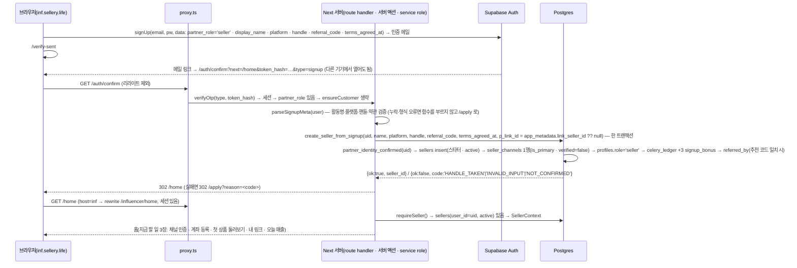

# 인플루언서 콘솔 구현 계획 — inf.sellery.life (도메인 → 로그인 → 결제)

> **상태(2026-09-21): §7 1~2단계는 `apps/influencer`(SvelteKit · 경로 모드 `sellery.life/influencer/*`) 로 이식 완료 · S1~S5 + 도메인 전환 완료 · `web/` 은 S5 PR-11 에서 삭제.** 호스트 모드(`inf.sellery.life`)는 폐기(monorepo-migration 결정 11). 다음 작업은 §7 3~6단계. 배포·운영·대시보드 설정은 [`deploy.md`](deploy.md)(§5.5 파트너 이메일 인증).
>
> 대상: `web/` 를 고치는 개발자 2명(인플루언서 담당 · 브랜드 담당)과 병렬 에이전트. 근거: `docs/app-plan.md`(슬라이스 1 · §4.2 파트너 스텁 · §12 로드맵), `docs/data-model.md`, `supabase/migrations/0001~0009`, 프로토타입 `js/20-seller.js`·`js/02-state.js`·`js/70-campaign.js`·`js/80-actions.js`·`login.html`, 앱 `web/src/{proxy.ts, lib/supabase/*, lib/auth.ts, lib/toss.ts, lib/checkout-sync.ts, app/api/payments/*}`. glo(`E:/위글로우/Glo/web`)의 `seller/_lib.ts getSellerGate()`·`0013_seller_applications.sql` 은 읽기 전용 참고.
>
> 범위: **인플루언서 쪽만**, 순서는 사용자 요청대로 **도메인 → 로그인 → 결제**. 브랜드 콘솔·관리자는 §9 에 "그대로 적용되는 것" 만 적는다. 이 문서는 세 설계안(같은 앱 호스트 리라이트 / 별도 앱 워크스페이스 / 같은 앱 카카오 단일)을 두 번 심사한 결과를 합친 최종안이다 — 심사 총점이 안 1 · 안 3 이 71:71 동점이라 **골격은 안 1(같은 앱 · 호스트 리라이트 — 단 Next 16 의 다중 root layout 규칙 때문에 고객 라우트는 `(customer)/` 로 옮긴다, 결정 2)**, **결제 규칙·화면 순서·모바일 경험은 안 3 접목**, 게이트·멱등·스크립트는 안 2 접목으로 정했다. 두 심사의 "반드시 수정" 항목은 전부 반영했고 본문에 `[mustFix]` 로 표시한다.

---

## 0. 결정 요약

인플루언서 콘솔은 **새 앱이 아니라 기존 `web/`(Vercel `sellery-app`) 안의 라우트 그룹 `(partner)/influencer/**`** 로 만들고, 도메인 `inf.sellery.life` 은 같은 Vercel 프로젝트에 두 번째 도메인으로 붙여 `src/proxy.ts` 가 호스트를 보고 `/influencer/*` 로 **리라이트**한다(사용자에게는 `https://inf.sellery.life/home` 처럼 접두 없는 URL). 로그인은 **이메일/비밀번호(Supabase email provider, 인증 메일 필수)** 로 파트너 계정을 고객 카카오 계정과 분리하고, **인증 메일을 누르는 순간 서버가 `sellers` 행을 만든다(수동 심사 없음 — 프로토타입 `login.html` 의 가입 정책 그대로, 결정 5)**. 채널(SNS) 인증은 가입과 별개의 셀프 서비스(마이페이지 · 1회용 코드 `SLRY-XXXX`, §4.7)이고 샘플 요청의 전제 조건이 아니다. 결제 1차는 **샘플 구매(현금 토스 + 🥬 혼합)** 하나이며 토스 결제위젯·`lib/toss.ts`·`payment_events`·웹훅 라우트를 그대로 쓰되 결제 대상 테이블만 `partner_payments` 로 새로 둔다. 🥬 는 **토스 승인 뒤 확정 RPC 한 트랜잭션에서만 차감**(선차감·크론 의존 없음). 🥬 유상 충전(TOPUP)은 규제 검토가 끝나기 전에는 넣지 않는다. 세션 쿠키는 host-only 유지(고객 사이트와 콘솔 세션 자동 분리).

| # | 결정 | 이유 |
|---|---|---|
| 1 | 같은 Next 앱 · 같은 Vercel 프로젝트 · 도메인 2개(A안) | 설계서 §12 가 이미 라우트 그룹 + proxy 게이트를 전제. 별도 앱은 워크스페이스·Vercel 3번째 프로젝트·env 8종 재입력·CI job 추가가 따라오고, 토스 웹훅·시크릿을 복제해야 한다. multi-zones 는 같은 호스트의 경로 분할용이라 서브도메인 요구와 맞지 않는다. |
| 2 | 1단계 PR 에서 `src/app/layout.tsx` 와 고객 라우트(`page, s, c, checkout, account, terms, privacy, login, not-found`)를 **`src/app/(customer)/` 로 옮기고** `(partner)/layout.tsx` 를 두 번째 root layout 으로 둔다 | Next 16 `layout.md` — root layout 은 "위에 layout.js 가 없는 레이아웃" 이고, 여러 root layout 을 두려면 최상위 `app/layout.tsx` 가 없어야 한다. 최상위 `layout.tsx` 를 남기면 `(partner)/layout.tsx` 는 그 아래 중첩 레이아웃이 되어 html/body 중복(빌드·하이드레이션 오류)이거나 콘솔이 고객 AppBar·SubNav·Footer 를 그대로 상속한다. 공유 경로 `auth/*`·`api/*`·`robots.ts` 는 최상위에 남긴다(레이아웃 불필요). 1단계 PR 은 다른 PR 이 없을 때 먼저 병합한다는 규칙(§7)이 이미 있으므로 rename 충돌 우려는 그 규칙으로 흡수한다. 옮기지 않는 대안(단일 root layout 을 html/body/폰트만 남기고 AppBar·Footer 를 proxy 가 넣는 `x-slry-console` 헤더로 분기)은 전 페이지를 동적으로 만들고 고객 파일도 결국 수정하므로 택하지 않는다. `[mustFix]` |
| 3 | 콘솔 root layout 은 `(partner)/layout.tsx` **하나** — 인플루언서·브랜드가 셸을 공유(앱 전체의 root layout 은 고객 `(customer)/layout.tsx` 와 둘) | root layout 을 콘솔마다 두면 html/body 중복·풀 리로드만 늘어난다. 브랜드는 `(partner)/brand/**` 를 같은 셸 아래 추가. |
| 4 | 파트너 로그인 = 이메일/비밀번호 + 인증 메일(**결정됨 2026-09-17**, §4.1 그대로) | `docs/app-plan.md §4.2`·0001 헤더 계약. 브랜드(법인 메일)와 같은 수단이라 가입 생성 함수 패턴 하나로 끝난다. 카카오는 고객 `auth.users` 와 겹쳐 `profiles.role` 단일값 충돌을 만든다. 생성 함수의 신원 확인은 카카오 신원도 허용하도록 계약을 열어 둔다(§4.5) — 나중에 카카오 버튼을 추가해도 DB 는 안 바뀐다. |
| 5 | 가입 = 인증 메일 완료 즉시 `sellers` 행 생성(**수동 심사 없음, 프로토타입 정책** — 결정됨 2026-09-17). SQL 함수 `create_seller_from_signup()` 을 `/auth/confirm` 이 service role 로 호출 | 프로토타입 `login.html` 의 정책이 그대로다: 가입 폼(활동명 · 이메일 · 비밀번호 영문+숫자 8자 이상 · 추천 코드(선택) · 약관 동의) → 인증 메일 → 인증 완료 즉시 센터 입장. 사칭 방어는 가입 심사가 아니라 **채널 인증**이 맡는다 — 마이페이지에서 채널 추가 → 1회용 코드 `SLRY-XXXX` 를 프로필 bio 또는 DM 으로 → [인증 확인](`js/20-seller.js verifyModal` · `js/80-actions.js confirmVerify`), 인증된 채널만 메인 SNS(`setPrimaryCh`). 샘플 요청은 채널 인증을 요구하지 않는다(`reqSample`). 관리자 화면 없이 운영 가능 — 함수는 트랜잭션 1개(sellers insert · 채널 1행 · profiles.role · 🥬 축하 3 · referred_by), 정지(`active=false`)·시드 행 연결·채널 인증 확정은 `web/scripts/partner-admin.mjs`(§4.7). |
| 6 | 게이트 = proxy 는 세션 유무만, **모든 page·서버 액션·route handler 가 `requireSeller()` 호출** | App Router 는 형제 페이지 이동 시 layout 을 재실행하지 않는다. layout 분기만으로는 정지(`active=false`)된 계정이 세션 동안 계속 들어온다. `[mustFix]` |
| 7 | 결제 1차 = 샘플 구매(현금+🥬 혼합) · 🥬 는 토스 승인 후 확정 RPC 안에서만 차감 | 신규(스타터) 인플루언서의 첫 캠페인은 거의 항상 샘플 구매다. 선차감(hold) 은 만료 크론에 의존해 잔액이 잠기고 복구 원장이 이중 적재될 수 있다. 후차감은 "돈이 움직인 뒤 DB 는 현실을 거부하지 않는다" 원칙과 같고, 거부 시 토스 전액 취소로 닫힌다. `[mustFix]` |
| 8 | `checkout_sessions`·`app_confirm_checkout` 은 재사용하지 않고 `partner_payments` + 전용 RPC | `campaign_id not null`·`shipping not null`·`is_sample=false` 하드코딩·LIVE 재검사가 샘플 구매와 맞지 않는다. `orders(is_sample)`·`payment_events`·`lib/toss.ts`·`checkout-sync.ts` 의 공용부는 그대로 쓴다. |
| 9 | 🥬 유상 충전(TOPUP) 은 규제 검토 결론 전 미도입 | 현금으로 발행한 🥬 가 여러 브랜드의 샘플 대금에 쓰이면 선불전자지급수단 성격. 1차의 🥬 는 가입 축하 3 + 관리자 지급 + (정산 슬라이스의) 획득분만. `[mustFix]` |
| 10 | 세션 쿠키 host-only 유지(`cookieOptions` 미지정) | 고객 세션이 콘솔에 자동으로 붙는 혼선을 없애고 `*.vercel.app` Preview 의 부모 도메인 쿠키 불가 문제를 피한다. 나중에 `.sellery.life` 공유가 필요하면 3곳(server/middleware/client)에 env 가드로 `domain` 만 추가. |
| 11 | 무상 샘플 요청 + 캠페인 목록을 결제보다 **앞 단계**에 둔다 | 결제 전까지 콘솔에서 할 수 있는 일이 계좌 등록뿐이면 실사용 검증이 결제 뒤로 밀린다. `[mustFix]` |
| 12 | 마이그레이션은 처음부터 역할 분기를 넣는다(0010 은 `sellers` 전용 `create_seller_from_signup` + 역할 중립 헬퍼 `partner_identity_confirmed(p_user_id)`, 0011 `partner_payments.owner_type`) | 브랜드 PR 이 마이그레이션을 재작성하지 않게 — 브랜드는 같은 헬퍼 위에 `create_brand_from_signup` 을 새 번호로 추가한다(§9). `[mustFix]` |

### 사용자가 결정해야 하는 것

| 항목 | 권장안 | 이유 | 결정 전 진행 |
|---|---|---|---|
| 도메인 TLD | **결정됨(2026-09-17)** — 정식 도메인 `sellery.life`(고객 사이트) · 콘솔 `inf.sellery.life` · 브랜드는 나중에 `brand.sellery.life`. `.com` 은 보유 시 리다이렉트만 | 저장소 전체에서 `sellery.co.kr` → `sellery.life` 치환 완료(데모 관리자 이메일 `admin@sellery.co.kr` 만 유지). 코드·문서·약관·푸터가 전부 `sellery.life`. | — |
| apex `sellery.life` 앱 이전 시점(DEPLOY.md §6) | 콘솔 1단계와 독립 — 서브도메인 먼저 | `inf.` 는 apex 가 어느 프로젝트에 있든 붙는다. 단 콘솔의 "판매 링크 복사"가 살아 있으려면 apex 이전이 선행돼야 한다. | 가능 |
| 파트너 로그인 수단 | **결정됨(2026-09-17)** — 이메일/비밀번호(결정 4, §4.1 설계 그대로). 구글은 2차, 카카오는 미지원 | §4.1 | — (생성 함수의 신원 확인은 두 신원 모두 허용, §4.5) |
| 가입 승인 정책 | **결정됨(2026-09-17)** — 프로토타입에 이미 있는 정책을 따른다, 수동 심사 없음: 가입 폼 → 인증 메일 → 인증 완료 즉시 콘솔 입장(결정 5). 채널(SNS) 인증은 별도 셀프 서비스(§4.7) | `login.html` 가입 폼(활동명 · 이메일 · 비밀번호 영문+숫자 8자 이상 · 추천 코드(선택) · 약관 동의) → `fVerify` → [인증 완료 → 센터 입장]. 사칭 방어는 채널 인증 코드(`verifyModal`)가 맡고 인증된 채널만 메인 SNS(`setPrimaryCh`), 샘플 요청은 채널 인증 불요(`reqSample`). 앱은 [인증 확인] 클릭 시 즉시 verified 로 두지 않고 `vcode_confirmed_at` 만 기록("인증 대기") → 운영자 확인 또는 자동 확인 후 verified — 프로토타입 문구 "실서비스: 프로필 크롤링/공식 API·DM 수신함 매칭으로 자동 확인" 에 맞춘 것. 정지(`active=false`)·시드 행 연결은 스크립트로. | — |
| 🥬 유상 충전 도입 여부·시점 | 미도입(결정 9). 법률 검토 후 (a) 샘플 대금에도 사용 · (b) 플랫폼 아이템에만 · (c) 보류 중 택일 | 전자금융거래법 선불업 등록 요건(2024.9 개정 소액 면제 기준 포함), 환불 불가 조항 적법성, 부가세·현금영수증. §5.8 | 가능(`partner_payments.kind` 가 `topup` 을 이미 받음) |
| 샘플 구매가에 등급 보너스 반영 | 반영(`rate + grade_bonus` 차감) | 제안서 정의("브랜드 제안 요율 + 등급 추가분")와 맞춘다. 프로토타입 `samplePrice` 는 `p.rate` 만 차감(불일치). | 4단계 전까지 — `app_sample_quote` 한 줄 |
| 샘플 배송지 | 결제·요청 시 입력 → `campaigns.sample_shipping` (프로필 기본값은 `sellers.sample_address` 에 저장해 프리필) | 브랜드 발송 화면(슬라이스 2) 이 캠페인에서 읽는다. 개인정보 보존·파기는 `purge` 규칙에 포함. | 가능 |
| 시드 인플루언서 8명(`*@sellery.demo`) 처리 | 실제 계약 인플루언서 행으로 재활용(`partner-admin.mjs invite <email> --link <seller_id>` 또는 `link <seller_id> <user_id>` 명시 연결, §4.7), 안 쓰는 행은 `suspend`(`active=false`) | 이메일 자동 매칭 금지(0001 헤더). 일반 가입은 새 행을 만들므로 시드 행 재활용은 반드시 운영자 초대 경로로. | 가능 |
| 세션 쿠키 범위 | host-only(결정 10) | 브랜드 콘솔 때 재검토 | 가능 |
| 콘솔 URL 표기 | **결정 변경(2026-09-18, 유지보수 개발자 요청)**: 서브도메인(`inf.sellery.life/home`) 대신 **경로 모드 `sellery.life/influencer/home`**. 코드는 두 모드를 모두 지원하므로 Production 의 `NEXT_PUBLIC_INF_HOST` 를 제거해 전환했다(코드 변경 없음). 경로 모드에서는 고객·콘솔이 세션 쿠키를 공유하므로 `requireSeller()` 에 `foreign`(파트너 아닌 세션 → `/login?switch=1` 안내) 상태를 추가했다. 브랜드도 `sellery.life/brand`. | §2.2·§3 의 서브도메인 절차는 되돌릴 때 참고 | 결정됨 |
| 정산 지급 수단 | 운영자 은행 이체 + 스크립트로 `payouts.paid` 표시 | 토스 페이아웃/펌뱅킹은 범위 밖. 계좌 폼 필드(주민번호·실명확인)에 영향 — §5.9 | 5단계 전 |
| 미리보기 링크의 유입 쿠키 우회(`?preview=1`) | 넣지 않음(관찰만) | 인플루언서 본인이 자기 링크로 들어온 것이라 정책상 문제 없음 | 가능 |

---

## 1. 왜 분리하는가 · 주체별 도메인 구조

한 앱에 고객·인플루언서·브랜드·관리자가 섞여 있어 헷갈린다는 문제의 본질은 **URL(호스트)과 첫 화면**이지 코드베이스가 아니다. 그래서 사용자에게는 주체별 도메인을, 코드에는 단일 앱을 준다.

```
                     ┌──────────────────────────────────────────── Vercel project: sellery-app (web/) ─────────────────────────────────────────────┐
                     │                                                                                                                             │
 sellery.life ──────┼─▶ src/proxy.ts ──(host = 고객)──▶ src/app/(customer)/{page,s,c,checkout,account,terms,privacy,login,not-found}  고객        │
                     │        │                          root layout: src/app/(customer)/layout.tsx (AppBar/Footer) — 첫 번째 root layout          │
                     │        │                                                                                                                    │
 inf.sellery.life ──┼─▶      ├──(host = INF_HOST)─rewrite─▶ /influencer/*  → src/app/(partner)/influencer/**                                      │
                     │        │                          root layout: src/app/(partner)/layout.tsx (콘솔 셸) — 두 번째 root layout                 │
                     │        │                                                                                                                    │
 brand.sellery.life ┼─▶      ├──(host = BRAND_HOST)─rewrite─▶ /brand/*     → src/app/(partner)/brand/**  (다음)                                   │
                     │        │                          같은 (partner)/layout.tsx 셸                                                              │
                     │        │                                                                                                                    │
 (호스트 없음)       │        └── /admin/* (app_role()='admin' + Basic Auth 이중 잠금, 슬라이스 4) → (admin)/**                                    │
                     │                                                                                                                             │
                     │   공유(리라이트 제외 · 최상위 app/ 에 그대로): /auth/*  /api/*  /_next/*  /robots.txt  — 어느 호스트에서도 같은 경로        │
                     │   /login 은 제외하지 않는다 — 콘솔 호스트의 /login 은 콘솔 로그인으로 리라이트, 고객 카카오 /login 은 고객 호스트만 (§3.2)  │
                     └─────────────────────────────────────────────────────────────────────────────────────────────────────────────────────────────┘
                                   │ 같은 Supabase(ocxppeuoiysnkwwujvko) · 같은 토스 상점 · 같은 env
 demo.sellery.life ──▶ Vercel project: sellery (프로토타입, 저장소 루트 정적) — 제안서 PDF 데모 주소는 별도로 유지
```

- **고객** `sellery.life` — 지금의 `web/` 그대로(라우트만 `(customer)/` 로 이동, URL 불변 · apex 이전은 DEPLOY.md §6, 이 문서와 독립).
- **인플루언서** `inf.sellery.life` — 이 문서.
- **브랜드** `brand.sellery.life` — `hosts.ts` 표에 한 줄 + `(partner)/brand/**` 폴더 + `lib/partner/brand.ts`(§9).
- **관리자** — 별도 호스트를 두지 않고 `/admin` 경로(어느 호스트에서 열어도 같은 경로, `app_role()='admin'` + Basic Auth). 정지·복구·채널 인증 확인 화면이 생기면 §4.7 의 스크립트가 부르는 SQL 을 그대로 버튼으로 감싼다.
- 호스트 분리의 부수 효과: 세션 쿠키가 host-only 라 "고객으로 로그인돼 있는데 콘솔이 열리는" 일이 없다. 콘솔 → 고객 사이트 링크는 `<a href>` 절대 URL(`NEXT_PUBLIC_SITE_URL`).

---

## 2. 앱 · 저장소 · Vercel 구조

### 2.1 디렉터리 트리 (추가·수정·이동만 표시 — 나머지 기존 파일은 그대로)

```
web/src/
├─ proxy.ts                               EDIT  호스트 리라이트 · 고객 호스트 /influencer 308(*.vercel.app 제외) · 콘솔 세션 게이트 (§3.2, §4.3)
├─ lib/
│  ├─ hosts.ts                            NEW   HOST_PREFIX 표 · REWRITE_EXCLUDE · CONSOLE_PUBLIC_PATHS · consoleUrl(role, path) · consolePath(role, path) · consoleRoleOf(host)
│  ├─ money.ts                            EDIT  ORDER_ID_PREFIX = { customer:'slry_', partner:'slrp_' } · generateOrderId(kind)   [mustFix 접두 상수 1곳]
│  ├─ supabase/middleware.ts              EDIT  updateSession(request, { rewriteTo? }) → { response, user }
│  ├─ supabase/{server,client}.ts         (변경 없음) cookieOptions 미지정 = host-only 유지(결정 10). `lib/supabase/options.ts`(쿠키 옵션 1곳)는 1단계에 만들지 않는다 — 브랜드 콘솔·`.sellery.life` 쿠키 공유 전환 때(§9) 추가
│  ├─ auth.ts                             EDIT  isPartnerUser(user) — user_metadata.partner_role 판정(비신뢰 값 · 게이트에 쓰지 않는다는 주석, §4.2)
│  ├─ partner/seller.ts                   NEW   getSellerContext() · requireSeller()(guest → /apply · suspended → /suspended) · SellerContext 타입
│  ├─ partner/signup.ts                   NEW   parseSignupMeta(user|form) · createSellerFromSignup(user, form?) — create_seller_from_signup RPC 래퍼(멱등 · auth/confirm · auth/callback · /apply 액션 공용, §4.3)
│  ├─ partner/sample.ts                   NEW   quoteSample()/beginSamplePurchase()/confirmSamplePurchase() 래퍼(RPC 호출 + 타입 좁히기)
│  └─ partner-payment-sync.ts             NEW   partner_payments 판 failPayment/cancelAndFail/confirmDone/syncFromPayment (checkout-sync 의 공용부 import)
├─ app/
│  ├─ (customer)/                         MOVE  기존 layout.tsx(html/body · AppBar · SubNav · Footer = 첫 번째 root layout) + 고객 라우트 page, s, c, checkout, account, terms, privacy, login, not-found 를 그대로 이동(URL 불변 · 1단계 PR). login/ 은 고객용 그대로 — 고객 호스트 한정(§3.2)
│  ├─ auth/callback/route.ts              EDIT  파트너 계정이면 ensureCustomer 생략 + createSellerFromSignup(user) 호출(멱등) (§4.2·§4.3)
│  ├─ auth/confirm/route.ts               NEW   token_hash 방식 인증·재설정·초대 링크: verifyOtp({ type, token_hash }) → 파트너면 ensureCustomer 생략 + createSellerFromSignup(user) 호출(sellers 행 생성, §4.3) → safeNext(next) 302 (§4.1)
│  ├─ auth/signout/route.ts               EDIT  consoleRoleOf(host) 가 있으면 consoleUrl(role,'/login')(env 호스트 기준 절대 URL — request.url 의 오리진에 기대지 않는다), 없으면 / 로 303
│  ├─ robots.ts                           EDIT  headers().get('host') 가 콘솔 호스트면 disallow: ['/'], 고객 호스트는 /influencer, /brand disallow (§3.2-7)
│  ├─ api/health/route.ts                 EDIT  응답에 hosts: { inf: NEXT_PUBLIC_INF_HOST ?? null, brand: NEXT_PUBLIC_BRAND_HOST ?? null, mode: 'host'|'path' } 추가(비밀 없음)
│  ├─ api/payments/webhook/route.ts       EDIT  orderId 'slrp_' 분기 + paymentKey 역조회 3테이블 (§5.6)
│  ├─ api/cron/reconcile/route.ts         EDIT  partner_payments CONFIRMING 고착·CANCEL_PENDING 종결 추가
│  ├─ api/partner/sample/begin/route.ts   NEW
│  ├─ api/partner/sample/confirm/route.ts NEW
│  └─ (partner)/
│     ├─ layout.tsx                       NEW   콘솔 root layout = 두 번째 root layout(html/body · 폰트 · 하단 탭 슬롯 · noindex · metadataBase = inf 호스트)
│     ├─ partner-shell.tsx                NEW   하단 탭 5개 + 상단 바(활동명·등급·🥬) — role 별 탭 목록을 props 로
│     └─ influencer/
│        ├─ page.tsx                      NEW   redirect(consolePath('seller','/home')) — 미로그인은 proxy 가 /login 으로 (inf 호스트 / → /influencer 리라이트의 착지)
│        ├─ (public)/{login,signup,verify-sent,apply,suspended,password,password/new}/page.tsx
│        ├─ home/page.tsx  products/page.tsx  products/[code]/page.tsx
│        ├─ campaigns/page.tsx  campaigns/[code]/page.tsx
│        ├─ pay/[id]/page.tsx  pay/success/page.tsx  pay/fail/page.tsx
│        ├─ sales/page.tsx  settle/page.tsx  my/page.tsx
│        └─ **/actions.ts                 서버 액션(전부 requireSeller() → createAdminClient())
web/scripts/
├─ partner-admin.mjs                      NEW   list · suspend <seller_id> · reactivate <seller_id> · link <seller_id> <user_id> · invite <email> --link <seller_id> · channels [--pending] · verify-channel <channel_id> (production 허용, §4.7)
└─ dev-seller.mjs                         NEW   auth.admin.createUser(email_confirm) + create_seller_from_signup(p_link_id) 한 번에 (production 거부)
supabase/migrations/
├─ 0010_partner_signup.sql                NEW   §5.4 — seller_channels.vcode_confirmed_at · sellers.sample_address/terms_agreed_at · partner_identity_confirmed · create_seller_from_signup (신청 테이블 없음)
└─ 0011_partner_payments.sql              NEW   §5.4
.github/CODEOWNERS                        NEW   /web/src/app/(partner)/influencer/ · /web/src/lib/partner/ · /web/src/app/api/partner/ → 인플루언서 담당
docs/{data-model.md, app-plan.md}         EDIT  §7·§9 / §4.2·§10.1·§12
web/DEPLOY.md                             EDIT  §1 도메인 표 · §2 env · §3.1 Redirect URLs · §3.5(NEW) Email provider·SMTP · §7 체크리스트
```

- `(partner)/influencer/**` 페이지는 전부 `export const dynamic = "force-dynamic"`(프리렌더 없음 — 세션·service role 읽기라 어차피 동적이고, 페이지가 늘어도 `web-ci` build 시간이 안 는다).
- 공유 코드 위치: 결제·인증·DB 타입은 지금 자리(`web/src/lib/*`) 그대로. 콘솔은 import 만 한다. UI 는 `components/checkout/{payment-widget,address-fields}.tsx` 만 재사용, 나머지 콘솔 UI 는 `(partner)/` 안에 둔다(고객 사이트 디자인과 독립).
- **파티션(소유) 갱신** — `docs/app-plan.md §10.1` 표에 추가: **I 인플루언서 콘솔** = `(partner)/influencer/**`, `lib/partner/seller.ts`, `lib/partner/signup.ts`, `lib/partner/sample.ts`, `lib/partner-payment-sync.ts`, `api/partner/**`, `scripts/{partner-admin,dev-seller}.mjs`. **J 브랜드 콘솔**(다음) = `(partner)/brand/**`, `lib/partner/brand.ts`. 공유 파일(`proxy.ts`, `hosts.ts`, `(customer)/` 이동, `(partner)/layout.tsx`, `partner-shell.tsx`, `money.ts`, 0010/0011) 은 1단계 PR 에서 먼저 병합하고 이후 변경은 공동 리뷰.

### 2.2 CI · Preview

| 항목 | 값 |
|---|---|
| CI | 기존 `web-ci`(npm ci → typegen → typecheck → lint → build) 그대로, job 추가 없음. `프로토타입 점검` 도 그대로. |
| Preview URL | `https://sellery-app-git-<branch>-weglow-team.vercel.app/influencer/...` — Preview 에는 `NEXT_PUBLIC_INF_HOST` 를 넣지 않으므로 **경로 모드**(리라이트 없음). 토스 successUrl 복귀·Supabase 콜백 모두 Preview 와일드카드 Redirect URL 로 동작. |
| Production 임시 확인 | `https://sellery-app.vercel.app/influencer/...` — apex 이전 전에는 이 주소가 `NEXT_PUBLIC_SITE_URL` 의 host(=고객 호스트)이기도 하지만, 고객 호스트 308 은 `*.vercel.app` 요청에 적용하지 않으므로(§3.2 규칙 3) 경로 모드로 계속 열린다(apex 이전 전후 모두). |
| 로컬 | `http://localhost:3000/influencer/...`(경로 모드). 호스트 모드 검증은 `.env.local` `NEXT_PUBLIC_INF_HOST=inf.localhost:3000` + `next.config.ts` `allowedDevOrigins:['inf.localhost']` → `http://inf.localhost:3000`. 로컬에서 고객(3000)·콘솔 세션이 같은 쿠키를 쓰므로 둘을 동시에 테스트할 때는 호스트 모드(`inf.localhost`)를 쓴다 — CONTRIBUTING 에 규칙으로 기재. |

### 2.3 환경변수 (추가분만 · 기존 8종은 DEPLOY.md §2)

| 이름 | Production | Preview | 로컬 | 용도 |
|---|---|---|---|---|
| `NEXT_PUBLIC_INF_HOST` | `inf.sellery.life` | (없음) | (없음 또는 `inf.localhost:3000`) | 호스트 리라이트 표. 없으면 경로 모드. |
| `NEXT_PUBLIC_BRAND_HOST` | (브랜드 때) `brand.sellery.life` | (없음) | (없음) | 같은 표의 두 번째 행 |
| `SLACK_WEBHOOK_URL` | 선택 | 선택 | 선택 | 가입 완료 · 채널 [인증 확인] 알림 한 줄 — 본문은 seller code · 활동명 · 플랫폼(채널은 channel code · 플랫폼) 만(이메일·핸들·채널 URL 은 넣지 않는다, §4.3). 없으면 무시 |
| `NEXT_PUBLIC_SITE_URL` | 변경 없음(`https://sellery.life`) | | | 고객 사이트·판매 링크·고객 metadataBase 기준. 콘솔 metadataBase 는 `NEXT_PUBLIC_INF_HOST` 로 계산. |

토스·Supabase 키는 추가 없음(같은 상점·같은 프로젝트).

---

## 3. 도메인 붙이기 절차

### 3.1 사용자가 할 일 (대시보드 · DNS)

| 순서 | 어디서 | 무엇을 | 확인 |
|---|---|---|---|
| 1 | Vercel `sellery`·`sellery-app` → Settings → Domains | `sellery.life` 이 지금 어느 프로젝트에 있는지(또는 미연결) 기록. DNS 관리 주체(Vercel NS vs 등록기관/Cloudflare) 확인 | DEPLOY.md §1 표에 현재값 기입 |
| 2 | Vercel `sellery-app` → Domains | `inf.sellery.life` 추가 (apex 위치와 무관하게 독립 추가 가능, 같은 팀이라 TXT 검증 없이 통과되는 것이 보통) | Vercel 이 CNAME 값을 표시 |
| 3 | DNS | Vercel NS 면 자동. 등록기관/Cloudflare 관리면 `CNAME inf → cname.vercel-dns.com`(Cloudflare 는 프록시 끔 = DNS only, 켜져 있으면 인증서 발급이 막힌다) | `curl -sI https://inf.sellery.life/api/health` 200 + 유효 인증서 |
| 4 | Vercel `sellery-app` → Environment Variables | **Production 만** `NEXT_PUBLIC_INF_HOST=inf.sellery.life` → Redeploy | `curl -s https://inf.sellery.life/api/health \| jq .hosts` 가 `mode: "host"` (§2.1 `api/health` EDIT — `hosts: { inf, brand, mode }`, 비밀 없음) |
| 5 | Supabase → Authentication → URL Configuration | Redirect URLs 에 `https://inf.sellery.life/**` 추가(없으면 인증·재설정 메일 링크가 Site URL 로 떨어져 `next` 를 잃음 — DEPLOY.md §3.1). Site URL 은 그대로 | 스크린샷을 DEPLOY.md §3.1 에 반영 |
| 6 | (변경 없음) | 카카오 Redirect URI 는 Supabase 콜백. 토스 웹훅 URL 은 고객 호스트 1개 유지 | — |

### 3.2 코드가 할 일

`web/src/lib/hosts.ts` (상수 하나에 모은다 `[mustFix]`):

```ts
export type ConsoleRole = "seller" | "brand";
export const HOST_PREFIX: Record<string, { role: ConsoleRole; prefix: "/influencer" | "/brand" }> = {
  ...(process.env.NEXT_PUBLIC_INF_HOST   ? { [process.env.NEXT_PUBLIC_INF_HOST]:   { role: "seller", prefix: "/influencer" } } : {}),
  ...(process.env.NEXT_PUBLIC_BRAND_HOST ? { [process.env.NEXT_PUBLIC_BRAND_HOST]: { role: "brand",  prefix: "/brand" } } : {}),
};
/** 리라이트하지 않는 공유 경로(어느 호스트에서도 같은 경로) — /login 은 넣지 않는다(아래) */
export const REWRITE_EXCLUDE = ["/auth/", "/api/", "/_next/", "/favicon", "/robots.txt"] as const;
/** 콘솔 안에서 세션 없이 열리는 경로(접두 제외 형태) */
export const CONSOLE_PUBLIC_PATHS = ["/login", "/signup", "/verify-sent", "/password", "/password/new"] as const;
/** 콘솔 호스트에서 열지 않는 고객 전용 경로(REWRITE_EXCLUDE 안이지만 공유하지 않는다 — proxy 가 404, 규칙 2) */
export const CONSOLE_BLOCKED_PATHS = ["/api/checkout", "/api/payments/confirm", "/api/payments/cancel"] as const;
/** 절대 URL(<a href>·복사용 링크 전용): 호스트 모드면 접두 없는 절대 URL, 경로 모드면 /influencer/... */
export function consoleUrl(role: ConsoleRole, path: string): string { /* … */ }
/** 항상 상대 경로: 호스트 모드 "/apply", 경로 모드 "/influencer/apply" — next= · redirect() · proxy 규칙 5 전용 */
export function consolePath(role: ConsoleRole, path: string): string { /* … */ }
export function consoleRoleOf(host: string | null): { role: ConsoleRole; prefix: string } | null { /* … */ }
```

- `/login` 은 제외 목록에 넣지 않는다 — 콘솔 호스트의 `/login` 은 `/influencer/login`(파트너 이메일 로그인)으로 리라이트되고, 고객 카카오 로그인 `/login` 은 고객 호스트에서만 열린다. §2.1 의 `login/ (고객용 그대로)` 는 고객 호스트 한정이라는 뜻이다.
- `consolePath(role, path)` 는 항상 **상대 경로**를 돌려준다 — 호스트 모드 `/apply`, 경로 모드 `/influencer/apply`. `next=`·`redirect()`·proxy 규칙 5 는 전부 `consolePath` 를, `<a href>`·복사용 링크만 `consoleUrl`(절대) 을 쓴다 — 예외: 라우트 핸들러의 `NextResponse.redirect`(절대 URL 필수)가 콘솔로 보낼 때는 `request.url` 의 오리진(`next start`·셀프 호스트에서는 기동 주소)에 기대지 않고 `consoleUrl` 을 쓴다(`auth/signout` 303). 호스트 모드에서 `consoleUrl` 은 절대 URL 이라 `${origin}` 을 또 붙이면 안 되고, `next` 에 절대 URL 을 넣으면 `safeNext` 가 `/` 로 떨어뜨린다. `/auth/*` 는 리라이트 제외 경로라 어느 헬퍼도 거치지 않고 접두 없이 그대로 쓴다(`emailRedirectTo` 등 — §4.1).

`web/src/proxy.ts` 규칙(코드 주석과 §8 curl 검사로 고정):

1. `rewrite` 는 **내부 URL 에만**, `redirect` 는 **원 요청 pathname 에만** 적용한다(리라이트 결과가 다시 308 조건에 걸리는 루프 금지). `[mustFix]` **proxy·route 에서 사용자 제어 경로(pathname 유래)를 `new URL(path, base)` 로 해석하지 않는다** — `//evil.com` 이 프로토콜 상대 URL 로 풀려 오리진이 바뀐다(오픈 리다이렉트 · `new URL('//evil.com','https://inf.sellery.life').href === 'https://evil.com/'`). Location 의 오리진은 문자열 결합으로 고정하고(`'https://inf.sellery.life' + '//evil.com'` 은 host 유지) `//`·`/\` 로 시작하는 경로는 `/` 로 떨어뜨린다. `next start` 의 base-server 는 `//` 를 먼저 308 정규화하지만 Vercel 의 프록시(Proxy/Middleware)는 라우팅 계층에서 Node 서버보다 먼저 실행되므로 그 정규화에 기대지 않는다. (`safeNext` 를 통과한 `next` 값과 상수 경로는 예외.)
2. `host ∈ HOST_PREFIX` 이고 pathname 이 `REWRITE_EXCLUDE` 로 시작하지 않으면 → `rewriteTo = prefix + pathname`. pathname 이 이미 `prefix` 로 시작하면 접두를 뗀 경로로 308(정규 URL 하나). `/api/checkout`·`/api/payments/{confirm,cancel}` 은 `REWRITE_EXCLUDE` 안이지만 콘솔 호스트에서 **404**(`CONSOLE_BLOCKED_PATHS`) — 파트너 세션(host-only 쿠키)으로 고객 체크아웃을 열어 `ensureCustomer` 가 파트너 계정에 `customers` 행을 만드는 경로(§4.2 위반)를 막는다. `/auth/callback` 은 2단계 파트너 분기(§4.2)에서 `consoleRoleOf(host)` 가 있으면 `ensureCustomer` 를 생략하고 파트너 경로만 탄다. 트레일링 슬래시 `/influencer/` 는 Next 가 먼저 308(`/influencer`) 하므로 2홉(루프 아님 · §7(e) 의 `/home` 홉 기준과 별개 — `skipTrailingSlashRedirect` 는 고객 URL 정규화가 바뀌어 켜지 않는다).
3. 고객 호스트(=`NEXT_PUBLIC_SITE_URL` 의 host, Production) 에서 `/influencer/*`·`/brand/*` 요청 → 해당 콘솔 호스트로 308. 이 308 은 `NEXT_PUBLIC_INF_HOST` 가 설정돼 있고 **요청 host 가 `*.vercel.app` 이 아닐 때만** 적용한다 — apex 이전 전에는 `sellery-app.vercel.app` 이 고객 호스트(`NEXT_PUBLIC_SITE_URL`, DEPLOY.md §2)이자 임시 확인 주소이므로 경로 모드 접근을 막지 않는다. `HOST_PREFIX` 가 비어 있으면(Preview·로컬) 아무것도 하지 않는다(경로 모드).
4. `updateSession(request, { rewriteTo })` 호출 — `rewriteTo` 가 있으면 `NextResponse.rewrite(rewriteTo, { request })` 로 응답을 만들고 회전 쿠키를 같은 응답에 싣는다. `createServerClient` 와 `getUser()` 사이에 코드를 넣지 않는 규칙 유지.
5. 리라이트 대상(또는 경로 모드의 `/influencer/*`) 중 `CONSOLE_PUBLIC_PATHS` 가 아닌 경로에서 `user` 가 없으면 → `consolePath(role, "/login") + "?next=" + consolePath(role, <접두 없는 경로>)` 302 — 둘 다 상대 경로(호스트 모드 `/login?next=/home`, 경로 모드 `/influencer/login?next=/influencer/home`), `safeNext` 가 같은 오리진 경로만 통과시키므로 절대 URL 을 넣지 않는다. **DB 는 조회하지 않는다.** 프록시 게이트는 **보조**다 — `config.matcher` 는 정적 디렉터리(`_next/static`·`_next/image`·favicon·`public/assets/*`)만 제외하고 **확장자로는 제외하지 않는다**(`.png` 로 끝나는 동적 세그먼트 `/influencer/campaigns/abc.png` 가 게이트를 건너뛰지 않게). 그래도 matcher 제외 경로는 통과하므로 `(partner)/influencer/**` 페이지는 예외 없이 `requireSeller()` 로 자체 게이트한다(§2.1).
6. 기존 `slry_linkctx` 로직은 고객 호스트에서만(콘솔 호스트의 `/s/...` 는 리라이트돼 `/influencer/s/...` 404).
7. `robots.ts` 는 `headers().get('host')` 가 콘솔 호스트(`consoleRoleOf(host)` 있음)면 `disallow: ['/']` 를 돌려준다(콘솔 호스트 전체 비색인 — `/robots.txt` 는 `REWRITE_EXCLUDE` 에 있어 inf 호스트에서도 리라이트 없이 열린다). 고객 호스트에서는 기존대로 `/influencer`, `/brand` disallow(경로 모드 대비). `(partner)/layout.tsx` 도 `robots: { index: false }`.

### 3.3 도메인 준비 전 임시 호스트

- DNS 전파 전: `https://sellery-app.vercel.app/influencer/home` — `*.vercel.app` 은 고객 호스트 308 대상이 아니므로(§3.2 규칙 3) apex 이전 전후 모두 경로 모드로 열린다.
- PR 리뷰: Preview URL 의 `/influencer/...`.
- 로컬 호스트 모드: `http://inf.localhost:3000`(§2.2).

---

## 4. 인증 설계

### 4.1 로그인 방식 — 이메일/비밀번호(Supabase email provider) + 인증 메일

| 항목 | 결정 |
|---|---|
| Provider | Email(Confirm email **ON**, 최소 길이 8). 앱 규칙은 프로토타입과 같이 영문+숫자 8자 이상(`/^(?=.*[A-Za-z])(?=.*\d).{8,}$/`) — 클라이언트·서버 액션 양쪽 검사. |
| 로그인 화면 | `(partner)/influencer/(public)/login` — 기존 `login/login-client.tsx` 의 개발용 `signInWithPassword` 폼을 콘솔용으로 옮겨 정식화(`NEXT_PUBLIC_DEV_LOGIN` 가드는 고객 `/login` 에만 남긴다). 카카오 버튼 없음. |
| 가입 | 폼 = 프로토타입 `login.html fJoin` 그대로(활동명 · 이메일 · 비밀번호 영문+숫자 8자 이상 · 추천 코드(선택) · 약관 동의) + **플랫폼 · 핸들**(`sellers.handle not null unique`·`platform not null` 이라 가입 시 받는다 — 판매 링크 `/s/{handle}/{code}` 의 재료이자 첫 채널). `signUp({ email, password, options: { emailRedirectTo: window.location.origin + '/auth/confirm?next=' + encodeURIComponent(consolePath('seller','/home')), data: { partner_role: 'seller', display_name, platform, handle, referral_code, terms_agreed_at } } })` — 콜백·confirm 라우트는 리라이트 제외라 콘솔 접두를 붙이지 않고, `next` 는 `consolePath`(상대 경로: 호스트 모드 `/home`, 경로 모드 `/influencer/home`) 로 만든다(§3.2). 활동명 필수 · 핸들 `/^@?[A-Za-z0-9._]{2,30}$/` · 플랫폼 enum · 약관 체크는 클라이언트·서버(`parseSignupMeta`) 양쪽 검사. 인증 전엔 세션이 없으므로 `/verify-sent` 화면("인증 메일을 보냈어요 · 메일의 버튼을 누르면 가입이 완료됩니다"). 수동 심사 없음 — 인증 링크를 누르면 `/auth/confirm` 이 `sellers` 행을 만들고 `/home` 으로 보낸다(§4.3). |
| 인증 링크 방식 | 가입 인증·비밀번호 재설정 링크는 PKCE `?code=` 가 아니라 **token_hash 방식**을 쓴다(Supabase SSR 권장 — PKCE code verifier 는 signUp 을 호출한 브라우저의 쿠키에만 있어, 데스크톱에서 가입하고 휴대폰 메일 앱에서 링크를 열면 `exchangeCodeForSession` 이 실패해 `/login?error=auth` 로 떨어진다). 새 라우트 `app/auth/confirm/route.ts`(`REWRITE_EXCLUDE` 의 `/auth/` 에 포함): `verifyOtp({ type, token_hash })` → 성공 시 `safeNext(next)` 로 302, 파트너 계정이면 `ensureCustomer` 생략(§4.2 와 같은 분기). 이메일 템플릿(Confirm signup · Reset password)의 링크를 `{{ .RedirectTo }}&token_hash={{ .TokenHash }}&type=signup`(재설정은 `type=recovery`) 로 바꾼다 — `.RedirectTo` 는 `emailRedirectTo`/`redirectTo` 값이라 inf 호스트와 `next` 가 그대로 실린다(§4.8). |
| 비밀번호 재설정 | `/password` → `resetPasswordForEmail(email, { redirectTo: window.location.origin + '/auth/confirm?next=' + encodeURIComponent(consolePath('seller','/password/new')) })` → `/auth/confirm` 이 `verifyOtp({ type:'recovery', token_hash })` 로 세션 생성 → `/password/new` 에서 `updateUser({ password })`. 실패 잠금은 Supabase Auth 레이트리밋에 맡긴다(별도 5회 잠금 없음). |
| 왜 이메일인가 | 설계서·0001 계약·제안서와 일치. 브랜드(법인 메일)와 같은 수단. 고객 카카오 계정과 `auth.users` 를 공유하지 않아 `profiles.role` 단일값 충돌 없음. 카카오 이메일 scope 미제공 문제도 없다. 대가: Custom SMTP 가 선행 조건(§4.7). |
| 구글 | 2차. Supabase Google provider + `signInWithOAuth({ provider:'google' })` 한 줄이지만 콘솔 앱·동의화면 등록이 추가 인프라. |
| 세션 | Supabase Auth 쿠키(host-only) 그대로. `safeNext` 는 같은 오리진 경로만 통과 → inf 호스트에서 `next=/home` 은 콜백 후 `https://inf.sellery.life/home` 으로 돌아와 리라이트된다. 고객 호스트 ↔ 콘솔 크로스 호스트 `next` 는 계속 거부(의도). |

### 4.2 콜백 — 파트너 계정은 `customers` 행을 만들지 않는다

`auth/callback/route.ts`: `exchangeCodeForSession` 뒤 **`user.user_metadata.partner_role` 이 있으면 `ensureCustomer` 를 건너뛴다**(`lib/auth.ts isPartnerUser(user)`). `next` 접두나 요청 host 로 판정하지 않는다 — Preview 경로 모드·비밀번호 재설정(`next=/password/new`) 에서 조건이 어긋난다. `[mustFix]` `?welcome=1` 은 고객 전용이므로 파트너면 붙이지 않는다. `handle_new_user` 트리거는 그대로 `profiles(role='customer')` 를 만들고, `create_seller_from_signup` 이 같은 트랜잭션에서 `'seller'` 로 바꾼다(인증 전까지는 customer 로 남지만 세션이 없어 어디에도 못 들어간다). `auth/confirm/route.ts`(§4.1, `verifyOtp` 뒤) 도 같은 분기를 쓰고, 이어서 `createSellerFromSignup(user)` 를 호출한다(§4.3).

`partner_role` 은 사용자가 `supabase.auth.updateUser({ data })` 로 언제든 바꿀 수 있는 **비신뢰 값**이다 — `ensureCustomer` 생략·`?welcome` 생략·**가입 생성 호출 여부** 같은 무해한 분기에만 쓰고 권한·게이트·집계에는 절대 쓰지 않는다(`lib/auth.ts isPartnerUser` 주석에 명시). 생성 호출의 트리거로 써도 되는 이유: 가입은 누구에게나 열려 있고(결정 5) 실제 가드는 함수 안의 신원 확인·중복·유니크 검사다(§4.5); 시드 행 연결에 쓰는 `link_seller_id` 는 `user_metadata` 가 아니라 service role 만 쓸 수 있는 `app_metadata` 에 둔다(§4.7). 게이트의 진실은 `sellers.user_id and active`(§4.4).

### 4.3 가입 → 인증 → 생성 → 진입 시퀀스

수동 심사가 없다(결정 5). 인증 메일의 링크를 누르는 요청 하나가 세션을 만들고 `sellers` 행을 만들고 `/home` 으로 보낸다 — 프로토타입 `login.html` 의 `fJoin` → `fVerify` → [인증 완료 → 센터 입장] 과 같은 세 걸음.



**예외 경로 `/apply`(보완 폼)** — 남는 유일한 중간 화면. `requireSeller()` 가 `guest`(세션은 있는데 `sellers.user_id` 행이 없음)를 만나면 `/apply` 로 보낸다. 여기 오는 경우는 셋뿐이다: (1) 핸들이 이미 쓰이고 있어 `HANDLE_TAKEN`, (2) `user_metadata` 가 비었거나 형식 오류(`INVALID_INPUT` — 예: 옛 템플릿 `{{ .ConfirmationURL }}` 로 인증해 `/auth/confirm` 을 거치지 않고 `/login` 으로 들어온 계정), (3) `/auth/confirm` 이 세션 생성 뒤 함수 호출 전에 죽은 경우. 페이지는 로드 시 먼저 `createSellerFromSignup(user)` 를 다시 시도하고(멱등 — 성공하면 바로 `/home`), 실패했을 때만 `user_metadata` 를 프리필한 폼(활동명 · 플랫폼 · 핸들 · 추천 코드)을 그린다. 제출 = 서버 액션 `completeSignup(form)`(`rejectCrossSite` · rate limit) → 같은 함수 → `/home`. 신청 테이블·심사 상태·반려·`/pending` 은 없다.

`auth/callback/route.ts`(PKCE `?code=` 경로) 도 `exchangeCodeForSession` 뒤 파트너면 같은 헬퍼를 호출한다 — 카카오 고객은 `partner_role` 이 없어 건너뛴다. `type=invite`(운영자 초대, §4.7) 도 같은 라우트·같은 헬퍼다. 헬퍼는 `sellers.user_id = uid` 행이 이미 있으면 `{ok:true, already:true}` 로 끝나므로 링크 재클릭·라우트 재시도에 안전하다.

Slack 알림(선택, `SLACK_WEBHOOK_URL`) 은 두 곳에서 한 줄씩: 가입 완료(`seller code · 활동명 · 플랫폼`) · 채널 [인증 확인](`channel code · 플랫폼`). 이메일·핸들·채널 URL 은 넣지 않는다(상세는 `partner-admin.mjs list`/`channels`). 개인정보가 제3자(Slack)로 나가지 않으므로 `/privacy` 의 수집·이용·제3자 제공 항목에는 넣지 않는다.

### 4.4 세션 · 역할 게이트

| 층 | 무엇을 보나 | 어디서 |
|---|---|---|
| proxy | 세션 쿠키 유무만(`updateSession` 이 돌려준 `user`). DB 호출 없음. 없으면 `consolePath(role,'/login')` + `?next=consolePath(role, 경로)`(상대 경로). | `src/proxy.ts` §3.2-5 |
| requireSeller() | `createAdminClient()` 로 `sellers.user_id = user.id` 1행 → 상태는 둘뿐: **guest**(행 없음 → `/apply` 보완 폼, §4.3) · **suspended**(행은 있는데 `active=false` → `/suspended` "이용이 정지되었습니다 · 고객센터 이메일", 폼 없음 — `partner-admin.mjs reactivate` 로만 복귀). `redirect(consolePath('seller', …))`. pending/rejected 는 없다(수동 심사 없음, 결정 5). **콘솔 게이트의 진실은 `sellers.user_id and active`** 이고 `profiles.role`/`app_role()` 은 관리자·집계 판정용(코드 주석으로 고정). `[mustFix]` | `lib/partner/seller.ts` — **모든 page·서버 액션·`api/partner/*` 가 직접 호출**(layout 에만 두지 않는다) |
| 서버 액션·API | `rejectCrossSite`(`sec-fetch-site` + JSON) → `requireSeller()` 로 `seller.id` 를 세션에서 얻는다. 클라이언트가 보낸 `seller_id`·금액은 믿지 않는다. 보완 폼 액션(`completeSignup`)·채널 액션(`issueVerifyCode`·`confirmVerify`)·결제 begin 은 checkout 과 같은 rate limit(30분 20건). `[mustFix]` | `**/actions.ts`, `api/partner/**` |
| RLS | 본인 행 select 정책은 추가하지 않는다(access-model 방침). 콘솔 읽기는 전부 service role + `seller_id` 필터. | — |

`SellerContext = { user, seller: { id, code, name, handle, platform, grade, active, settle_type, bank_info?, sample_address? }, balance }` — `balance` 는 `celery_balances` 뷰.

### 4.5 가입 생성 함수 계약 (0010)

`create_seller_from_signup(p_user_id uuid, p_name text, p_platform text, p_handle text, p_referral_code text default null, p_terms_agreed_at timestamptz default now(), p_link_id uuid default null) returns jsonb` — security definer, `service_role` 만 execute(public/anon/authenticated 회수). 호출자는 서버뿐: `/auth/confirm`·`/auth/callback` 라우트와 `/apply` 의 `completeSignup` 액션이 `lib/partner/signup.ts createSellerFromSignup(user, form?)` 을 거쳐 부른다. 입력은 **`auth.users.id` + 서버가 `user_metadata`(또는 보완 폼)에서 검증한 값**(`parseSignupMeta`: 활동명 1~30자 · 플랫폼 enum · 핸들 `/^@?[A-Za-z0-9._]{2,30}$/` · 추천 코드 대문자 정규화 · 약관 동의 시각) — 클라이언트가 보낸 원문을 그대로 넘기지 않는다. `p_link_id` 는 운영자 경로 전용(`app_metadata.link_seller_id` — service role 만 쓸 수 있는 값 — 또는 `partner-admin.mjs link`·`dev-seller.mjs`; `user_metadata` 의 값은 절대 넘기지 않는다). 한 트랜잭션, **멱등**:

1. `sellers where user_id = p_user_id` 가 있으면 `{ok:true, already:true, seller_id, code}` 로 끝(링크 재클릭·라우트 재시도·`/apply` 재진입). `active=false` 여도 여기서 끝난다(게이트가 `/suspended` 로 보낸다).
2. **신원 확인 — 계약 개정** `[mustFix]`: 헬퍼 `partner_identity_confirmed(p_user_id)` = `auth.users.email_confirmed_at is not null` **또는** `exists (select 1 from auth.identities where user_id=… and provider='kakao')`. 아니면 `{ok:false, code:'NOT_CONFIRMED'}`. 0001 헤더(L44–46)의 "관리자가 심사 승인한 신청을 서버가 처리" 는 "인증 메일 완료 즉시 서버가 생성(수동 심사 없음)" 으로, 신원 조건은 위와 같이 넓혀 `docs/data-model.md §7` 에 기록한다(지금은 이메일 계정만 오지만 카카오 버튼을 나중에 켜도 DB 는 안 바뀐다).
3. 입력 재검사: `p_platform in ('instagram','youtube','naver','tiktok')`, `p_name`·`p_handle` 비어 있지 않음 → 아니면 `{ok:false, code:'INVALID_INPUT'}`. `handle` 은 DB 규약대로 `'@' || normalize(p_handle)`(소문자 · 앞 `@` 제거 후 다시 `@` 1개 부착)로 저장한다 — `sellers.handle` 은 `@` 포함이 규약(0001 컬럼 주석 · `lib/campaign.ts` L50), URL 은 `normalizeHandle()` 이 뗀다.
4. `p_link_id` 가 **없으면**(일반 가입): 유니크 선검사 — `sellers.handle` 이 이미 있거나 `seller_channels (platform, handle)` 이 이미 있으면 `{ok:false, code:'HANDLE_TAKEN'}`(접미 자동 부여는 하지 않는다 — 판매 링크에 쓰이는 이름이라 본인이 고른다, `/apply` 보완 폼). 통과하면 `sellers` insert(code `'s'||nextval`, name·handle·platform·followers 0·email(auth 이메일)·grade 스타터·active·`ref_code` 발급 `SLRY-XXXX`·`terms_agreed_at`).
5. `p_link_id` 가 **있으면**(시드 인플루언서·기존 오프라인 계약자용, **이메일 자동 매칭은 하지 않는다**): 그 `sellers` 행의 `user_id` 가 null 인지 확인(아니면 `{ok:false, code:'LINK_TARGET_TAKEN'}`) 후 `user_id` 연결. name·handle·platform 은 기존 행 값을 유지하고 `email`·`terms_agreed_at` 이 비어 있을 때만 채운다. **6단계(채널)와 8단계(축하 🥬)를 건너뛴다** — 기존 행에 primary 채널이 있으면 그대로 두고(없을 때만 insert; `seller_channels` 의 부분 유니크 `(seller_id) where is_primary`(0001) 에 걸려 RPC 전체가 실패하지 않도록), `celery_ledger` 에 같은 seller 의 `signup_bonus` 행이 있으면 지급하지 않는다(`not exists` 가드 — 시드 원장에 이미 있음, seed.sql).
6. `seller_channels` 1행(platform·handle·url null·followers 0·`is_primary=true`·`verified=false`·`vcode null`·`vcode_confirmed_at null`). 가입 직후 "지금 할 일" 첫 장이 이 채널의 인증이다(§4.7).
7. `profiles.role='seller'`.
8. `celery_ledger(+platform_settings.signup_bonus_cel, reason 'signup_bonus', owner seller)`.
9. `p_referral_code` 가 `sellers.ref_code` 와 일치하면(본인 제외) `referred_by` 세팅. 불일치·빈 값은 무시(실패 아님 — 프로토타입 `fJoin` 도 코드를 검증하지 않는다).
10. `{ok:true, seller_id, code, linked: p_link_id is not null}`.

`ok:false` 는 예외를 던지지 않고 반환한다(라우트가 `/apply?reason=` 으로 보낸다). 브랜드는 같은 헬퍼(`partner_identity_confirmed`) 위에 `create_brand_from_signup(p_user_id, p_name, p_biz_no, …, p_link_id)` 을 새 번호 마이그레이션으로 추가한다(§9) — 0010 은 손대지 않는다.

### 4.6 고객 계정과의 관계

- 파트너는 이메일 계정, 고객은 카카오 계정 — `auth.users` 2행, 서로 무관. 한 사람이 둘 다인 경우 호스트별 host-only 쿠키라 동시 로그인 가능.
- 파트너(이메일) 계정은 고객 호스트에 로그인할 수단이 없다(고객 `/login` 은 카카오 버튼뿐이고 이메일 폼은 `NEXT_PUBLIC_DEV_LOGIN` + 비production 에서만 렌더). 한 사람이 둘 다이면 카카오 고객 계정을 따로 쓴다 — `auth.users` 2행, 서로 무관. (고객 경로가 role 을 보지 않는 것은 그대로 — 개발 환경에서 이메일 계정으로 고객 호스트에 들어가면 `ensureCustomer` 가 `/api/checkout` 에서 customers 행을 만든다, 콜백·confirm 에서만 생략.)
- **`profiles.role` 단일값 규칙** `[mustFix]`: role 은 파트너 판정에만 쓰고 고객 집계는 `customers` 행 존재 기준 — `docs/app-plan.md §4.2` 에 명문화. 카카오 계정이 나중에 seller 로 승격되면 role 이 customer 에서 사라지지만 구매는 계속 가능.

### 4.7 관리자 화면 없이 운영하는 최소 구현 — `partner-admin.mjs` · 채널 인증 확인

가입 심사가 없으므로 운영자 스크립트는 **정지 · 연결 · 채널 인증 확인** 세 가지만 한다. `node web/scripts/partner-admin.mjs <cmd>` — service role, production 허용(`dev-user.mjs` 와 달리). 대안은 언제나 `npx supabase db query --linked "…"`.

| 서브커맨드 | 하는 일 |
|---|---|
| `list [--inactive]` | 인플루언서 표(code · 활동명 · 이메일 · 플랫폼 · 핸들 · 등급 · active · user_id 연결 여부 · 가입일). |
| `suspend <seller_id> ["<사유>"]` | `sellers.active=false`. 다음 요청부터 `requireSeller()` 가 `/suspended` 로 보낸다(세션은 남지만 모든 page·액션이 게이트를 통과하지 못한다, §4.4). 사유는 stdout·Slack 한 줄로만 남기고 컬럼은 두지 않는다. |
| `reactivate <seller_id>` | `active=true`. |
| `link <seller_id> <user_id>` | `create_seller_from_signup(p_user_id, …, p_link_id=<seller_id>)` 를 연결 경로로 호출 — 전제: 그 `user_id` 로 만들어진 `sellers` 행이 없고 대상 행의 `user_id` 가 null. 일반 가입은 새 행을 만들어 버리므로 시드·기존 계약자는 아래 `invite` 로 초대한다. |
| `invite <email> --link <seller_id>` | `auth.admin.inviteUserByEmail(email, { data:{ partner_role:'seller' }, redirectTo: <SITE 또는 inf 오리진>/auth/confirm?next=<consolePath('/password/new')> })` + `auth.admin.updateUserById(uid, { app_metadata:{ link_seller_id } })`. 초대 메일의 링크 → `/auth/confirm(type=invite)` → `createSellerFromSignup(user)` 가 `app_metadata.link_seller_id`(service role 만 쓸 수 있는 값이라 신뢰) 를 `p_link_id` 로 넘겨 시드 행에 연결 → `/password/new` 에서 비밀번호 설정. 시드 인플루언서 8명(`*@sellery.demo`)은 실제 메일을 못 받으므로 production 에서는 실제 계약자의 메일로 이 명령을 쓰고, 로컬·Preview 에서는 `dev-seller.mjs` 로 연결한다. |
| `channels [--pending]` | `seller_channels` 표(channel code · seller code · 플랫폼 · 핸들 · URL · verified · vcode · vcode_confirmed_at). `--pending` = `vcode_confirmed_at is not null and not verified`(인플루언서가 [인증 확인] 을 누른 채널). |
| `verify-channel <channel_id>` | 운영자가 확인을 마친 채널을 `verified=true, vcode=null` 로(`vcode_confirmed_at` 은 기록으로 유지). `unverify-channel <channel_id>` 는 반대(사칭 발견 시 `verified=false, vcode_confirmed_at=null`; 메인 채널이면 primary 는 유지 — 0001 주석). |

- `node web/scripts/dev-seller.mjs --email … --seller s1` — `auth.admin.createUser(email_confirm:true, user_metadata.partner_role='seller')` + `create_seller_from_signup(p_link_id=그 seller)` 를 한 번에(production 거부 가드). 연결 경로라 채널·축하 🥬 는 건너뛴다(§4.5 5단계 — 시드 행에는 둘 다 이미 있다).

**채널 인증 확인 절차**(프로토타입 `verifyModal`·`confirmVerify` 를 서버 확인 방식으로 — 가입 심사를 대신하는 유일한 사칭 방어):

1. 인플루언서가 `/my` 에서 채널의 [인증하기] → 서버 액션 `issueVerifyCode` 가 `vcode='SLRY-XXXX'` 를 발급·저장(이미 있으면 재사용). 화면은 프로토타입 그대로 두 방법을 안내한다 — 방법 1 프로필 소개글(bio)에 코드 붙여넣기 · 방법 2 해당 계정에서 `@sellery.official` 로 코드 DM.
2. [인증 확인] → 서버 액션 `confirmVerify` 가 **`vcode_confirmed_at=now()` 만 기록**한다(프로토타입은 즉시 `verified=true` 였지만, 실서비스 문구 "프로필 크롤링/공식 API·DM 수신함 매칭으로 코드 존재를 자동 확인" 에 맞춰 사람이든 자동이든 확인한 뒤에만 verified — 클라이언트 요청으로 `verified=true` 가 되는 경로는 두지 않는다). `[mustFix]` 목록 칩은 `verified` → "✓ 인증됨", `vcode_confirmed_at` → "인증 대기", 그 외 → "미인증"(`vMy` 의 세 칩과 같은 규칙, 기준 컬럼만 `vcode` → `vcode_confirmed_at`). Slack 한 줄(선택).
3. 운영자가 `partner-admin.mjs channels --pending` 으로 대기 채널을 보고 실제 프로필 bio 또는 `@sellery.official` DM 수신함에서 코드를 확인 → `verify-channel <channel_id>`. 확인 항목은 코드 존재 · 핸들 일치뿐이다(팔로워 수·카테고리 심사는 하지 않는다). 자동 확인(공식 API·크롤링)은 이후 단계 — 같은 컬럼을 같은 규칙으로 바꾸므로 화면·스크립트는 그대로다.
4. 인증된 채널만 [메인 SNS로 설정] 이 보인다(`setPrimaryCh` 서버 액션 가드 — `sellers.platform/handle/followers` 를 그 채널로 동기화). 핸들·플랫폼을 수정하면 `verified=false, vcode=null, vcode_confirmed_at=null` 로 초기화(`saveChannel`, 프로토타입 `saveCh` 규칙 — 메인 채널이면 primary 는 유지). 메인 채널은 삭제 불가(`delCh` 규칙).
5. 채널 인증은 **샘플 요청·구매의 전제 조건이 아니다**(프로토타입 `reqSample` 은 채널을 보지 않는다). 브랜드 갤러리·고객 화면 노출만 verified 채널 기준(0001 `seller_channels_select_verified` 정책 그대로).

### 4.8 사용자가 대시보드에서 할 일 (3단계 착수 전)

Supabase → Authentication → Providers → **Email ON · Confirm email ON · 최소 비밀번호 8** / URL Configuration → Redirect URLs 에 inf 호스트(§3.1) / **Custom SMTP**(Resend·SES 등; 발신 `no-reply@sellery.life`, SPF/DKIM DNS 레코드 — 기본 SMTP 는 시간당 소량·팀원 주소 위주라 외부 인플루언서에게 안 간다) / 이메일 템플릿(Confirm signup · Reset password) 한국어화 — 링크는 `{{ .ConfirmationURL }}` 이 아니라 `{{ .RedirectTo }}&token_hash={{ .TokenHash }}&type=signup`(Reset password 는 `type=recovery`, Invite user 는 `type=invite` — `partner-admin.mjs invite`, §4.7) 로 바꾼다(§4.1 token_hash 방식 — `.RedirectTo` 에 inf 호스트와 `next` 가 실린다). 문구는 역할 중립('셀러리 파트너')으로 — 템플릿은 프로젝트당 1벌이라 브랜드 가입 메일과 공유된다. **현재 대시보드 값(Email provider 상태·Confirm 여부·SMTP·Redirect URLs)을 `web/DEPLOY.md §3.5` 에 기록**한다 — 저장소로는 확인 불가. `[mustFix]` 로컬 `supabase/config.toml` 은 클라우드에 영향 없으니 손대지 않는다.

### 4.9 보안 체크리스트

- [ ] proxy 는 세션 유무만, DB 판정은 `requireSeller()` 를 **모든** page·action·route 에서(§4.4).
- [ ] 서버 액션·`api/partner/*`: `rejectCrossSite` + rate limit + 세션에서 `seller.id` 재확인, 입력값(금액·seller_id·campaign_id) 불신.
- [ ] `safeNext` 유지(크로스 호스트 `next` 거부). `emailRedirectTo`·`redirectTo` 는 `window.location.origin` 기반.
- [ ] `auth/callback`·`auth/confirm` 의 `ensureCustomer` 생략은 `user_metadata.partner_role` 로만 — 이 값은 비신뢰(§4.2), 게이트·권한에는 쓰지 않는다.
- [ ] 가입 생성 함수 `create_seller_from_signup` 은 service_role 만 execute, 입력은 `parseSignupMeta` 가 검증한 값만, 멱등(`already:true`), `p_link_id` 는 `app_metadata.link_seller_id`·스크립트에서만(`user_metadata` 의 값은 절대 넘기지 않는다, §4.5).
- [ ] `partner_payments`·`celery_ledger`·`settlements`·`payouts` 는 RLS on + revoke all(서버 전용). 0007 default privileges 로 service role 만 접근. `seller_channels.vcode_confirmed_at` 은 0001 의 공개 grant 목록에 넣지 않는다(verified·is_primary 만 공개).
- [ ] 정산 민감 컬럼(`bank_info`, `biz_no`, 주민번호 §5.9) 은 콘솔 응답에서 마스킹(계좌 뒤 4자리), 원문은 service role 조회 시에만.
- [ ] 사업자등록증·신분 서류는 Storage `partner-docs`(0006, 비공개) 에 서버가 업로드하고 object path 만 저장. 공개 URL 금지.
- [ ] 채널 인증 코드 `SLRY-XXXX` 는 저장만, [인증 확인] 은 `vcode_confirmed_at` 기록만, `verified=true` 전환은 운영자(`partner-admin.mjs verify-channel`) 또는 이후의 자동 확인만 — 클라이언트 요청으로 verified 가 되는 경로는 없다(§4.7).
- [ ] 콘솔 페이지 `noindex` + `robots.ts` disallow.
- [ ] 로그아웃 `POST /auth/signout` 재사용 — `auth/signout/route.ts` 를 고쳐(§2.1 EDIT) `consoleRoleOf(host)` 가 있으면 `consoleUrl(role,'/login')`(절대 URL — `request.url` 의 오리진은 `next start`·셀프 호스트에서 기동 주소라 믿지 않는다), 없으면 `/` 로 303. 지금은 `new URL("/", request.url)` 고정이라 콘솔에서 로그아웃하면 `/` → `/influencer` 리라이트 → 세션 없음 → `/login` 으로 두 번 튄다.

---

## 5. 결제 설계

### 5.1 1단계 범위

**샘플 구매(현금 토스 + 🥬 혼합) 하나.** 스타터·브론즈는 대부분 상품의 무상 기준 등급(`spOf` 기본 브론즈~골드)에 못 미치므로 신규 인플루언서의 첫 캠페인은 거의 항상 샘플 구매이고, 가입 축하 3🥬(₩60,000 상당)가 있어 첫 구매가 혼합 결제 UI 를 자연스럽게 시험한다. 🥬 충전은 규제 검토 뒤(§5.8), 셀러리 샵은 토스 없이 원장만 움직이므로 그 다음(`app_buy_shop_item`), 정산 지급은 결제가 아니라 송금이므로 **계좌 등록 + 내역 열람까지만**(§5.9).

### 5.2 토스 연동 — 결제위젯 v2 재사용

`components/checkout/payment-widget.tsx` + `checkout-client.tsx` 의 `widgets.setAmount → requestPayment({ orderId, successUrl, failUrl })` 패턴 그대로. `customerKey = user.id`, `orderName = '샘플 · <상품명>'`, `successUrl = window.location.origin + consolePath('seller','/pay/success')`, `failUrl = … '/pay/fail'`(토스에 넘기는 절대 URL — `consolePath` 는 상대 경로라 origin 을 붙인다, §3.2). 같은 상점·같은 gck/gsk → env 추가 없음. 위젯 변형(`NEXT_PUBLIC_TOSS_WIDGET_VARIANT`)·약관 UI·`FAIL_MESSAGES`·가상계좌 거부 규칙이 이미 검증돼 있어 결제창 API 로 갈아탈 이유가 없다. 토스는 successUrl 도메인 화이트리스트가 없으므로 inf 호스트도 그대로(위험 §7 참고: 실측 1회).

### 5.3 🥬 + 현금 규칙 (서버가 계산 — 클라이언트 금액 불신)

`app_sample_quote(p_seller_id, p_product_id, p_use_cel boolean) returns jsonb` — 화면 표시와 결제 생성이 **같은 함수**를 쓴다(표시 금액 ≠ 청구 금액 방지).

| 단계 | 규칙 | 프로토타입 원본 |
|---|---|---|
| 잠김 | 상품이 listed 아님 → `NOT_LISTED`. 독점 확정(다른 인플루언서 exclusive) → `EXCLUSIVE_LOCKED`. 같은 seller×product 진행 중 캠페인(DECLINED/REJECTED/PASSED/SETTLED 제외) → `ALREADY_ACTIVE` | `sampleBtnHtml` 분기 순서 |
| 무상 판정 | `freeEligible`(등급 ≥ `sample_free_grade`, 미지정 시 gp<30,000 브론즈 / <80,000 실버 / 그 외 골드) **and** `!hadFreeSample`(= 같은 seller×product 캠페인 중 `purchased=false and invited=false and status not in ('REJECTED','DECLINED')` 인 행이 없음 — 구매·브랜드 제안으로 받은 샘플은 무상 1회에 포함하지 않는다, 프로토타입 `hadFreeSample` 동일) **and** `sampleLeft>0`(`grade.sample_quota + sellers.sample_extra − 이달 createdAt 캠페인 중 invited·purchased 아닌 건수`) → `{free:true}` → 결제 대신 `app_request_free_sample` | `spOf`·`freeEligible`·`hadFreeSample`·`sampleQuota` |
| 가격 | `price = sample_buy_mode='fixed' ? sample_fixed_price : round(sale_price × (1 − (rate + grade_bonus)) / 10) × 10` — 등급 보너스 반영은 결정 항목(권장 반영). | `samplePrice` (p.rate 만) |
| 분할 | `p_use_cel=false` → `cel=0, cash=price`. `true` → `cel = min(floor(price / sample_cel_won), balance)`, `cash = price − cel×20000`; **`0 < cash < 100` 이면 `cel −= 1`**(토스 최소 금액) `[graft 안 3]`; `cel=0` 이 되면 `use_cel=false` 로 취급 | `sampleSplit` |
| 응답 | `{ free, reason?, price, cel, cash, balance, method: cel>0 ? 'cel' : 'cash' }` | — |

0003 의 `campaigns_sample_split_consistent`(`cel*20000+cash=price`, 20000 = `sample_cel_won`) 가 확정 시 이 분할을 다시 검산한다.

### 5.4 테이블 · 함수 (마이그레이션 초안)

**0010_partner_signup.sql** (신청 테이블 없음 — 결정 5. `partner_applications` 는 만들지 않는다)

| 변경 | 내용 |
|---|---|
| `seller_channels.vcode_confirmed_at timestamptz` | 인플루언서가 [인증 확인] 을 누른 시각. "인증 대기" 칩·`partner-admin.mjs channels --pending` 의 기준. `verified=true` 전환 시 `vcode` 는 null 로, 이 컬럼은 기록으로 유지. 핸들·플랫폼 수정 시 null(§4.7). 0001 의 공개 grant 목록(`id, seller_id, platform, handle, url, followers, verified, is_primary`)에 넣지 않는다 |
| `sellers.sample_address jsonb` | 샘플 배송지 기본값(결제·요청 폼 프리필). 수령인 연락처는 여기 들어간다 — 별도 `contact_phone` 컬럼은 두지 않는다(가입 폼이 연락처를 받지 않는다) |
| `sellers.terms_agreed_at timestamptz` | 가입 시 약관 동의 시각(`user_metadata.terms_agreed_at` 스냅샷; 연결 경로는 비어 있을 때만 채움) |
| 함수 `partner_identity_confirmed(p_user_id uuid) returns boolean` | 신원 확인 헬퍼(§4.5 2단계) — 역할 중립으로 두어 브랜드 생성 함수가 그대로 공유(0010 재작성 없음) `[mustFix 처음부터]` |
| 함수 `create_seller_from_signup(…)` | §4.5. security definer · `service_role` 만 execute |
| 인덱스 | `seller_channels (vcode_confirmed_at) where vcode_confirmed_at is not null and not verified`(대기 목록용, 선택) |
| RLS | 새 테이블 없음 — 변경 없음 |

**0011_partner_payments.sql** → **적용 기록(2026-09-21)**: 3단계 부분집합(`campaigns.sample_shipping` · `app_sample_quote` · 일괄 `app_sample_quotes` · `app_request_free_sample` · `app_receive_sample`)은 **`0011_sample_request.sql`** 로 먼저 적용했다(Supabase CLI 는 `<숫자>_이름.sql` 만 인식해 "0011a" 대신 0011). 아래 결제 테이블·함수는 **`0012_partner_payments.sql`** 로 간다(4단계). 견적 응답 키는 0011 파일 헤더가 정본이고 앱 쪽 타입은 `packages/db/src/partner/sample-rules.ts` `SampleQuote`.

| 컬럼 | 타입 · 제약 |
|---|---|
| `id` | uuid pk |
| `owner_type` | text not null check in ('seller','brand') `[mustFix]` |
| `seller_id` | uuid → sellers on delete restrict (owner_type='seller' 면 not null) |
| `brand_id` | uuid → brands (브랜드용) |
| `user_id` | uuid → auth.users on delete set null (소유자 일치 검사용) |
| `kind` | text not null check in ('sample','topup','shop') — 1차는 'sample' 만 사용 |
| `product_id` | uuid → products (sample) |
| `campaign_id` | uuid → campaigns (확정 후 기록) |
| `price_total` | integer not null check ≥ 0 |
| `amount_cel` | integer not null default 0 check ≥ 0 |
| `amount_cash` | integer not null check ≥ 0 — 토스 청구액. check `kind<>'sample' or amount_cel*cel_won_snapshot + amount_cash = price_total` |
| `cel_won_snapshot` | integer not null default 20000 — 1차는 `check (cel_won_snapshot = 20000)` 으로 고정: 0003 `campaigns_sample_split_consistent` 의 20000 리터럴과 같은 값이며, 단가를 바꾸려면 두 제약과 `platform_settings.sample_cel_won` 을 한 마이그레이션에서 함께 바꾼다(아니면 quote·partner_payments 는 통과하고 캠페인 insert 에서 확정 트랜잭션이 깨진다 — 돈은 이미 승인된 뒤라 전액 취소 경로로 빠진다) |
| `use_cel` | boolean not null default false |
| `shipping` | jsonb (샘플 배송지 — 확정 시 `campaigns.sample_shipping` 으로 복사) |
| `toss_order_id` | text unique not null check `~ '^slrp_[A-Za-z0-9_-]{6,59}$'` (`ORDER_ID_PREFIX.partner` 와 같은 값 — `lib/money.ts` 주석이 이 제약을 가리킨다) |
| `payment_key` | text, partial unique where not null |
| `status` | text not null default 'PENDING' check in ('PENDING','CONFIRMING','CONFIRMED','FAILED','EXPIRED','SUPERSEDED','CANCEL_PENDING') |
| `payment_method` · `approved_at` · `raw_payment jsonb` · `fail_code` · `fail_message` | 토스 응답 스냅샷 |
| `expires_at` | timestamptz not null default now() + interval '30 min' |
| `created_at` · `updated_at` | timestamptz |
| 인덱스 | (seller_id, created_at desc) · (status, expires_at) where status='PENDING' · payment_key partial |
| RLS | on + revoke all |

같은 파일: `campaigns.sample_shipping jsonb` · `celery_ledger.ref_type` 값 `'partner_payment'` 사용(컬럼은 자유 텍스트, 변경 없음; reason 열거도 `sample_purchase`·`topup`·`shop_item` 이 이미 있어 추가 없음) · 함수(전부 security definer, service_role 만 execute):

| 함수 | 역할 |
|---|---|
| `app_sample_quote(p_seller_id, p_product_id, p_use_cel)` | §5.3 |
| `app_request_free_sample(p_seller_id, p_product_id, p_shipping jsonb)` | quote 가 free 일 때만 `campaigns(SAMPLE_REQUESTED, sample_shipping)` + `campaign_events('sample_requested')`. 월 한도·상품당 1회·등급을 함수 안에서 재검사. |
| `app_begin_sample_purchase(p_seller_id, p_user_id, p_product_id, p_use_cel, p_shipping, p_toss_order_id)` | quote 재계산 → 같은 seller 의 PENDING 을 SUPERSEDED → `partner_payments` insert(PENDING). **🥬 는 건드리지 않는다.** 반환 `{id, toss_order_id, amount_cash, amount_cel, price_total, order_name}` |
| `app_claim_partner_payment(p_toss_order_id, p_payment_key, p_stale interval)` | 0008 `app_claim_checkout` 복제: `for update` → CONFIRMED 면 `{already:true}` / PENDING→CONFIRMING + payment_key / 고착 CONFIRMING 재선점 |
| `app_confirm_sample_purchase(p_payment_id, p_payment jsonb)` | §5.5. `p_payment=null` 은 `amount_cash=0`(🥬 전액) 경로 |
| `app_fail_partner_payment(p_payment_id, p_code, p_message, p_raw jsonb)` | `for update` → 이미 CONFIRMED/FAILED 면 `{already:true}` → FAILED. (선차감이 없으므로 원장 복구 없음) |
| `app_cancel_sample_purchase(p_payment_id, p_reason)` | 운영자용(§5.7): CONFIRMED → `orders.status='CANCELED'` + `campaigns.status='DECLINED'`(+event) + `celery_ledger(+amount_cel, reason 'sample_refund', ref partner_payment)` + payment `FAILED(fail_code 'ADMIN_CANCELED')`. 멱등. |
| `celery_spend(p_owner_type, p_owner_id, p_delta, p_reason, p_ref_type, p_ref_id)` | 내부 헬퍼: `pg_advisory_xact_lock(hashtext(owner_id))` → `celery_balances` 재조회 → 부족 시 raise `CEL_INSUFFICIENT` → insert. 샘플 확정·셀러리 샵(다음)·데이터패스가 공유. |
| `expire_partner_payments(p_grace)` · `stale_partner_payments(p_age, p_limit)` | 0008 판 복제. `api/cron/reconcile` 이 호출. 만료는 잔액과 무관(후차감)하므로 크론이 안 돌아도 돈이 잠기지 않는다. |
| `recalc_campaign_sold_qty(campaign_id)` — 재정의(0011b) | 0004 정의를 유지하고 `and not o.is_sample` 조건만 추가해 replace. `orders_sync_sold_qty` 트리거(0004 L118~149)는 `status='PAID'` 주문을 `is_sample` 구분 없이 합산해 샘플 주문 1건이 그 캠페인의 `sold_qty=1` 로 잡힌다 — 같은 캠페인이 LIVE 가 되면 `campaign_card` 잔여(`qty − sold_qty`)와 `/api/checkout` 소프트 예약이 1개 적게 계산되고, `public_stats` 는 샘플을 빼는데 잔여는 빼지 않는 불일치가 생긴다(시드 c2 도 같은 상태). 샘플 주문은 재고·잔여 계산에서 제외하고 정산의 `sample_net` 으로만 집계한다. 적용 후 `select recalc_campaign_sold_qty(id) from campaigns where purchased` 로 시드 c2 를 재계산한다. |

적용 후 `npm run gen:types` 재생성, `docs/data-model.md §5.2`(서버 규칙 → RPC 이관 표시)·§7·§9 갱신.

### 5.5 확정 트랜잭션 `app_confirm_sample_purchase` (한 트랜잭션 · 멱등)

1. `partner_payments` `for update`. status 가 CONFIRMED 면 `{ok:true, already:true, campaign_id}`, FAILED/EXPIRED 면 `{ok:false, code:'NOT_CONFIRMABLE'}`. `[mustFix 멱등]`
2. `p_payment` 대조(`amount_cash>0` 일 때): `status='DONE'`, `orderId=toss_order_id`, `totalAmount=amount_cash`, `paymentKey` 일치, `virtualAccount is null` — 아니면 `PAYMENT_MISMATCH`.
3. `products` 재검사(listed·독점) → `NOT_LISTED`. 같은 seller×product 진행 중 → `ALREADY_ACTIVE`.
4. `amount_cel>0` 이면 `celery_spend(seller, −amount_cel, 'sample_purchase', 'partner_payment', id)` → 부족 시 `CEL_INSUFFICIENT`(raise → 트랜잭션 롤백, 원장·캠페인 미생성).
5. `campaigns` insert(`status 'SAMPLE_PURCHASED'`, purchased=true, sample_price/sample_cel/sample_cash/sample_method(cel>0 ? 'cel' : 'cash'), sample_shipping ← shipping) + `campaign_events('sample_purchased')`.
6. `orders` insert(`is_sample=true`, qty 1, unit_price=price_total, status PAID, `buyer_name = seller.name || ' (샘플 구매)'`(프로토타입 원문 — `orders.buyer_name` 은 0004 에서 not null), `shipping` = 5단계와 같은 배송지 복사(브랜드 콘솔(슬라이스 2) 주문 발송 화면이 `orders.shipping` 을 읽을 때 샘플 주문만 비지 않도록 — `campaigns.sample_shipping` 과 함께 보관), `order_name`, `user_id`=인플루언서, customer_id null, checkout_session_id null, payment_key, paid_at=approvedAt 또는 now()).
7. payment → CONFIRMED, campaign_id, approved_at, raw_payment.

호출 측(`api/partner/sample/confirm`) 검증 순서(고정): 입력 형식 → `rejectCrossSite` → `requireSeller()` → 소유자 일치(`partner_payments.user_id`, 불일치도 404) → `app_claim_partner_payment` → `amount === amount_cash`(아니면 FAILED `AMOUNT_MISMATCH`, 토스 미호출) → `tossConfirm`(`lib/toss.ts`, amount = DB 값) → `status==='DONE'`(WAITING_FOR_DEPOSIT → 취소) → `app_confirm_sample_purchase` → `{ok:false}` 면 **`cancelAndFail`(토스 전액 취소 → FAILED)**, 취소 실패면 `CANCEL_PENDING` + `payment_events handled=false` → reconcile 재시도. 토스 응답 불명(status 0/5xx) 은 CONFIRMING 유지 후 GET 재조회. 모두 `lib/partner-payment-sync.ts`(checkout-sync 의 `FAIL_MESSAGES/apiError/rejectCrossSite/logPaymentEvent/markPaymentEvent` import + 테이블 종속부만 복제).

`amount_cash = 0`(🥬 전액): 클라이언트는 위젯을 렌더하지 않고 [🥬 n개로 받기] 버튼 → 서버 액션이 `app_claim`(payment_key null 허용) → `app_confirm_sample_purchase(p_payment=null)`.

**🥬 결제분의 브랜드 보전**: 🥬 로 결제된 금액(`amount_cel × cel_won_snapshot`)은 플랫폼이 브랜드에 원화로 보전하는 **플랫폼 비용**이다 — `orders.unit_price` 는 전액 `price_total` 이지만 토스로 들어온 돈은 `amount_cash` 뿐이다. 브랜드 정산은 샘플 주문 전액을 기준으로 하고, 정산 슬라이스(0012)에서 `settlements.sample_cel_cover bigint`(원장 `sample_purchase` 행 합 — §5.8 의 `celCover`)를 추가해 `platform_fee` 에서 차감한다(0004 에는 `sample_refund_cel/cash` 만 있다). 4단계에서는 원장 `sample_purchase` 행의 `ref_id=partner_payment.id` 가 이 금액의 유일한 기록이다.

### 5.6 웹훅 · 고객 주문과의 구분

- orderId 접두는 **`lib/money.ts` 상수 하나**: `ORDER_ID_PREFIX = { customer: 'slry_', partner: 'slrp_' }`, `generateOrderId(kind='customer')`. `partner_payments.toss_order_id` check(`^slrp_…`) 가 이 값을 참조한다는 주석을 둔다. `checkout_sessions.toss_order_id` check 는 형식(`^[A-Za-z0-9_-]{6,64}$`, 0008)만 검사한다(접두 미강제) — 0011 에서 `check (toss_order_id like 'slry\_%')` 를 추가하거나, 추가하지 않는다면 `money.ts` 주석에 '고객 접두는 코드만 보장' 이라고 적는다(웹훅 `slrp_` 분기는 `partner_payments` 쪽 check 만으로 안전). `[mustFix]`
- `api/payments/webhook/route.ts` 매칭 2단계: `orderId` 가 `slrp_` 로 시작하면 `partner_payments` → `syncPartnerFromPayment`(DONE → confirm recover, CANCELED → `app_cancel_sample_purchase` 또는 FAILED, 부분취소 → `partial_cancel_manual` 큐). **paymentKey 만 온 경우는 `checkout_sessions.payment_key → partner_payments.payment_key → orders.payment_key` 세 테이블을 순서대로 조회**(지금은 파트너 결제 웹훅이 'unknown order' 로 버려진다). `[mustFix]` 매칭 순서를 `money.ts` 상수 옆 주석으로 고정.
- `payment_events` 는 그대로 공용(`toss_order_id`·`payment_key` 로 조인). 토스 상점·웹훅 URL 추가 등록 없음.
- `api/cron/reconcile`: `stale_partner_payments` 재조회 종결 + `CANCEL_PENDING` 재취소 + `expire_partner_payments`. 크론 미등록 상태에서도 `app_begin_sample_purchase` 가 같은 seller 의 옛 PENDING 을 SUPERSEDED 로 정리하므로 기능은 닫힌다.

### 5.7 실패 · 환불 규칙

| 상황 | 처리 |
|---|---|
| 위젯에서 취소 / failUrl | PENDING 유지 → SUPERSEDED(다음 begin) 또는 EXPIRED(reconcile). `/pay/fail` 은 `FAIL_MESSAGES` 문구 |
| successUrl amount 변조 | `AMOUNT_MISMATCH` → FAILED, 토스 미호출 |
| 토스 승인 후 RPC 거부(`CEL_INSUFFICIENT`·`NOT_LISTED`·`ALREADY_ACTIVE`·`PAYMENT_MISMATCH`) | `tossCancel` 전액 → FAILED(fail_code). 취소 실패 → `CANCEL_PENDING` → reconcile. 실패 뷰 문구와 "원장·캠페인 미생성" 이 일치 |
| confirm 2회 / 웹훅 중복 | `already:true`, 원장 행 1개 유지 |
| 토스 불명(0/5xx) | CONFIRMING 유지 → GET 재조회(웹훅/reconcile) |
| **결제 후 취소 요청**(브랜드 발송 전) `[mustFix]` | `orders(is_sample)` 는 `orders_sample_not_refunded` 로 REFUNDED 불가 → **운영자 스크립트** `node web/scripts/cancel-sample.mjs <payment_id>`: `tossCancel`(현금분 전액) → `app_cancel_sample_purchase`(orders `CANCELED` 조정 큐 · campaigns DECLINED · 🥬 원장 +복구) → `payment_events(cancel)`. 결제 화면·약관에 "브랜드 발송 전 취소 가능 · 발송 후 불가" 문구. 브랜드 콘솔 전까지 발송 지연·취소는 운영자에게 몰린다(위험 §7). |
| 발송 후 | 불가(고객센터 이메일). `sample_refund` 옵션 상품은 정산 시 환급(정산 슬라이스). |

### 5.8 규제 검토 항목 — 🥬 유상 판매 (착수 게이트) `[mustFix]`

🥬 충전(`kind='topup'`, `app_confirm_topup`: 원장 +n · `won`=결제액)은 코드상 `partner_payments` 한 행 더하는 일이지만, **법률 검토 결론 전에는 배포하지 않는다**:

- 전자금융거래법 **선불전자지급수단 발행업 등록** 요건 — 현금으로 발행한 🥬 가 여러 브랜드(제3자)의 상품(샘플) 대금에 쓰이면 범용성 요건에 걸릴 수 있다. 2024.9 개정법의 소액 발행 면제 기준(발행잔액·연간 총발행액) 해당 여부.
- "충전 셀러리는 환불 불가" 조항의 적법성(약관규제법 · 전자상거래법 청약철회) — 최소 미사용분 환불 규정 필요 가능성.
- 부가세: 충전 = 플랫폼 매출(용역) vs 샘플 현금 = 브랜드 상품대금(통신판매중개) 구분, 현금영수증 발급 의무, 정산 명세의 🥬 결제분 브랜드 원화 보전(`celCover` = `settlements.sample_cel_cover`, §5.5) 회계 처리.
- 결론에 따라 (a) 샘플 대금에도 사용 · (b) 플랫폼 아이템(데이터패스 등)에만 사용 · (c) 충전 보류. 그 전까지 🥬 는 가입 축하 3 · 관리자 지급(`admin_grant`) · 정산 확정 시 `earned` 원장 적재(정산 슬라이스)로만 생긴다.

### 5.9 정산 — 계좌 등록과 원천징수 자료 (송금은 범위 밖)

`/settle` 폼 → `sellers.settle_type('personal'|'biz') / bank_info{bank, account, holder} / biz_no / biz_doc_url`(Storage `partner-docs`) / `sample_address`. 검증은 프로토타입 `saveSettleInfo` 규칙(은행·계좌·예금주 필수, biz 면 `biz_no` 필수).

**원천징수 자료** `[mustFix]`: 개인(`personal`) 에게 3.3% 사업소득 원천징수를 하려면 플랫폼이 원천징수의무자로서 **주민등록번호**와 지급명세서 제출 자료가 필요하다. 설계: `sellers.rrn_enc bytea`(pgcrypto `pgp_sym_encrypt`, 키는 서버 env `RRN_ENC_KEY`, service role 전용, 콘솔에는 "등록됨/미등록" 만 표시) + 열람 로그 테이블 `sensitive_access_log(actor, seller_id, field, at)` + 예금주 실명 일치 확인(1차는 운영자 육안, 자동 실명확인 API 는 범위 밖) + 사업자는 세금계산서 발행용 정보(상호·대표자·업태·이메일). `/privacy` 에 수집 항목·보존 기간(지급명세서 5년) 추가. 이 컬럼·로그는 **0012_settle_pii.sql** 로 5단계에서 넣는다. 표시 규칙: 실수령 = `sfTotal × (1 − wht)`, `wht = settle_type='biz' ? 0 : 0.033` — 프로토타입 `vSellerSettle`/`vSales` 의 "항상 3.3%" 버그를 재현하지 않는다. `payouts.status → paid` 전이는 운영자 은행 이체 후 스크립트(관리자 슬라이스에서 화면화).

계좌번호(`bank_info{bank, account, holder}`)는 1차에서 평문 jsonb(service role 전용 · 콘솔 마스킹, §4.9)로 두는 것을 **의도적 결정**으로 기록한다 — 개인정보보호법상 계좌번호는 고유식별정보가 아니라 암호화 의무 대상은 아니지만 유출 시 피해 규모는 주민번호와 같으므로, 0012 에서 `rrn_enc` 와 같은 키(`RRN_ENC_KEY`)로 `bank_account_enc` 로 옮길지 정산 지급 수단 확정 때 함께 결정한다. 0012 첫 줄은 `create extension if not exists pgcrypto`.

---

## 6. 화면 목록 (인플루언서 콘솔 1차)

URL 은 inf 호스트 기준(접두 없음). 내부 경로는 `/influencer` + URL. 전부 `force-dynamic`, 게이트는 각 page 의 `requireSeller()`.

| URL | 프로토타입 원본(파일:함수) | 읽기(service role) | 쓰기(서버 액션 · RPC) | 단계 |
|---|---|---|---|---|
| `/login`(콘솔 호스트의 `/login` 은 여기로 리라이트 — 고객 카카오 `/login` 아님, §3.2) `/signup` `/verify-sent` `/password` `/password/new` | `login.html` (ACCOUNTS·fJoin(+플랫폼·핸들)·fVerify·비번 재설정) | — | Supabase Auth (`signInWithPassword`, `signUp`, `resetPasswordForEmail`, `updateUser`) | 2 |
| `/apply`(보완 폼 — guest 만) `/suspended` | `login.html fJoin`(프리필된 같은 필드) · 정지 화면은 프로토타입에 없음(glo `seller/_lib.ts` 게이트 참고) | `sellers.user_id` 행 유무 · `active`(§4.4) · `user_metadata`(프리필) | `/apply` 로드 시 `createSellerFromSignup(user)` 재시도(멱등) → 실패 시만 폼 → `completeSignup` → `create_seller_from_signup`. `/suspended` 는 쓰기 없음(고객센터 이메일 안내) | 2 |
| `/home` | `js/20-seller.js:vSellerHome` 중 **지금 할 일 · 진행 중(LIVE) 카드 · 내 자산** 3개 위젯 | `campaigns`(본인, 상태별) · `orders` 집계(오늘 매출) · `celery_balances` · `grade_tiers` · `sellers.bank_info` 유무 | — (가입 직후 "지금 할 일" = 채널 인증(가입 시 만든 primary 채널 · 인증 대기면 "운영자 확인 중") · 계좌 등록 · 첫 상품 둘러보기) | 3 |
| `/products` | `vExplore` · `prodCard` · `CATS` · `sampleLine` · `sampleBtnHtml` | `products`(listed) + `brands` · `app_sample_quote`(카드마다 버튼 문구: 무상 요청 / 샘플 구매 ₩N / 독점 잠김 / 진행 중) | — | 3 |
| `/products/[code]` | `productDetailModal` · `sampleBuyModal` 진입 | 위 + 캠페인 익명 실적(데이터패스 마스킹은 다음) | `requestFreeSample`(배송지) → `app_request_free_sample` · [샘플 구매] → `/pay/new?product=` | 3·4 |
| `/campaigns` | `vSellerCamps` · `campRow` (캘린더는 다음) | `campaigns`(본인) + `products` + 상태 칩 | — | 3 |
| `/campaigns/[code]` | `js/70-campaign.js:vCampDetail` · `detActions`(seller 분기) | `campaigns` + `campaign_events`(스레드 읽기) + 샘플 결제 정보 | `receiveSample`(SAMPLE_SHIPPED → TESTING, testDue+14) 최소형. 일정 제안·수락/거절은 다음 | 3 |
| `/pay/[id]` `/pay/success` `/pay/fail` | `sampleBuyModal` · `ACT.confirmSampleBuy` | `partner_payments` 1행 — **`seller_id = ctx.seller.id` 필터, 없으면 `notFound()`**(id 는 uuid 지만 success/fail URL 에 실려 공유될 수 있다) + quote | `api/partner/sample/begin` · `PaymentWidget` · `api/partner/sample/confirm` · 🥬 전액이면 서버 액션 직접 확정 | 4 |
| `/sales` | `js/30-shared.js:vSales`(시뮬 토글 제외) | LIVE `campaigns` + `orders` 집계(오늘·누적·내 수수료 = `calc` 규칙, wht 는 settle_type) | — | 5 |
| `/settle` | `vSellerSettle` + `vMy` 정산 정보 폼 | `sellers.settle_type/bank_info/biz_no` · `settlements` · `payouts` | `saveSettleInfo` · `uploadBizDoc`(partner-docs) · 주민번호(0012) | 5 |
| `/my` | `vMy`(프로필 · 채널 목록 3칩 인증됨/인증 대기/미인증 · 추천 코드) · `channelModal` · `verifyModal`(코드 + 방법 1 bio / 방법 2 DM) | `sellers` · `seller_channels`(`verified`·`vcode`·`vcode_confirmed_at`) · `ref_code` | `addChannel`/`saveChannel`(핸들·플랫폼 변경 시 `verified=false, vcode=null, vcode_confirmed_at=null`) · `issueVerifyCode`(`SLRY-XXXX` 저장만) · `confirmVerify`(`vcode_confirmed_at=now()` 만 — verified 는 운영자, §4.7) · `setPrimaryCh`(verified 채널만 · `sellers.platform/handle/followers` 동기화) · `deleteChannel`(primary 불가) · `saveSampleAddress` | 3 |
| (하단 탭) | `js/10-render.js:SCREENS.seller` 9탭 → 5탭: 홈 · 상품 · 캠페인 · 매출 · 내 정보(정산 포함) | — | — | 1 |

1차에서 뺀 프로토타입 화면: DM(`vDM`), 랭킹(`vRank`), 셀러리 샵(`vShop`, 규제 검토 후), 추천 프로그램(`vRef`, 코드 표시만 `/my`), 판매 캘린더(`calHtml`), 일정 제안(`scheduleModal`, 브랜드 콘솔과 함께).

---

## 7. 단계별 계획 (도메인 → 로그인 → 결제)

각 단계는 PR 1개 이상, `web-ci` + `프로토타입 점검` 초록 + 리뷰 코멘트 해결 후 squash. 1단계는 공유 파일을 만지므로 **다른 PR 이 없을 때 먼저** 병합하고, 이후 단계는 파티션 I 안에서만 움직인다.

| 단계 | 범위 | 산출물(코드) | 완료 기준(확인 방법) | 사용자가 할 일 | 마이그레이션 |
|---|---|---|---|---|---|
| **1. 호스트 분리 골격** | inf.sellery.life 이 앱을 가리키고 콘솔 셸이 뜬다 | `src/app/(customer)/` 이동(root layout + 고객 라우트, URL 불변) · `lib/hosts.ts`(`consoleUrl`/`consolePath`) · `proxy.ts` 리라이트/308(`*.vercel.app` 제외)/세션 게이트 · `supabase/middleware.ts` `{response,user}` + `rewriteTo`(`lib/supabase/options.ts` 는 1단계 산출물이 아님 — §2.1 · §9 쿠키 공유 전환 때) · `(partner)/layout.tsx`(두 번째 root layout) + `partner-shell.tsx` · `(partner)/influencer/page.tsx`(→ `/home`) · `(partner)/influencer/home/page.tsx`("준비 중" 카드) · `auth/signout` 303 목적지 · `api/health` `hosts` · `robots.ts`(콘솔 호스트 전체 disallow) · `next.config.ts allowedDevOrigins` · `.github/CODEOWNERS` · app-plan §10.1 파티션 I·J · DEPLOY.md §1·§2 | (a) `https://inf.sellery.life/` → 콘솔 셸(로그인 안내 — `/` → `/influencer` 리라이트가 `(partner)/influencer/page.tsx` 에 착지), `/influencer` 는 `/` 로 308, `https://sellery-app.vercel.app/influencer/`(apex 이전 전후 모두) 와 PR Preview `/influencer/` 도 같은 화면, `curl -s https://inf.sellery.life/robots.txt` 가 `Disallow: /`, `curl -s https://inf.sellery.life/api/health \| jq .hosts` 가 `mode: "host"` (b) **`curl -D - https://inf.sellery.life/home` 응답에 `set-cookie: sb-…` 회전 쿠키가 실린다**(세션 있는 쿠키로 요청) (c) **`curl -I https://inf.sellery.life/auth/callback` 이 404 가 아니다**(리라이트 제외) (d) 고객 홈·`/s/…`·체크아웃·`not-found` 회귀 없음(`(customer)/` 이동 후 URL 동일 · app-plan §11.2 시나리오) (e) 308 루프 없음(`curl -IL` 홉 ≤ 2) `[mustFix]` | Vercel Domains 추가 · DNS CNAME · Production env `NEXT_PUBLIC_INF_HOST` · Supabase Redirect URL(§3.1 1~5) · TLD 확정(완료 2026-09-17: `sellery.life` / 콘솔 `inf.sellery.life`) · `main` 보호 규칙에서 Require review from Code Owners 를 켤지 결정(켜면 required approvals 0 → 1 로 바뀌어 팀 2명 규칙이 달라진다 — 켜지 않으면 CODEOWNERS 는 리뷰어 자동 지정용일 뿐) | 없음 |
| **2. 로그인 · 가입 · 자동 생성** | 이메일로 가입하고 인증 메일을 누르면 바로 콘솔에 들어온다(수동 심사 없음, 결정 5) | 0010(`seller_channels.vcode_confirmed_at` · `sellers.sample_address`·`terms_agreed_at` · `partner_identity_confirmed` · `create_seller_from_signup`) · `(public)/{login,signup,verify-sent,apply,suspended,password,password/new}` · `lib/partner/signup.ts`(`parseSignupMeta`·`createSellerFromSignup`) · `lib/partner/seller.ts` `requireSeller()`(guest/suspended) · `auth/callback` 파트너 분기 · `auth/confirm/route.ts`(token_hash 검증 + 생성 호출, §4.1·§4.3) · `completeSignup`(보완 폼 액션 · rate limit) · Slack 알림(선택) · `scripts/partner-admin.mjs`(list/suspend/reactivate/link/invite/channels/verify-channel) · `scripts/dev-seller.mjs` · `npm run gen:types` · data-model §7·§9(0001 헤더 계약 개정) · DEPLOY.md §3.5 | (a) **팀원이 아닌 실제 이메일**로 `/signup`(활동명·플랫폼·핸들·추천 코드·약관) → 인증 메일 수신 → 링크를 **가입한 브라우저가 아닌 기기(휴대폰 메일 앱)** 에서 열어도(token_hash) 곧바로 `/home` 에 활동명·스타터·🥬 3 (b) `db query` 로 `sellers`(user_id·terms_agreed_at)·`seller_channels` 1행(is_primary·verified=false)·`profiles.role='seller'`·`celery_ledger +3` 이 한 트랜잭션에 생김; 같은 링크 재클릭·`/apply` 재진입에도 행 1개(`already:true`) (c) 이미 쓰이는 핸들로 가입 → 인증 후 `/apply` 보완 폼 → 핸들 바꿔 제출 → `/home`; `email_confirmed_at` 이 null 인 계정으로 함수를 직접 호출하면 `NOT_CONFIRMED` (d) `partner-admin.mjs suspend` 후 `/products` 직접 접근 → `/suspended`, 폼 없음(게이트가 page 에 있음) → `reactivate` 후 복귀 (e) `/password` 메일 → 다른 기기에서 링크를 열어도 `/password/new` → 새 비번 로그인 (f) `sellery.life` 카카오 세션 브라우저에서 inf 는 미로그인(쿠키 분리) (g) 파트너 계정에 `customers` 행 없음 (h) `dev-seller.mjs --seller s1` 로 시드 지유 연결 → 같은 화면 · 채널 1행 유지 · 원장 signup_bonus 1행 유지; `partner-admin.mjs invite --link s2` 초대 메일 → `/password/new` → 혜린 행에 연결 (i) 시드 인플루언서 `ref_code` 를 추천 코드로 가입 → `referred_by` 세팅 | Supabase Email provider ON · Confirm ON · 최소 8 · **Custom SMTP + SPF/DKIM** · 템플릿 한국어(Confirm signup · Reset password · Invite user 모두 token_hash 링크 · 역할 중립 문구) · 대시보드 값 DEPLOY.md §3.5 기록 · `npx supabase db push --linked` 승인 · `@sellery.official` DM 수신함 확인 담당자 지정(채널 인증 확인, §4.7) | **0010** |
| **3. 돈 없이 첫 캠페인** | 상품 갤러리 · 무상 샘플 요청 · 캠페인 목록 · 홈 위젯 · 내 정보 | 0011 중 `app_sample_quote`·`app_request_free_sample`·`campaigns.sample_shipping`·`sellers.sample_address` 를 **0011a** 로 먼저 적용(결제 테이블은 4단계) · `/home` 3위젯 · `/products` · `/products/[code]`(버튼 분기, 샘플 구매는 "4단계 예고" 비활성) · `/campaigns` · `/campaigns/[code]`(스테퍼·스레드·수령 확인) · `/my`(채널 추가·인증 코드 발급·[인증 확인] → 인증 대기·메인 SNS 설정·배송지) | (a) 가입 계정(`db query` 로 등급을 브론즈로 올린 뒤)이 브론즈 조건 상품에서 [무상 샘플 요청] → 배송지 입력 → `campaigns SAMPLE_REQUESTED` + `sample_shipping` (b) 같은 상품 재요청 → `ALREADY_ACTIVE`, 월 한도 소진 시 버튼이 [샘플 구매 ₩N] 으로 바뀜(quote 결과) (c) `db query` 로 상태를 SAMPLE_SHIPPED 로 바꾸면 홈 "지금 할 일" 카드 변경 → [수령 확인] → TESTING + testDue (d) 다른 인플루언서 캠페인은 URL 을 바꿔도 404 (e) 400px 폭 가로 스크롤 없음 (f) `/my` 채널 [인증하기] → 코드 발급 → [인증 확인] → "인증 대기"(`vcode_confirmed_at`) → `partner-admin.mjs verify-channel` → "✓ 인증됨" → [메인 SNS로 설정] 노출, 핸들 수정 시 미인증으로 초기화 | `db push`(0011a) · 등급 보너스 반영 여부 확정 | **0011a** |
| **4. 결제 1 — 샘플 구매** | 토스 위젯 + 🥬 혼합 · 웹훅 분기 · 취소 스크립트 | 0011b(`partner_payments`·claim/confirm/fail/cancel/expire/stale·`celery_spend`·`recalc_campaign_sold_qty` 재정의) · `money.ts` 접두 상수 · `lib/partner-payment-sync.ts` · `api/partner/sample/{begin,confirm}` · `/pay/[id]`(세그먼트 2개 · 위젯 · cash=0 버튼) · `/pay/{success,fail}` · 웹훅 `slrp_` 분기 + paymentKey 3테이블 · reconcile 확장 · `scripts/cancel-sample.mjs` · 캠페인 상세 "샘플 결제 ₩N (🥬 n + 현금 m)" · 결제 화면 취소 규정 문구 | (a) 세 경로: 현금 전액 / 🥬 3 + 현금 / 🥬 전액(위젯 미렌더) 각각 `partner_payments CONFIRMED` · `campaigns SAMPLE_PURCHASED`(split 제약 통과) · `orders is_sample=true`(buyer_name·shipping 채워짐) · `campaigns.sold_qty` 는 0 유지(`recalc_campaign_sold_qty` 재정의) · 원장 −cel(cash 전액은 0행) · 홈 잔액 감소 (b) 성공 페이지 새로고침 → `already:true`, 원장 1행 유지 (c) successUrl amount 변조 → `AMOUNT_MISMATCH`, 토스 승인 기록 없음 (d) 토스 승인 직후 SQL 로 잔액을 깎아 `CEL_INSUFFICIENT` → 토스 콘솔에 전액 취소 + FAILED + 실패 문구, 원장·캠페인 없음 (e) 토스 개발자센터 "웹훅 테스트" 로 `slrp_` orderId 전송 → 200 + `payment_events` 1행; paymentKey 만 보낸 경우도 매칭 (f) `cancel-sample.mjs` → 토스 취소 + orders CANCELED + 🥬 복구, 두 번 실행해도 원장 1행 (g) 고객 결제(app-plan §11.3 #1) 회귀 없음 | `db push`(0011b) · 토스 테스트 키 그대로 · inf 호스트에서 위젯 로드 실측 1회 · 배송지 정책 확정 | **0011b** |
| **5. 매출 · 정산 자료** | 실시간 매출 · 계좌/원천징수 자료 · 정산 내역 열람 | 0012(`pgcrypto` 확장 · `sellers.rrn_enc`·`sensitive_access_log`·세금계산서 정보·`settlements.sample_cel_cover`) · `/sales` · `/settle`(폼 + 서류 업로드 + 표) · `/privacy` 항목 추가 · 홈 LIVE 카드 링크 복사(`NEXT_PUBLIC_SITE_URL + /s/<handle>/<code>`) | (a) 계좌 저장 → `sellers.bank_info` · `biz_doc_url` 이 partner-docs 경로(공개 URL 아님) · 콘솔 응답은 마스킹 (b) 주민번호 저장 후 DB 에 평문 없음, 열람 로그 1행 (c) `db query` 로 만든 `settlements` 1행이 표에 실수령(사업자면 원천징수 0)으로 표시 (d) 고객이 판매 링크로 산 주문이 `/sales` 에 반영 (e) 미등록 경고가 등록 후 사라짐 | `db push`(0012) · 정산 지급 수단 확정 · 개인정보처리방침 문구 검토 · `RRN_ENC_KEY` env | **0012** |
| **6. (게이트) 🥬 충전 · 셀러리 샵** | 규제 결론 뒤에만 | `app_confirm_topup`(kind 'topup', `platform_settings.topup` 서버 검증) · `/shop`(잔액·원장·충전 3패키지·아이템) · `app_buy_shop_item` · 약관 조항 | (a) 5🥬 ₩100,000 → 원장 +5(won 100000) (b) 데이터패스 2🥬 → 상품 상세 실적 열림 (c) 잔액 부족 결제 화면에서 충전 후 🥬 옵션 활성 | **법률 검토 결론(§5.8)** · 약관 개정 | 0013 |

---

## 8. 검증 계획

### 8.1 정적
- `npm run typecheck && npm run lint && npm run build`(web-ci). `node scripts/check.mjs`(프로토타입 점검, 변경 없음이라 통과).
- 마이그레이션은 `npx supabase db push --linked --dry-run` 후 적용, `db query --linked "select proname from pg_proc where proname like 'app_%partner%' or proname like '%sample%'"` 로 함수 존재 확인. 0007 default privileges 로 service role 권한이 붙었는지 `select has_table_privilege('service_role','partner_payments','select')`.

### 8.2 호스트 · 세션 (1단계, curl)
```
curl -sI https://inf.sellery.life/                      # 200, x-robots-tag 또는 meta noindex
curl -sI https://inf.sellery.life/influencer/home       # 308 → /home (홉 1)
curl -sIL https://inf.sellery.life/home | grep -c '^HTTP'   # ≤ 2 (루프 없음)
curl -sI https://inf.sellery.life/auth/callback         # 404 아님(리라이트 제외)
curl -sI https://sellery.life/influencer/home           # 308 → https://inf.sellery.life/home (apex 이전 후)
curl -sD - -H "cookie: sb-…=<세션>" https://inf.sellery.life/home | grep -i set-cookie   # 회전 쿠키 실림
curl -sI https://sellery-app.vercel.app/influencer/home  # 200 (경로 모드, 308 없음 — apex 이전 전후 모두, *.vercel.app 은 규칙 3 제외)
curl -s  https://inf.sellery.life/robots.txt             # Disallow: / (리라이트 제외 · 콘솔 호스트 전체 비색인)
curl -s  https://inf.sellery.life/api/health | jq .hosts  # mode: "host"
curl -sI https://inf.sellery.life/login                  # 200 콘솔 로그인(/influencer/login 으로 리라이트) — 고객 카카오 로그인이 아님
```

### 8.3 브라우저 시나리오 (2~3단계)
1. 실제 외부 이메일 가입(활동명·플랫폼·핸들·추천 코드·약관) → 메일(링크는 다른 기기에서 연다 — token_hash) → 곧바로 `/home`(활동명 · 스타터 · 🥬 3 · "지금 할 일" 첫 장 = 채널 인증). 같은 링크를 다시 열어도 행 1개(`already:true`), 원장 signup_bonus 1행.
2. 이미 쓰이는 핸들로 가입 → 인증 후 `/apply` 보완 폼(프리필) → 핸들 바꿔 제출 → `/home`. `user_metadata` 를 비운 계정(옛 템플릿 경로 재현)으로 `/login` → `/apply` → 폼 → `/home`.
3. `partner-admin.mjs suspend` 후 형제 페이지 이동(`/products` → `/campaigns`)에서도 `/suspended` 로(폼 없음) — layout 이 아니라 page 게이트 확인. `reactivate` 후 같은 세션으로 `/home` 복귀.
4. `/my` 채널 [인증하기] → 코드 `SLRY-XXXX` 발급·복사 → bio 에 붙이고 [인증 확인] → 칩 "인증 대기"(`vcode_confirmed_at`), [메인 SNS로 설정] 없음 → `partner-admin.mjs channels --pending` 에 보임 → `verify-channel` → 새로고침 시 "✓ 인증됨" + [메인 SNS로 설정] → 설정 시 `sellers.platform/handle` 동기화. 핸들 수정 → "미인증" 으로 초기화(primary 유지). 인증 전에도 [무상 샘플 요청]/[샘플 구매] 버튼은 그대로(채널 인증은 전제 조건이 아님).
5. 두 인플루언서 계정으로 서로의 `/campaigns/[code]`·`/pay/[id]` 404.
6. 고객 사이트 카카오 세션 브라우저에서 콘솔 미로그인.
7. 모바일 폭(375px) 하단 탭·폼·결제 세그먼트.

### 8.4 토스 테스트 결제 (4단계, 테스트 키)
- 현금 전액 / 혼합 / 🥬 전액 3회 + 변조 1회 + 강제 거부(`CEL_INSUFFICIENT`) 1회 + 웹훅 테스트 전송(orderId·paymentKey 각각) + `cancel-sample.mjs` 1회. 각 회차 후 `partner_payments`·`campaigns`·`orders`·`celery_ledger`·`payment_events` 를 `db query` 로 대조(§7 4단계 완료 기준).
- 토스 개발자센터 결제 내역에서 `slrp_` orderId 와 취소 기록 확인.
- 고객 결제 회귀: app-plan §11.3 #1(정상)·#3(취소) 재실행.

### 8.5 DB 스모크 (SQL 만으로)
- `app_sample_quote` 를 등급·잔액·한도 조합 6가지로 호출해 `free/price/cel/cash` 표 대조(현금 잔액 < 100 케이스 포함).
- `app_confirm_sample_purchase` 를 가짜 `p_payment`(DONE) 로 2회 호출 → 2회째 `already:true`, 원장 1행.
- `campaigns_sample_split_consistent` 위반 조합이 quote 로는 나오지 않음(랜덤 가격 100건 스크립트).

---

## 9. 이후(브랜드 콘솔 · 관리자)에 그대로 적용되는 것

| 재사용 | 브랜드 콘솔에서 하는 일 |
|---|---|
| `lib/hosts.ts` `HOST_PREFIX` 표 · `proxy.ts` 리라이트/게이트 | env `NEXT_PUBLIC_BRAND_HOST` + Vercel 도메인 + Supabase Redirect URL 1줄. 코드 0줄. |
| `(partner)/layout.tsx` + `partner-shell.tsx` | `(partner)/brand/**` 폴더에 role='brand' 탭 목록만 전달 |
| 가입 = 인증 즉시 생성 패턴(`partner_identity_confirmed` 헬퍼 · `create_seller_from_signup` · `lib/partner/signup.ts` · `/auth/confirm` 호출 · `/apply` 보완 폼) | `create_brand_from_signup(p_user_id, p_name, p_biz_no, …, p_link_id)` 을 새 번호 마이그레이션으로 추가(0010 은 손대지 않음) — 가입 폼은 프로토타입 `fJoin` 의 브랜드 분기 그대로(브랜드명 · 사업자등록번호 `\d{3}-?\d{2}-?\d{5}` 형식 검사 · 이메일 · 비밀번호 · 약관), 수동 심사 없음. `/auth/confirm` 은 `partner_role` 로 두 헬퍼 중 하나를 고른다. |
| Supabase 이메일 템플릿(Confirm signup · Reset password) | 프로젝트당 1벌이라 브랜드 가입 메일과 공유 — §4.8 의 역할 중립 문구('셀러리 파트너')·token_hash 링크를 그대로 쓴다. 브랜드 전용 문구는 두지 않는다 |
| `(public)/{login,signup,password}` | 브랜드용은 카피만 다름 → 2단계 후 `components/partner-auth/*` 로 올려 role 매개변수화(브랜드 착수 직전 리팩터) |
| `requireSeller()` 패턴 | `lib/partner/brand.ts requireBrand()` (`brands.user_id and active`) |
| `partner_payments.owner_type='brand'` + `partner-payment-sync.ts` + 웹훅 `slrp_` 분기 | 브랜드 🥬 충전·데이터 열람 결제(`kind 'topup'/'shop'`) — 규제 결론 뒤 |
| `celery_spend()` 헬퍼 | 브랜드 제안권(diamond 10🥬)·데이터패스 차감 |
| `campaigns.sample_shipping` | 브랜드 발송 화면이 읽고 송장(`courier/tracking_no/shipped_at`) 을 쓴다 |
| `scripts/dev-seller.mjs` · `partner-admin.mjs` 구조 | `dev-brand.mjs` · `partner-admin.mjs` 에 `brands` 대상 서브커맨드(`suspend-brand`/`reactivate-brand`/`link-brand`/`invite-brand`) 추가 |
| 관리자(슬라이스 4) | `/admin` 경로(호스트 없음) + `app_role()='admin'` + Basic Auth 이중 잠금. 정지·복구·시드 행 연결·채널 인증 확인(`channels --pending` 큐)·샘플 취소·payouts.paid 화면은 이 문서의 SQL/스크립트를 버튼으로 감싼다. `partner_payments CANCEL_PENDING`·`payment_events handled=false` 큐 화면. |
| 세션 쿠키 host-only · `.sellery.life` 공유 전환 | 브랜드 콘솔 때 재검토 — 전환 시 `lib/supabase/options.ts` 한 곳 + Preview 분기 + `clearAuthCookiesAtScopes` 실측 |
| 문서 | `docs/app-plan.md §12` 슬라이스 2 행에 "호스트 brand.sellery.life · (partner)/brand" 반영, §10.1 파티션 J |
